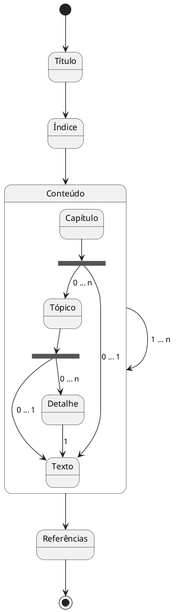

# Escrevendo artigos
_<sup>por Giovani Perotto Mesquita - 29/10/2024</sup>_
_<sup>rev. Giovani Perotto Mesquita -  30/10/2024</sup>_

## <a name="_toc000"></a>Índice

1. [Introdução](#_toc001)
1. [Pré-requsitos](#_toc002)
1. [Documento](#_toc003)
   - [Estrutura](#_toc0031)
     - [Título](#_toc00311)
     - [Índice](#_toc00312)
     - [Conteúdo](#_toc00313)
       - [Capítulo](#_toc003131)
       - [Tópico](#_toc003132)
       - [Detalhe](#_toc003133)
       - [Texto](#_toc003134)

## <a name="_toc001"></a>Introdução[↩︎](#_toc000)

Neste artigo iremos sugerir um template para criação de artigos em [markdown](https://en.wikipedia.org/wiki/Markdown)[^1], que podem ser facilmente renderizados utilizando o vscode.

O nosso objetivo é do trazer uma alternativa grátis e que possa ser utilizado tanto online quanto offline, suportada por diversas plataformas e ferramentas.

## <a name="_toc002"></a>Pré-requsitos[↩︎](#_toc000)

Utilizaremos os seguintes requsitos de software, para escrever os artigos:

- [VS Code](https://code.visualstudio.com/download)
  - extension [Markdown Preview Enhanced](https://marketplace.visualstudio.com/items?itemName=shd101wyy.markdown-preview-enhanced)
  - extension [Markdown Preview Mermaid Support](https://marketplace.visualstudio.com/items?itemName=bierner.markdown-mermaid)
  - extension [Markdown Checkboxes](https://marketplace.visualstudio.com/items?itemName=bierner.markdown-checkbox)
  - extension [learn-markdown](https://marketplace.visualstudio.com/items?itemName=docsmsft.docs-markdown)
  - extension [Markdown+Math](https://marketplace.visualstudio.com/items?itemName=goessner.mdmath)
  - extension [PlantUML](https://marketplace.visualstudio.com/items?itemName=jebbs.plantuml)
  - extension [PlantUML - Simple Viewer](https://marketplace.visualstudio.com/items?itemName=well-ar.plantuml)
  - extension [Graphviz Preview](https://marketplace.visualstudio.com/items?itemName=EFanZh.graphviz-preview)
  - extension [LaTeX Workshop](https://marketplace.visualstudio.com/items?itemName=James-Yu.latex-workshop)

Conhecimento (não mandatório) em:

  - [Markdown](https://en.wikipedia.org/wiki/Markdown)[^1]
  - [Plantuml](https://plantuml.com/)[^2]
  - [LaTEX](https://www.latex-project.org/)[^3]

## <a name="_toc003"></a>Documento[↩︎](#_toc000)

### <a name="_toc0031"></a>Estrutura[↩︎](#_toc003)

O artigo será estruturado de 4 partes:
- [Título](#_toc00311)
- [Índice](#_toc00312)
- [Conteúdo](#_toc00313)
- [Referências](#_toc00314)

Já o conteúdo poderá ser sub-dividido em:
- [Capítulo](#_toc003131)
- [Tópico](#_toc003132)
- [Detalhe](#_toc003133)



#### <a name="_toc00311"></a>Título[↩︎](#_toc0031)

O __Título__ é uma frase que identifica o artigo, deve ser único entre os seus demais artigos, para evitar sobreposições. Também deve-se colocar a identificação do autor e a data que o mesmo foi redigido, bem como revisões posteriores e suas datas.

Sintaxe:
>```
># <<Nome do artigo>>
>_<sup>por <<redator do artigo>> - DD/MM/YYY</sup>_
>_<sup>rev. <<redator da revisão>> - DD/MM/YYY</sup>_
>```
Exemplo:
```
# Escrevendo artigos
_<sup>por Giovani Perotto Mesquita - 29/10/2024</sup>_
_<sup>rev. John Doe - 30/10/2024</sup>_
```

#### <a name="_toc00312"></a>Índice[↩︎](#_toc0031)

O índice é uma lista das partes de um artigo, organizado pela ordem em que as partes aparecem. O mesmo possui relevância para uma acesso rápido a tôpicos do artigo.

Sintaxe:
>```
>1. [<<Capítulo/Tópico/Detalhe>>](#_tocnnn)
>```
Exemplo:
```
1. [Introdução](#_toc001)
1. [Pré-requsitos](#_toc002)
1. [Documento](#_toc003)
   - [Estrutura](#_toc0031)
     - [Título](#_toc00311)
     - [Índice](#_toc00312)
```

A ligação ao Capítulo/Tópico/Detalhe é efetuado quando da declaração do mesmo, através de um hyperlink (ex.: _toc001). Utilizaremos hyperlink para evitar problemas com acentuação e permitir apontamentos com o mesmo nome.

Sintaxe:
>```
>## <a name="_tocnnn"></a><<Capítulo/Tópico/Detalhe>>[↩︎](#_tocnnn)
>```
Exemplo:
```
## <a name="_toc001"></a>Introdução[↩︎](#_toc000)
## <a name="_toc002"></a>Pré-requsitos[↩︎](#_toc000)
## <a name="_toc003"></a>Documento[↩︎](#_toc000)
### <a name="_toc0031"></a>Estrutura[↩︎](#_toc003)
#### <a name="_toc00311"></a>Título[↩︎](#_toc0031)
#### <a name="_toc00312"></a>Índice[↩︎](#_toc0031)
 ...
```

Convencionamos que:

Capítulo será iniciado com ```##```
Tópico será iniciado com ```###```
Detalhe será iniciado com ```###```

E que os hyperlinks serão numerados em ordem sequencial conforme a estrutura, por exemplo: se o capítulo for _toc001 o tópico filho se houver será _toc0011, o segundo será _toc0012, etc...

De mesma forma se o tópico tiver detalhe o mesmo será sequencial, exemplo o tópico _toc0011 o seu filho será _toc00111, _toc00112, etc ...

>```<a name="_tocnnn"></a><<Capítulo/Tópico/Detalhe>>```

Na declaração do Capítulo/Tópico/Detalhe iremos ter um apontamento para o nível anterior, ou seja:

```dos
detalhe --> tópico
tópico --> capítulo
capítulo --> índice
```

Sintaxe:
>```[↩︎](#_tocnnn)```

Outra convenção será que o hyperlink do índice será ```_toc000```, e que todos os capítulos irão apontar para ele na sua declaração.

Exemplo:
```
## <a name="_toc001"></a>Introdução[↩︎](#_toc000)
```

#### <a name="_toc00313"></a>Conteúdo[↩︎](#_toc0031)

__Conteúdo__ é basicamente tudo o que você consome ou cria em termos de informação, entretenimento, ou educação. Pode ser um texto, imagem, vídeo, áudio, gráfico, arte, etc. É algo que tem valor para quem recebe, seja para informar, entreter, educar ou inspirar. Pense em um artigo de blog, um post nas redes sociais, um podcast, ou até um meme engraçado. Todos são tipos de __conteúdo__.

#### <a name="_toc003131"></a>Capítulo[↩︎](#_toc00313)

__Capítulo__ é uma especialização do [Conteúdo](#_toc00313), afim de criar itens que ajudam na compreensão do [Conteúdo](#_toc00313).

#### <a name="_toc003132"></a>Tópico[↩︎](#_toc00313)

__Tópico__ é uma especialização do [Capítulo](#_toc003131), afim de criar itens que ajudam na compreensão do [Capítulo](#_toc003131).

#### <a name="_toc003133"></a>Detalhe[↩︎](#_toc00313)

__Detalhe__ é uma especialização do [Tópico](#_toc003132), afim de criar itens que ajudam na compreensão do [Tópico](#_toc003132).

#### <a name="_toc003134"></a>Texto[↩︎](#_toc00313)

É o assunto a ser transcorrido, podento ser texto, imagem, vídeo, áudio, gráfico, arte, etc. Para isso usamos a linguagem [markdown](https://en.wikipedia.org/wiki/Markdown)[^1], afim de realizar a sua formatação. Alguns padrões foram estabelecidos:

- Link externo é efetuado pela seguinte sintaxe:
  >```
  >[<<nome do link>>](<<link>>)
  >```
  
  exemplo:
  ```
  [Markdown](https://en.wikipedia.org/wiki/Markdown)
  ```
- Link de midias é efetuado pela seguinte sintaxe:
  >```
  >
  >```
  
  exemplo:
  
  ```
  
  ```
- Link de item interno do documento é efetuado pela seguinte sintaxe:
  >```
  >[<<nome do item](#_tocnnn)
  >```
  
  exemplo:
  
  ```
  [Índice](#_toc000)
  ```
  
  Obs.: ```(#_tocnnn)``` como criado na declaração do item, como descrito em [Índice](#_toc0031).
- Link de um vídeo youtube com a capa do próprio youtube é efetuado pela seguinte sintaxe:
  >```
  >[](https://www.youtube.com/watch?v=<<vídeo ID>>)
  >```
  
  exemplo:
  
  ```
  [](https://www.youtube.com/watch?v=oYpiYoqXCbA)
  ```
  Obs.: Podemos usar esta técnica para outros tipos de mídias também.
- Link de referência é efetuado pela seguinte sintaxe:
  >```
  > <<referência>>[^<<ID da referencia>>]
  > ...
  >[^<<ID da referencia>>]: <<descrição>>
  >```
  
  exemplo:
  ```
  [^2]
  ...
  [^2]: **Koblin, Jonas**, "Cipolla’s 5 Laws of Human Stupidity", [Sprouts Schools](https://sproutsschools.com), 25/10/2024, [https://sproutsschools.com/cipollas-5-laws-of-human-stupidity/](https://sproutsschools.com/cipollas-5-laws-of-human-stupidity/).
  ```
- Link de retono é efetuado pela seguinte sintaxe:
  >```
  >[↩︎](#_tocnnn)
  >```
  
  exemplo:
  ```
  [↩︎](#_toc001)
  ```
- Uma citação é efetuado pela seguinte sintaxe:
  >```
  >>Texto
  >>[^<<ID da referencia>>]
  > ...
  >[^<<ID da referencia>>]: <<descrição>>
  >```
  
  exemplo:
  ```
  >"Só sei que nada sei"
  >[^1]
  ```

#### <a name="_toc00314"></a>Referências[↩︎](#_toc0031)

As referências bibliográficas é efetuada pela seguinte sintaxe:
- Artigo:
  ```
  **Autor**, "Título do Artigo", Nome da Revista, Volume, Número, Ano, Páginas.
  ```
- Artigo de Conferência:
  ```
  **Autor(es)**, "Título do Artigo", em *Nome da Conferência*, Local, Ano, Páginas.
  ```
- Blog Post:
  ```
  **Autor**, "Título do Post", Nome do Blog, Data, [URL](URL).
  ```
- Capítulo de Livro:
  ```
  **Autor do Capítulo**, "Título do Capítulo", em *Título do Livro*, editado por Editor(es), Editora, Ano, Páginas.
  ```
- Documentário:
  ```
  **Diretor**, *Título do Documentário*, Produtora, Ano.
  ```
- Entrevista:
  ```
  **Nome do Entrevistado**, entrevistado por **Nome do Entrevistador**, "Título da Entrevista", Nome da Publicação, Data, Páginas.
  ```
- Livro:
  ```
  **Autor**, *Título do Livro*, Edição, Editora, Ano.
  ```
- Página da Web sem Autor Identificável:
  ```
  "Título da Página", Nome do Site, Data de Acesso, [URL](URL).
  ```
- Podcast:
  ```
  **Nome do Host**, "Título do Episódio", Nome do Podcast, Data, [URL](URL).
  ```
- Relatório Técnico:
  ```
  **Autor(es)**, *Título do Relatório*, Número do Relatório, Nome da Instituição, Ano.
  ```
- Site:
  ```
  **Autor**, "Título do Artigo", Nome do Site, Data de Acesso, [URL](URL).
  ```
- Tese ou Dissertação:
  ```
  **Autor**, *Título da Tese/Dissertação*, Grau Acadêmico, Nome da Instituição, Ano.
  ```
- Trecho de vídeo:
  ```
  **Autor**, "Título do Vídeo", Nome do Canal, Data de Publicação, [URL](URL), minuto:segundo.
  ```
- Vídeo do YouTube:
  ```
  **Autor**, "Título do Vídeo", Nome do Canal, Data de Publicação, [URL](URL).
  ```

## <a name="_toc004"></a>Referências[↩︎](#_toc000)

[^1]: **Wikipedia**, "Markdown", [Wikipedia](https://pt.wikipedia.org), 30/10/2024, [https://en.wikipedia.org/wiki/Markdown](https://en.wikipedia.org/wiki/Markdown).
[^2]: **PlantUML**, "PlantUML at a Glance", [PlantUML](https://plantuml.com/), 30/10/2024, [https://plantuml.com/](https://plantuml.com/).
[^3]: **LaTEX**, "The LaTEX Project", [LaTEX](https://www.latex-project.org/), 30/10/2024, [https://www.latex-project.org/](https://www.latex-project.org/).