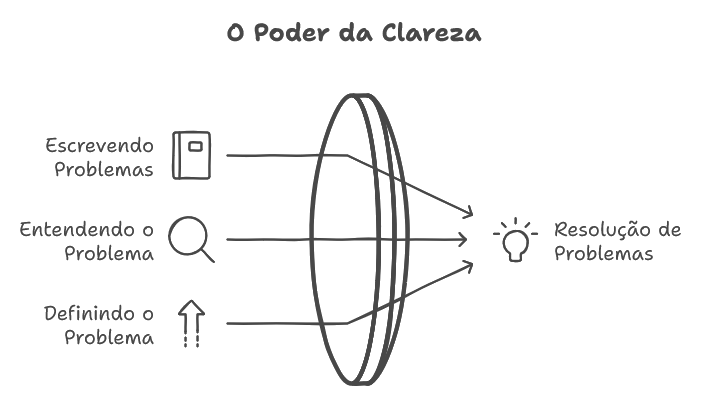
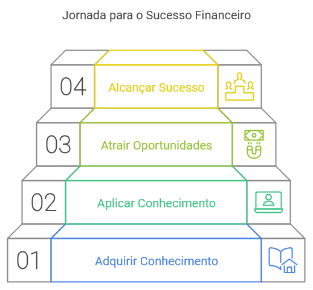

# As 5 Leis

## Murphy´s law [^5]

>
>
>__Anythig that can go wrong, will go wrong!__
>"Tudo que pode dar errado, dará errado!"
>
>_Edward A. Murphy Jr., um engenheiro aeroespacial, ficou irritado quando um  técnico fez uma conexão errada em um experimento crucial. Ele disse algo como “Se existir uma maneira errada de fazer algo, alguém a encontrará”. Os colegas começaram a chamar isso de “Lei de Murphy” e o nome pegou._

## Kidlin's law [^4]

>
>
>__If you can write it down, it is half solved!__
>"Se você pode escrever, está metade resolvido!"
>
>_A melhor maneira de resolver um problema é entendendo e definindo ele._

## Falkland's law [^3]

>
>
>__Until and unless absolutely necessary to, don't make that decision!__
>"Até e a menos que seja absolutamente necessário, não tome essa decisão!"
>
>_Abraçe a paciência na tomada de decisões._

## Wilson's law [^2]

>
>
>__If you have the right knowlegment, the right money will flow to you!__
>"Se você tiver o conhecimento certo, o dinheiro certo virá até você!"
>
>_O conhecimento é o maior ativo, o qual conduz ao sucesso._

## Gilbert's law [^1]

>
>
>__When you take on a task, finding the best ways to achieve the desire result is always your responsibility!__
>"Quando você assume uma tarefa, encontrar as melhores maneiras de alcançar o resultado desejado é sempre sua responsabilidade!"
>
>_O manifesto de Gilbert Lafayette, um político e empresário americano da virada do século 20, significa que não apenas a autossuficiência é crucial no local de trabalho, mas também a remoção de barreiras à comunicação e colaboração._

[^1]: https://trojanczyk.eu/gilberts-law/
[^2]: https://trojanczyk.eu/wilsons-law/
[^3]: https://www.hulkapps.com/blogs/ecommerce-hub/understanding-falklands-law-embracing-patience-in-decision-making
[^4]: https://medium.com/@hhuseyincosgun/solve-any-problem-by-kidlins-law-4cb5ab67fd7
[^5]: https://www.toppr.com/guides/physics/physics-article/murphys-law/