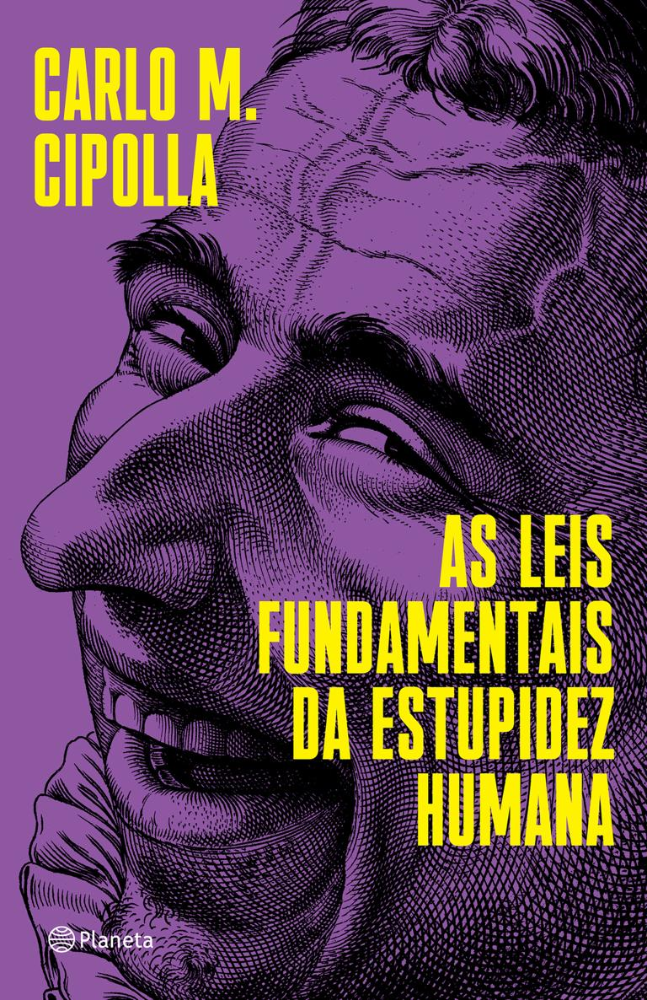
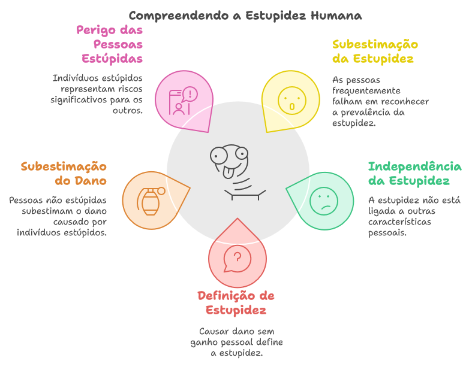

[](https://www.amazon.com.br/As-leis-fundamentais-estupidez-humana-ebook/dp/B085NV3WJC/ref=sr_1_1?crid=28T4GM9827Q97&dib=eyJ2IjoiMSJ9.2z7YkvMlEw8_ViR7n0eegRbPZQTv6yZ5HQfm_iIISrhVDZcHy8-gH4g0193JJytfNYrRrYtYWfkDl0DIXFF3udVgCmgqz-3KtsiAbqBStTmonvbP0vl4GE9ciNdvGW1NTYN470eDOtqF4oIKAq0zLuch7ocOf-m-FySIaS5uM8e5D5WQu5KfgqnJOSjACwzb4lTesh7bzqPsFM9MCA-knzzy7ShziFLDmlO_52fzakVeHDRC9FgMsgefTXEd_KI7JMLPgD8s5ASEuNMLuXmP9mc2-Chw-Y7z0bIGXolLfps.5aNMTioUw3xjcHRN82Q2LhCBgyf84imNSxAfg6Iaf6s&dib_tag=se&keywords=as+leis+fundamentais+da+estupidez+humana&qid=1729821173&sprefix=as+leis%2Caps%2C464&sr=8-1)

# As leis fundamentais da estupidez humana:

- Todo mundo subestima, sempre e inevitavelmente, o número de indivíduos estúpidos em circulação.
- A probabilidade de determinada pessoa ser estúpida independe de qualquer outra característica dessa pessoa.
- Uma pessoa estúpida é uma pessoa que provoca perdas para outra pessoa ou um grupo de pessoas enquanto não obtém nenhum ganho para si mesma, e possivelmente incorre em perdas.
- Pessoas não estúpidas sempre subestimam o poder de causar danos dos indivíduos estúpidos. Em particular, pessoas não estúpidas se esquecem constantemente de que em todo momento e lugar, e sob qualquer circunstância, lidar e/ou se associar com pessoas estúpidas resulta infalivelmente em um erro altamente custoso.
- Uma pessoa estúpida é o tipo mais perigoso de pessoa.

[Cinco estúpidos que mudaram a história](https://www.youtube.com/watch?v=aczOqwc66gc)