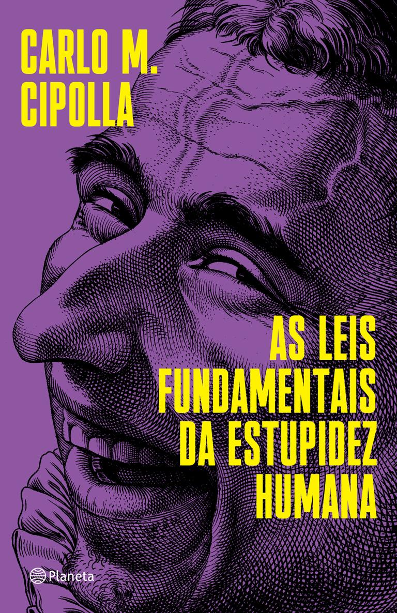

# As leis fundamentais da estupidez humana

[](https://www.amazon.com.br/As-leis-fundamentais-estupidez-humana-ebook/dp/B085NV3WJC/ref=sr_1_1?crid=28T4GM9827Q97&dib=eyJ2IjoiMSJ9.2z7YkvMlEw8_ViR7n0eegRbPZQTv6yZ5HQfm_iIISrhVDZcHy8-gH4g0193JJytfNYrRrYtYWfkDl0DIXFF3udVgCmgqz-3KtsiAbqBStTmonvbP0vl4GE9ciNdvGW1NTYN470eDOtqF4oIKAq0zLuch7ocOf-m-FySIaS5uM8e5D5WQu5KfgqnJOSjACwzb4lTesh7bzqPsFM9MCA-knzzy7ShziFLDmlO_52fzakVeHDRC9FgMsgefTXEd_KI7JMLPgD8s5ASEuNMLuXmP9mc2-Chw-Y7z0bIGXolLfps.5aNMTioUw3xjcHRN82Q2LhCBgyf84imNSxAfg6Iaf6s&dib_tag=se&keywords=as+leis+fundamentais+da+estupidez+humana&qid=1729821173&sprefix=as+leis%2Caps%2C464&sr=8-1)

## Sobre o Autor

__[Carlo M. Cipolla](https://pt.wikipedia.org/wiki/Carlo_M._Cipolla)__ (_[Pavia](https://pt.wikipedia.org/wiki/Pavia), 15 de agosto de 1922 — [Pavia](https://pt.wikipedia.org/wiki/Pavia), 5 de setembro de 2000_) foi um historiador económico e medievalista italiano. Obteve sua licenciatura na [Universidade de Pavia](https://pt.wikipedia.org/wiki/Universidade_de_Pavia) em 1944. Seu nome de batismo é Carlo Cipolla. Nas publicações, porém, é habitualmente referido como Carlo M. Cipolla. Esse nome do meio inexistente é normalmente mal interpretado como Maria.

Através da história econômica, com um enfoque humanista da mesma, procurou mostrar um maior interesse nas causas que tem provocado determinadas situações econômicas e sociais ao longo da história, tendo em vista os efeitos materiais e cifras concretas. Foi também conhecido por seus artigos sobre a "superpopulação" e seus ensaios sobre a estupidez humana.

## As Leis

Conforme Carlo M. Cipolla cita em seu livro, eis as 5 leis:

- Todo mundo subestima, sempre e inevitavelmente, o número de indivíduos estúpidos em circulação.
- A probabilidade de determinada pessoa ser estúpida independe de qualquer outra característica dessa pessoa.
- Uma pessoa estúpida é uma pessoa que provoca perdas para outra pessoa ou um grupo de pessoas enquanto não obtém nenhum ganho para si mesma, e possivelmente incorre em perdas.
- Pessoas não estúpidas sempre subestimam o poder de causar danos dos indivíduos estúpidos. Em particular, pessoas não estúpidas se esquecem constantemente de que em todo momento e lugar, e sob qualquer circunstância, lidar e/ou se associar com pessoas estúpidas resulta infalivelmente em um erro altamente custoso.
- Uma pessoa estúpida é o tipo mais perigoso de pessoa.

## As 4 categorias de pessoas

Segundo o autor podemos categorizar avaliando o comportamento, dividindo em quatro quadrantes de 2 dimensões. Uma dimensão irá retratar a relação de ganho/perda do indivíduo e outra o ganho/perda do(s) outro(s).

- As __Prestativas__: Aquele tipo de pessoa que para evitar dano a outra(s) pessoa(s), se coloca em situação de dano. Provocando a sua perda, para o ganho do(s) outro(s) __-/+__.
- As __Inteligentes__: Aquele tipo de pessoa que evita a situação de dano a si, e a outra(s) pessoa(s). Busca o ganho a todos __+/+__.
- As __Bandidas__: Aquele tipo de pessoa que evita a situação dano a si, colocando outra(s) pessoa(s) em situação de dano. Importa somente com o seu ganho __+/-__.
- As __Estúpidas__: Aquele tipo que coloca a si e a outra(s) pessoa(s) em situação de dano. Provoca perda a todos __-/-___.

## Conclusão

Contrariando as principais tendências culturais entre os seus colegas intelectuais, Cipolla estava convencido de que os homens não são iguais. Que alguns são estúpidos e outros não, e que a diferença é determinada pela natureza e nada mais. Uma pessoa é estúpida da mesma forma que alguém é ruivo, escreveu ele.

Cipolla alertou que o potencial prejudicial da pessoa estúpida depende, portanto, da quantidade de estupidez herdada, bem como da sua posição de poder na sociedade.

Entre burocratas, generais e políticos não é difícil encontrar exemplos claros de indivíduos basicamente estúpidos, cuja capacidade prejudicial foi alarmantemente reforçada pela posição do poder que ocupavam.

Cipolla não considerou necessariamente a estupidez como uma questão de quociente intelectual, mas sim uma falta de inteligência relacional. Ele parte da ideia de que, ao nos relacionarmos uns com os outros, podemos obter benefícios e proporcionar benefícios aos outros ou, pelo contrário, podemos causar danos ou prejudicar os outros.

## Vídeo

## Exemplos

## A vida imita a arte

## Referências

**Abraham**, "Idiocracia Não é uma Comédia: Foi um AVISO!", YouTube, 25/10/2024, [https://www.youtube.com/watch?v=sD52RZAVahY](https://www.youtube.com/watch?v=sD52RZAVahY).

**David 432 RDRDRD**, "IDIOCRACIA dublado", Youtube, 25/10/2024, [https://www.youtube.com/watch?v=xUQbNgbK0S4](https://www.youtube.com/watch?v=xUQbNgbK0S4).

**Koblin, Jonas**, "Cipolla’s 5 Laws of Human Stupidity", [Sprouts Schools](https://sproutsschools.com), 25/10/2024, [https://sproutsschools.com/cipollas-5-laws-of-human-stupidity/](https://sproutsschools.com/cipollas-5-laws-of-human-stupidity/).

**Rezzutti, Paulo**, "Cinco estúpidos que mudaram a história", YouTube, 25/10/2024, [https://www.youtube.com/watch?v=aczOqwc66gc](https://www.youtube.com/watch?v=aczOqwc66gc).

**Scapella, Rafael**, "IDIOCRACIA - O Filme Que Tentou Nos Alertar", YouTube, 25/10/2024, [https://www.youtube.com/watch?v=yR9pAGnlLF8](https://www.youtube.com/watch?v=yR9pAGnlLF8).

**Streck, Lenio Luiz**, "A conspiração dos néscios e as cinco leis fundamentais da estupidez", [Conjur](https://www.conjur.com.br), 25/10/2024, [https://www.conjur.com.br/2020-set-24/senso-incomum-conspiracao-nescios-cinco-leis-fundamentais-estupidez//](https://www.conjur.com.br/2020-set-24/senso-incomum-conspiracao-nescios-cinco-leis-fundamentais-estupidez//)

**Sprouts**, "As cinco leis da estupidez humana de Cipolla", YouTube, 25/10/2024, [https://www.youtube.com/watch?v=oYpiYoqXCbA](https://www.youtube.com/watch?v=oYpiYoqXCbA).

**Wikipedia**, "Carlo M. Cipolla", Wikipedia, 25/10/2024, [https://pt.wikipedia.org/wiki/Carlo_M._Cipolla](https://pt.wikipedia.org/wiki/Carlo_M._Cipolla).