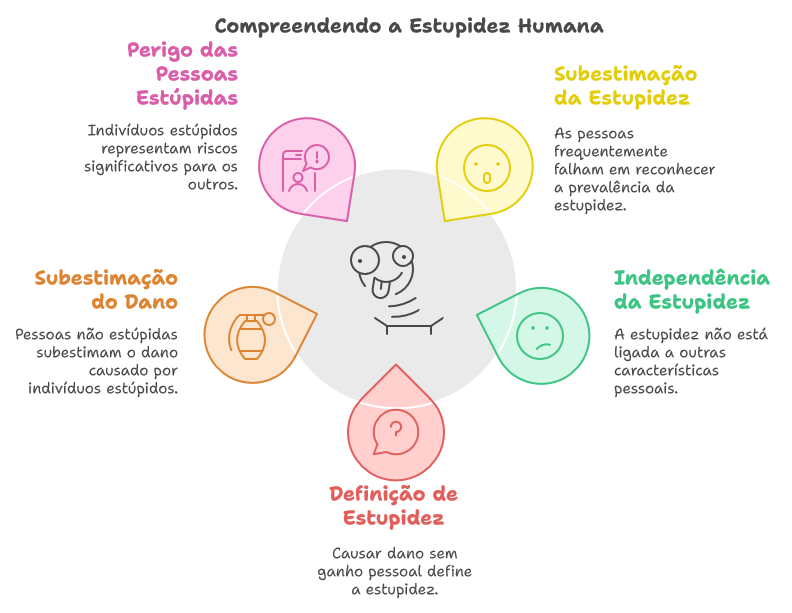
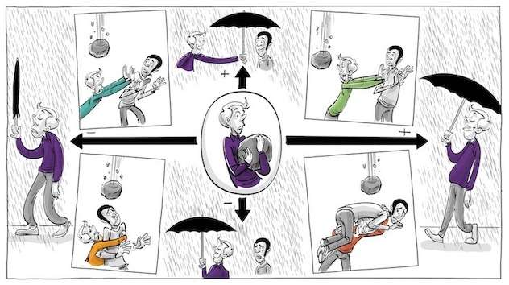

# $$ \color{Blue} \Huge As\ leis\ fundamentais \newline da\ estupidez\ humana $$

_por Giovani Perotto Mesquita - 25/10/2024_
_rev. 30/10/2024_

## Índice

1. [Introdução](#_toc20241023001)
1. [Sobre o Autor do livro](#_toc20241023002)
1. [As Leis](#_toc20241023003)
1. [As 4 categorias de pessoas](#_toc20241023004)
1. [Conclusão](#_toc20241023005)
1. [Vídeos](#_toc20241023006)
1. [Exemplos](#_toc20241023007)
1. [A vida imita a arte](#_toc20241023008)
1. [Referências](#_toc20241023009)

## Introdução[↩︎](#_toc20241023000)

Analisaremos a tese proposta por Carlo M. Cipolla em seu livro As Leis Fundamentais da Estupidez Humana, onde ele delineia perfis comportamentais das relações humanas com base nos ganhos e perdas resultantes das ações dos indivíduos.

É importante destacar que este é um tema controverso, que gera discussões acaloradas entre acadêmicos.

Nosso objetivo não é defender ou acusar, mas apresentar a teoria de forma resumida e estimular a reflexão do leitor.

[](https://www.amazon.com.br/As-leis-fundamentais-estupidez-humana-ebook/dp/B085NV3WJC/ref=sr_1_1?crid=28T4GM9827Q97&dib=eyJ2IjoiMSJ9.2z7YkvMlEw8_ViR7n0eegRbPZQTv6yZ5HQfm_iIISrhVDZcHy8-gH4g0193JJytfNYrRrYtYWfkDl0DIXFF3udVgCmgqz-3KtsiAbqBStTmonvbP0vl4GE9ciNdvGW1NTYN470eDOtqF4oIKAq0zLuch7ocOf-m-FySIaS5uM8e5D5WQu5KfgqnJOSjACwzb4lTesh7bzqPsFM9MCA-knzzy7ShziFLDmlO_52fzakVeHDRC9FgMsgefTXEd_KI7JMLPgD8s5ASEuNMLuXmP9mc2-Chw-Y7z0bIGXolLfps.5aNMTioUw3xjcHRN82Q2LhCBgyf84imNSxAfg6Iaf6s&dib_tag=se&keywords=as+leis+fundamentais+da+estupidez+humana&qid=1729821173&sprefix=as+leis%2Caps%2C464&sr=8-1)[^9]

##  Sobre o Autor do livro[↩︎](#_toc20241023000)

>__[Carlo M. Cipolla](https://pt.wikipedia.org/wiki/Carlo_M._Cipolla)__ (_[Pavia](https://pt.wikipedia.org/wiki/Pavia), 15 de agosto de 1922 — [Pavia](https://pt.wikipedia.org/wiki/Pavia), 5 de setembro de 2000_) foi um historiador económico e medievalista italiano. Obteve sua licenciatura na [Universidade de Pavia](https://pt.wikipedia.org/wiki/Universidade_de_Pavia) em 1944. Seu nome de batismo é Carlo Cipolla. Nas publicações, porém, é habitualmente referido como Carlo M. Cipolla. Esse nome do meio inexistente é normalmente mal interpretado como Maria.
>
>Através da história econômica, com um enfoque humanista da mesma, procurou mostrar um maior interesse nas causas que tem provocado determinadas situações econômicas e sociais ao longo da história, tendo em vista os efeitos materiais e cifras concretas. Foi também conhecido por seus artigos sobre a "superpopulação" e seus ensaios sobre a estupidez humana.[^1]

##  As Leis[↩︎](#_toc20241023000)

Conforme Carlo M. Cipolla cita em seu livro, eis as 5 leis:

- Todo mundo subestima, sempre e inevitavelmente, o número de indivíduos estúpidos em circulação.
- A probabilidade de determinada pessoa ser estúpida independe de qualquer outra característica dessa pessoa.
- Uma pessoa estúpida é uma pessoa que provoca perdas para outra pessoa ou um grupo de pessoas enquanto não obtém nenhum ganho para si mesma, e possivelmente incorre em perdas.
- Pessoas não estúpidas sempre subestimam o poder de causar danos dos indivíduos estúpidos. Em particular, pessoas não estúpidas se esquecem constantemente de que em todo momento e lugar, e sob qualquer circunstância, lidar e/ou se associar com pessoas estúpidas resulta infalivelmente em um erro altamente custoso.
- Uma pessoa estúpida é o tipo mais perigoso de pessoa.

##  As 4 categorias de pessoas[↩︎](#_toc20241023000)

De acordo com o autor, podemos categorizar as pessoas avaliando seu comportamento. Para isso, dividimos em quatro quadrantes, considerando duas dimensões: uma que retrata a relação de ganho/perda do indivíduo e outra que representa o ganho/perda dos demais.

- As __Prestativas__: Aquele tipo de pessoa que para evitar dano a outra(s) pessoa(s), se coloca em situação de dano. Provocando a sua perda, para o ganho do(s) outro(s) __-/+__.
- As __Inteligentes__: Aquele tipo de pessoa que evita a situação de dano a si, e a outra(s) pessoa(s). Busca o ganho a todos __+/+__.
- As __Bandidas__: Aquele tipo de pessoa que evita a situação dano a si, colocando outra(s) pessoa(s) em situação de dano. Importa somente com o seu ganho __+/-__.
- As __Estúpidas__: Aquele tipo que coloca a si e a outra(s) pessoa(s) em situação de dano. Provoca perda a todos __-/-__.

[^2]

##  Conclusão[↩︎](#_toc20241023000)

>Contrariando as principais tendências culturais entre os seus colegas intelectuais, Cipolla estava convencido de que os homens não são iguais. Que alguns são estúpidos e outros não, e que a diferença é determinada pela natureza e nada mais. Uma pessoa é estúpida da mesma forma que alguém é ruivo, escreveu ele.
>
>Cipolla alertou que o potencial prejudicial da pessoa estúpida depende, portanto, da quantidade de estupidez herdada, bem como da sua posição de poder na sociedade.
>
>Entre burocratas, generais e políticos não é difícil encontrar exemplos claros de indivíduos basicamente estúpidos, cuja capacidade prejudicial foi alarmantemente reforçada pela posição do poder que ocupavam.[^2]

>Cipolla não considerou necessariamente a estupidez como uma questão de quociente intelectual, mas sim uma falta de inteligência relacional. Ele parte da ideia de que, ao nos relacionarmos uns com os outros, podemos obter benefícios e proporcionar benefícios aos outros ou, pelo contrário, podemos causar danos ou prejudicar os outros.[^8]

A estupidez deve ser reconhecida como uma realidade independente da inteligência. Diversas teorias tentam identificar seus gatilhos, agravados pelo isolacionismo de ideias e a arrogância de pensamento, que criam barreiras no mundo atual.

A estupidez é mais facilmente identificada após suas consequências. O desafio está em tentar identificá-la e mitigá-la antecipadamente, pois suas consequências tendem ser piores que a maldade e perduraram mais.

A estupidez é uma característica humana, seja intrínseca ao indivíduo ou manifesta. Não podemos negá-la, mesmo que isso fira o senso social, ideológico, cultural, dogmático ou econômico.

A dúvida pode ser um antídoto eficaz, forçando-nos a refletir antes de tomar decisões ou agir. Citando Sócrates: "Só sei que nada sei", devemos reconhecer nossa própria ignorância e a importância de admitir que não sabemos tudo. Este pode ser o primeiro passo para mitigar a estupidez.

[^2]

##  Vídeos[↩︎](#_toc20241023000)

Resumo da teoria de Carlo M. Cipolla:

[^3]

Argumento de contraposição, com uma visão focada no efeito-causa:

[^11]

A visão de [Robert Musil](https://pt.wikipedia.org/wiki/Robert_Musil) sobre a estupidez, resultado da ação ou falta de ação:

[^12]

Teoria da estupidez de [Dietrich Bonhoeffer](https://pt.wikipedia.org/wiki/Dietrich_Bonhoeffer):

[^15]

##  Exemplos[↩︎](#_toc20241023000)

Pessoas estúpidas também fazem a História
- __Gengis Khan e a destruição do Império Corásmio__ [01:52](https://www.youtube.com/watch?v=aczOqwc66gc&t=112s)[^4]
    _Como um governante regional instigou um dos maiores conquistadores da história, resultando na queda do Império Corásmio, na invasão do leste europeu e na disseminação de novas doenças pela Europa._
- __O acidente do Exxon Valdez__ [07:08](https://www.youtube.com/watch?v=aczOqwc66gc&t=428s)[^4]
    _Quando o capitão do navio decide relaxar e deixa a embarcação sob o comando de seu terceiro imediato inexperiente, resulta em uma das maiores catástrofes ambientais da história, com impactos irreparáveis ao meio ambiente._
- __A Operação Barbarossa__ [11:27](https://www.youtube.com/watch?v=aczOqwc66gc&t=687s)[^4]
    _Quando Hitler rompeu o acordo com a URSS, ele abriu duas frentes de batalha. Como consequência, seu regime caiu, e os impactos dessa decisão ainda reverberam nas relações internacionais até os dias de hoje._
- __A Primeira Guerra Mundial__ [17:36](https://www.youtube.com/watch?v=aczOqwc66gc&t=1056s)[^4]
    _Uma sucessão de decisões estúpidas resultou em um dos maiores conflitos modernos, cujas consequências perduram até hoje._
- __O acidente nuclear de Chernobyl__ [20:37](https://www.youtube.com/watch?v=aczOqwc66gc&t=1237s)[^4]
    _O engenheiro-chefe da usina, ignorando alertas e protocolos, decidiu prosseguir com um teste para se promover. Como consequência, quase causou uma contaminação global e contribuiu para o aumento do aquecimento global._

[^4]

- __Campanha das 4 pagras__[^13]
   _Mao Tsé-Tung implementou uma ação para eliminar os pardais, considerados culpados por comer as sementes das plantações. Como consequência, o número de lagartas e gafanhotos explodiu, resultando na morte de quase 30 milhões de chineses por fome._

[^13]

- __Dust Bowl__[^14]
   _Uma seca, agravada pelo manejo inadequado do solo, a ignorância em relação ao meio ambiente e políticas equivocadas, deixou muitas pessoas famintas e falidas._

[^14]

##  A vida imita a arte[↩︎](#_toc20241023000)

>O filme que originalmente era uma comédia e que se tornou um documentário. Assim é definido o filme “[Idiocracia](https://www.adorocinema.com/filmes/filme-109539/)” (“Idiocracy”, 2006) do diretor e escritor [Mike Judge](https://pt.wikipedia.org/wiki/Mike_Judge) (“[Beavis e Butthead](https://pt.wikipedia.org/wiki/Beavis_and_Butt-Head)” e “[O Rei do Pedaço](https://pt.wikipedia.org/wiki/King_of_the_Hill)”)
>
>Um casal acorda de uma longa hibernação criogênica de 500 anos para encontrar um mundo no qual a burrice, estupidez e preguiça (e suas consequências como o machismo e a intolerância) se tornam virtudes. O presidente dos EUA é um ex ator pornô e lutador de Telecatch e a água potável foi substituída por um isotônico produzido por uma gigantesca corporação, gerando uma catástrofe ambiental. E a política se confunde com entretenimento e vídeo-game.
>
>Um filme tão profético que o próprio estúdio 20th Century Fox resolveu boicotar o lançamento da sua própria produção, escondendo “Idiocracia” das grandes redes de exibição.
>
>“Idiocracia” é visionário: como uma sociedade inteira não percebeu que emburrecia enquanto as expectativas sobre o que é ser inteligente cada vez mais diminuíam com o avanço tecnológico e da indústria do entretenimento.[^10]

[^5]

[^6]

[^7]

##  Referências[↩︎](#_toc20241023000)

[^6]: **Abraham**, "Idiocracia Não é uma Comédia: Foi um AVISO!", [YouTube](https://www.youtube.com), 25/10/2024, [https://www.youtube.com/watch?v=sD52RZAVahY](https://www.youtube.com/watch?v=sD52RZAVahY).

[^9]: **Cipolla, Carlo M.**, *[As leis fundamentais da estupidez humana](https://www.amazon.com.br/As-leis-fundamentais-estupidez-humana-ebook/dp/B085NV3WJC/ref=sr_1_1?crid=28T4GM9827Q97&dib=eyJ2IjoiMSJ9.2z7YkvMlEw8_ViR7n0eegRbPZQTv6yZ5HQfm_iIISrhVDZcHy8-gH4g0193JJytfNYrRrYtYWfkDl0DIXFF3udVgCmgqz-3KtsiAbqBStTmonvbP0vl4GE9ciNdvGW1NTYN470eDOtqF4oIKAq0zLuch7ocOf-m-FySIaS5uM8e5D5WQu5KfgqnJOSjACwzb4lTesh7bzqPsFM9MCA-knzzy7ShziFLDmlO_52fzakVeHDRC9FgMsgefTXEd_KI7JMLPgD8s5ASEuNMLuXmP9mc2-Chw-Y7z0bIGXolLfps.5aNMTioUw3xjcHRN82Q2LhCBgyf84imNSxAfg6Iaf6s&dib_tag=se&keywords=as+leis+fundamentais+da+estupidez+humana&qid=1729821173&sprefix=as+leis,aps,464&sr=8-1)*, 1ª edição, [Planeta](https://www.planetadelivros.com.br/), 2020.

[^5]: **David 432 RDRDRD**, "IDIOCRACIA dublado", [YouTube](https://www.youtube.com), 25/10/2024, [https://www.youtube.com/watch?v=xUQbNgbK0S4](https://www.youtube.com/watch?v=xUQbNgbK0S4).

[^10]: **Ferreira, Wilson Roberto Vieira**, "A burrice e estupidez do futuro já estão entre nós em Idiocracia", [Cinegnose](http://cinegnose.blogspot.com), 25/10/2024, [http://cinegnose.blogspot.com/2019/09/a-burrice-e-estupidez-do-futuro-ja.html](http://cinegnose.blogspot.com/2019/09/a-burrice-e-estupidez-do-futuro-ja.html).

[^2]: **Koblin, Jonas**, "Cipolla’s 5 Laws of Human Stupidity", [Sprouts Schools](https://sproutsschools.com), 25/10/2024, [https://sproutsschools.com/cipollas-5-laws-of-human-stupidity/](https://sproutsschools.com/cipollas-5-laws-of-human-stupidity/).

[^4]: **Rezzutti, Paulo**, "Cinco estúpidos que mudaram a história", [YouTube](https://www.youtube.com), 25/10/2024, [https://www.youtube.com/watch?v=aczOqwc66gc](https://www.youtube.com/watch?v=aczOqwc66gc).

[^7]: **Scapella, Rafael**, "IDIOCRACIA - O Filme Que Tentou Nos Alertar", [YouTube](https://www.youtube.com), 25/10/2024, [https://www.youtube.com/watch?v=yR9pAGnlLF8](https://www.youtube.com/watch?v=yR9pAGnlLF8).

[^8]: **Streck, Lenio Luiz**, "A conspiração dos néscios e as cinco leis fundamentais da estupidez", [Conjur](https://www.conjur.com.br), 25/10/2024, [https://www.conjur.com.br/2020-set-24/senso-incomum-conspiracao-nescios-cinco-leis-fundamentais-estupidez//](https://www.conjur.com.br/2020-set-24/senso-incomum-conspiracao-nescios-cinco-leis-fundamentais-estupidez//)

[^3]: **Sprouts**, "As cinco leis da estupidez humana de Cipolla", [YouTube](https://www.youtube.com), 25/10/2024, [https://www.youtube.com/watch?v=oYpiYoqXCbA](https://www.youtube.com/watch?v=oYpiYoqXCbA).

[^1]: **Wikipedia**, "Carlo M. Cipolla", [Wikipedia](https://pt.wikipedia.org), 25/10/2024, [https://pt.wikipedia.org/wiki/Carlo_M._Cipolla](https://pt.wikipedia.org/wiki/Carlo_M._Cipolla).

[^11]: **Barros, Daniel Martins de**, "Estupidez: Por que acreditamos em coisas idiotas?", [YouTube](https://www.youtube.com), 30/10/2024, [https://www.youtube.com/watch?v=2BCQVwCwl6U](https://www.youtube.com/watch?v=2BCQVwCwl6U).

[^12]: **Conjunção Bookiana**, "Somos todos estúpidos? Sobre a Estupidez - Robert Musil", [YouTube](https://www.youtube.com), 30/10/2024, [https://www.youtube.com/watch?v=uzhlgJ_AWKc](https://www.youtube.com/watch?v=uzhlgJ_AWKc).

[^13]: **Caça Viagens**, "China matou 1 bilhão de pardais o que provocou a morte de 30 milhões de pessoas", [YouTube](https://www.youtube.com), 30/10/2024, [https://www.youtube.com/watch?v=Zt8_-as-TIQ](https://www.youtube.com/watch?v=Zt8_-as-TIQ).

[^14]: **Porteira Frouxa**, "DUST BOWL, QUANDO A POEIRA TOMOU CONTA DOS ESTADOS UNIDOS", [YouTube](https://www.youtube.com), 30/10/2024, [https://www.youtube.com/watch?v=svFNrcE73Vw](https://www.youtube.com/watch?v=svFNrcE73Vw).

[^15]: **Razão e Reflexão**, "A TEORIA DA ESTUPIDEZ de BONHOEFFER", [YouTube](https://www.youtube.com), 30/10/2024, [https://www.youtube.com/watch?v=v-vLi3l5DeE](https://www.youtube.com/watch?v=v-vLi3l5DeE).