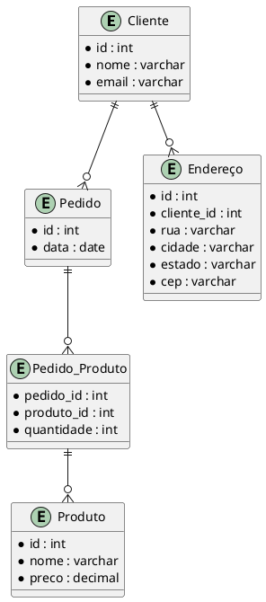

```plantuml
@startuml
  entity "Cliente" {
    * id : int
    * nome : varchar
    * email : varchar
  }
  
  entity "Pedido" {
    * id : int
    * data : date
  }
  
  entity "Produto" {
    * id : int
    * nome : varchar
    * preco : decimal
  }
  
  entity "Pedido_Produto" {
    * pedido_id : int
    * produto_id : int
    * quantidade : int
  }
  
  entity "Endereço" {
    * id : int
    * cliente_id : int
    * rua : varchar
    * cidade : varchar
    * estado : varchar
    * cep : varchar
  }
  
  Cliente ||--o{ Endereço
  Cliente ||--o{ Pedido
  Pedido ||--o{ Pedido_Produto
  Pedido_Produto ||--o{ Produto
@enduml
```