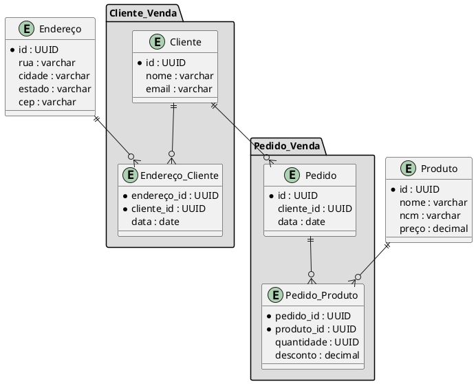

```plantuml
@startuml
  
  package "Cliente_Venda" #DDDDDD {
    entity "Cliente" {
      * id : UUID
      nome : varchar
      email : varchar
    }
    
    entity "Endereço_Cliente" {
      * endereço_id : UUID
      * cliente_id : UUID
      data : date
    }
  }
  
  entity "Endereço" {
    * id : UUID
    rua : varchar
    cidade : varchar
    estado : varchar
    cep : varchar
  }
  
  package "Pedido_Venda" <<folder>> #DDDDDD {
    entity "Pedido" {
      * id : UUID
      cliente_id : UUID
      data : date
    }
    
    entity "Pedido_Produto" {
      * pedido_id : UUID
      * produto_id : UUID
      quantidade : UUID
      desconto : decimal
    }
  }
  
  entity "Produto" {
    * id : UUID
    nome : varchar
    ncm : varchar
    preço : decimal
  }
  
  Cliente ||--o{ Endereço_Cliente
  Endereço ||--o{ Endereço_Cliente
  Cliente ||--o{ Pedido
  Pedido ||--o{ Pedido_Produto
  Produto ||--o{ Pedido_Produto
@enduml
```