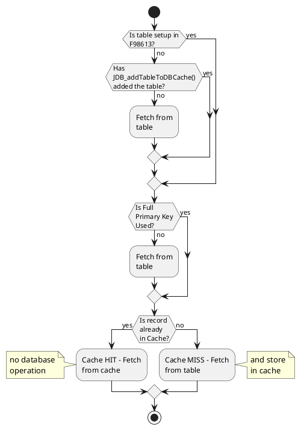

# E1 Cache Concepts – JDB Cache – Part 2 

In last article (part 1), have shared about the concept of JDB cache and its features. In this article, we will see how we can implement the JDB cache and use it efficiently during our performance issues.

## How it works

When a table is configured to be a part of JDB cache then , once a record is fetched from the table, it gets stored in cache also and then further Selects of the same record are fetched from cache rather than the database.

## Basic Rules

1. An entry should be there in F98613 for the table which is a list of cache tables.
1. Table must be accessed using full primary key.
1. Table must be accesses through API ‘JDB_FetchKeyed’ in C Business Function or using ‘Fetch Single’ table I/O operation 1. in JDE event rules.
1. APIs like JDB_SetSelection or JDB_SetSequencing must not be called when using the JDB cache.
1. There is no synchronization / replication across processes.

## Works in below manner:

<!--

-->

## Limitations

1. Tables must be static.
1. Same records must be fetched repeatedly.
1. Caching tables which are dynamic will cause applications to break.
1. Queries which return zero row, will not be cached.
1. Caching table having millions of records is not suggested.

## Benefits

1. An automated table caching mechanism feature in EnterpriseOne.
1. Suitable for table which remain constant and static.
1. It can help in increasing performance of the process.
1. Redundant Select statements on same primary key can be eliminated by using JDB cache.

Reference:
- JDB cache in EnterpriseOne
- JDEdwards EnterpriseOne Applications Task Force