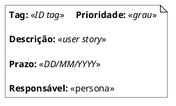
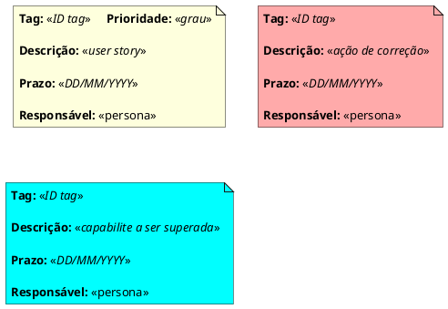
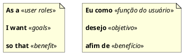
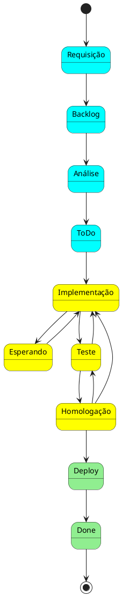
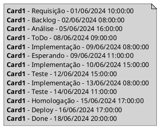

$$\color{Blue} \Huge Cards$$

_por Giovani Perotto Mesquita - 05/11/2024_

**Índice**

1. [Kanban Cards](#_toc001)
    1. [Tipos de Cards](#_toc0011)
    1. [User Story](#_toc0012)
1. [Base de dados](#_toc002)

# Kanban Cards[↩︎](#_toc000)

É o componente central na metodológia Kanban, é utilizado para registrar a tarefa, ajudando na visualização e o progresso dentro do quadro. Dependendo do tipo card Kanban poderemos ter variações nas informações contidas. Idealmente o Card deve conter as informações essenciais, com a finalidade de representar o trabalho.

As informações comumente utilizadas em um card visual são:

- __Título__: Nome da tarefa.
- __Descrição__: Detalhes adicionais sobre a tarefa, em caso de kanban da área de TI utilizamos um user story.
- __Responsável__: A pessoa designada para realizar a tarefa, lembrando que a resposabilidade é sempre coletiva.
- __Prazos__: Datas de início e conclusão esperadas.
- __Comentários/Notas__: Observações adicionais que possam ser relevantes.
- __Etiquetas/Tags__: Categorias ou marcadores para organizar melhor as tarefas.
- __Prioridade__: Indicador da necessidade do card.

## Tipos de Cards[↩︎](#_toc000)

Os tipos de Cards serão aqueles os quais fazem sentido para a sua equipe, contudo mais usualmente é encontrado tipos simplificados afim de facilitar a leitura no board. Um modelo muito encontrado e o de 3 tipos:

- __Tarefa__ (Feature): Adiciona valor ao projeto. Reperesenta uma ação específica que necessita ser realizada para atender um requisito, comumente escrita em forma de user story.
- __Bug__ (Fix): Não adiciona valor, evitável (termina com o desperdício). Representa qualquer ação que deva ser realizada, cuja a origem seja uma correção de uma tarefa anterior.
- __Preparação__ (Capabilite): Não Adiciona Valor, mas é inevitável. Representa uma ação que deve ocorrer para que uma tarefa ou uma necessiade da equipe seja efetuada. Entre exemplos podemos citar: POC, treinamento, hardware, aquisições, servidores, etc ...

Lembrando que um block não é uma capabilite, uma trata-se de uma alocação de tempo para uma preparação e a outra trata-se de um impedimento sobre uma tarefa.

Estes cards também podem possuir cores distintas para melhor acompanhamento no board.

## User Story[↩︎](#_toc000)

Trata-se de uma lista de input onde tudo o que precisa ser feito estará lá. Neste momento, é importante que tarefas muito grandes ou muito complexas sejam dividas em tarefas menores que possam ser realizadas a tempo e com qualidade.

Uma boa ferramenta para compreender e padronizar as tarefas é a “User Story” (ou história do usuário). Nada mais é do que uma maneira simples de sintetizar em uma frase o que precisa ser feito.

# Base de dados[↩︎](#_toc000)

Afim de extrair [métricas](Metricas.html) sobre os cards, é necessário preservar os status que o card passa, bem como informações de tempo para o inicio e fim.

