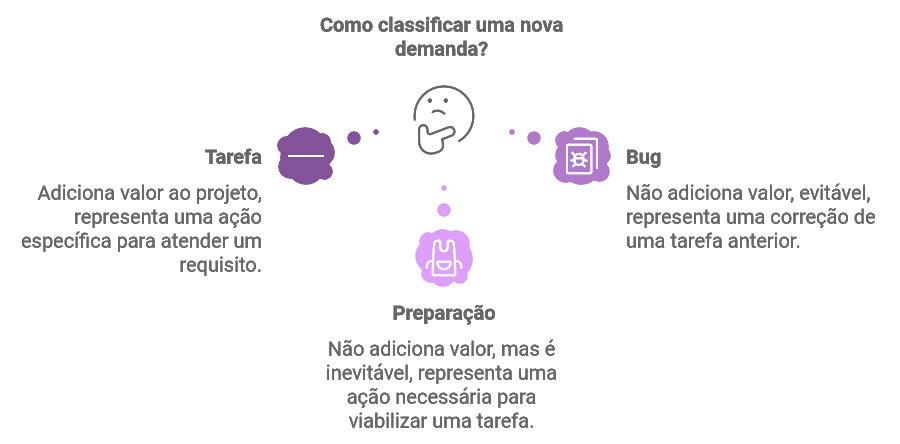

$$\color{Blue} \Huge Cards$$

_por Giovani Perotto Mesquita - 05/11/2024_

**Índice**

1. [Kanban Cards](#_toc001)
    1. [Prioridade](#_toc0011)
        1. [MoSCoW](#_toc00111)
        1. [GUT](#_toc00112)
    1. [Tipos de Cards](#_toc0013)
    1. [User Story](#_toc0014)
        1.  [5W2H](#_toc00141)
1. [Base de dados](#_toc002)
1. [Qual é a receita para ter sucesso com Kanban?](#_toc003)
    1. [Focando na qualidade](#_toc0031)
    1. [Limitando a quantidade de trabalho em andamento](#_toc0032)
    1. [Entregando frequentemente](#_toc0033)
    1. [Balanceando a demanda com a capacidade máxima](#_toc0034)
    1. [Priorizando tarefas](#_toc0035)
    1. [Atacando fontes de variedade](#_toc0036)

# Kanban Cards[↩︎](#_toc000)

É o componente central na metodológia Kanban, é utilizado para registrar a tarefa, ajudando na visualização e o progresso dentro do quadro. Dependendo do tipo card Kanban poderemos ter variações nas informações contidas. Idealmente o Card deve conter as informações essenciais, com a finalidade de representar o trabalho.

O nome Kanban é de origem japonesa e sua tradução seria como “sinal” ou “cartão”. Portanto, vamos chamar de sinalizador ou melhor “registro visual”. O nome Kanban surgiu dos sistemas de cartão usados nas indústrias de produção, que tinham como finalidade o gerenciamento do fluxo de trabalho através da organização de desenvolvimento.

O Kanban, com seu mecanismo de sinalização, tem como objetivo apresentar uma atividade de trabalho em processo, ou seja, o número de atividades ou cartões em circulação é equivalente à capacidade do sistema.

Uma outra característica importante do modelo Kanban é o conceito de “puxar tarefa” quando há capacidade de processá-la. Esse recurso vai de encontro ao tradicional modelo de “empurrar tarefa” conforme sua demanda, mantendo assim o bom desempenho da equipe. Portanto, ao invés dos membros que produzem o produto receberem atividades conforme suas demandas, os requisitos são adicionados a lista de backlog e “puxados” pelos membros que liberam suas atividades correntes e se tornam disponíveis para iniciar uma nova tarefa.

Uma boa metáfora que descreve essa regra é imaginarmos uma rodovia que suporta até 100 veículos para manter o fluxo de trafego com um bom desempenho, porém em todos os feriados essa rodovia recebe em torno de 200 veículos. Essa demanda não suportada pela rodovia gera um congestionamento afetando consideravelmente o desempenho do trafego. Logo, não adianta empurrar um numero de atividades não suportada pela equipe, isso irá causar um “congestionamento” e afetar o desempenho de produção.

A implementação do modelo Kanban se resume em três etapas que são:
- Visualizar os processos;
- Limitar o trabalho em processo do inglês WIP (work in progress);
- Gerenciamento do lead-time, ou seja, tempo que a atividade leva para passar por todas as fases até a sua entrega.

As informações comumente utilizadas em um card visual são:

- __Título__: Nome da tarefa.
- __Descrição__: Detalhes adicionais sobre a tarefa, em caso de kanban da área de TI utilizamos um user story.
- __Responsável__: A pessoa designada para realizar a tarefa, lembrando que a resposabilidade é sempre coletiva.
- __Prazos__: Datas de início e conclusão esperadas.
- __Comentários/Notas__: Observações adicionais que possam ser relevantes.
- __Etiquetas/Tags__: Categorias ou marcadores para organizar melhor as tarefas.
- __Prioridade__: Indicador da necessidade do card. Podemos usar as técnicas MoSCoW ou GUT.

## Prioridade[↩︎](#_toc000)

### MoSCoW[↩︎](#_toc000)

Uma boa ferramenta de priorização é a chamada técnica de“**M**o**SC**o**W**”. A palavra moscow é um anagrama para:

### GUT[↩︎](#_toc000)

**GUT**, sigla para **G**ravidade, **U**rgência e **T**endência, é uma ferramenta utilizada na priorização das estratégias, tomadas de decisão e solução de problemas de organizações/projetos. 

- Listar forças;
- Dar uma nota, de 1 a 5 para a gravidade de cada força;
- Dar uma nota, de 1 a 5 para a urgência de cada força;
- Dar uma nota, de 1 a 5 para a tendência de cada força;
- Multiplicar os resultados (gravidade x urgência x tendência) de cada força;
- Fazer a média dos resultados das forças;
- Repetir os passos acima com as fraquezas, oportunidades e ameaças

- **Gravidade** (G): trata do impacto que o problema gerará nos envolvidos, podendo ser os colaboradores, os processos, tarefas, resultados da empresa etc. O quão grave é/será para a empresa quando ocorrer?
- **Urgência** (U): é o prazo, ou o tempo disponível para a resolução do problema. Aqui não tem segredo: quanto menor o tempo, mais urgente será o problema que deverá ser resolvido. O recomendado é fazer a pergunta: Isso pode esperar?
- **Tendência** (T): trata da probabilidade (ou do potencial) que o problema tem de crescer com o passar do tempo. Aqui é feita uma previsão da evolução do problema. A pergunta a ser feita é: Se eu não resolver isso hoje, o problema vai piorar aos poucos ou bruscamente?

## Tipos de Cards[↩︎](#_toc000)

Os tipos de Cards serão aqueles os quais fazem sentido para a sua equipe, contudo mais usualmente é encontrado tipos simplificados afim de facilitar a leitura no board. Um modelo muito encontrado e o de 3 tipos:

- __Tarefa__ (Feature): Adiciona valor ao projeto. Reperesenta uma ação específica que necessita ser realizada para atender um requisito, comumente escrita em forma de user story.
- __Bug__ (Fix): Não adiciona valor, evitável (termina com o desperdício). Representa qualquer ação que deva ser realizada, cuja a origem seja uma correção de uma tarefa anterior.
- __Preparação__ (Capabilite): Não Adiciona Valor, mas é inevitável. Representa uma ação que deve ocorrer para que uma tarefa ou uma necessiade da equipe seja efetuada. Entre exemplos podemos citar: POC, treinamento, hardware, aquisições, servidores, etc ...

Lembrando que um block não é uma capabilite, uma trata-se de uma alocação de tempo para uma preparação e a outra trata-se de um impedimento sobre uma tarefa.

Estes cards também podem possuir cores distintas para melhor acompanhamento no board.

## User Story[↩︎](#_toc000)

Trata-se de uma lista de input onde tudo o que precisa ser feito estará lá. Neste momento, é importante que tarefas muito grandes ou muito complexas sejam dividas em tarefas menores que possam ser realizadas a tempo e com qualidade.

Uma boa ferramenta para compreender e padronizar as tarefas é a “User Story” (ou história do usuário). Nada mais é do que uma maneira simples de sintetizar em uma frase o que precisa ser feito. Podemos utilizar a écnica 5W2H para realizar o levantamento para a criação de uma user story.

## 5W2H[↩︎](#_toc000)

5W2H é uma ferramenta de gestão em formato de checklist com perguntas importantes sobre o projeto que será desenvolvido ou o problema que será resolvido. A sigla se refere a cinco palavras que começam com W e duas com H em inglês, sendo elas: What, Why, Where, When, Who, How, How much.

Em português as siglas são interpretadas da seguinte maneira:

- **What** – O que? Qual tarefa será realizada.
- **Why** – Por que? A razão de realizar a tarefa.
- **Where** – Onde? Onde será realizada.
- **When** – Quando? Quando será realizada e o seu cronograma
- **Who** – Quem? Quem serão as pessoas responsáveis pela tarefa.
- **How** – como? Qual será o processo para realizar a tarefa.
- **How much?** – Quanto? Quais serão os custos para realizar a tarefa.

# Base de dados[↩︎](#_toc000)

Afim de extrair [métricas](Metricas.html) sobre os cards, é necessário preservar os status que o card passa, bem como informações de tempo para o inicio e fim.

# Qual é a receita para ter sucesso com Kanban?[^1][↩︎](#_toc000)

Para que qualquer pessoa que queira ser um agente de mudança na sua organização tenha sucesso rápido (ou, uma melhoria rápida) e com baixa resistência da equipe, com foco na melhoria de processos em alguns pontos com o uso ou até mesmo sem o uso do método Kanban, é preciso seguir algumas etapas:

1. Focar na qualidade;
1. Limitar a quantidade de trabalho em progresso;
1. Entregar frequentemente;
1. Balancear demanda com a capacidade máxima;
1. Priorizar tarefas;
1. Atacar fontes de variedade.

## Focando na qualidade[^1][↩︎](#_toc000)

Como os agentes de mudanças nas empresas de TI são geralmente pessoas com um background técnico, essa tende a ser uma das etapas mais fáceis de ser implementada, principalmente por ser um problema bem entendido por todos. As
outras etapas desse guia tendem a ter uma implementação mais difícil porque dependem da colaboração de outras áreas e equipes. Com isso, exigem que o agente de mudança tenha muitas habilidades de negociação, articulação e bastante in teligência emocional.

Os maiores geradores de retrabalho em desenvolvimento de software são os defeitos causados principalmente pela baixa qualidade das entregas. E, além de um gerador de retrabalho,baixa qualidade faz os clientes ficarem inseguros e a equipe desmotivada.

O incentivo à qualidade das entregas tem um grande impacto na produtividade das equipes com altas taxas de defeitos. Segundo David, em equipes verdadeiramente ruins, somente concentrando-se na qualidade pode-se obter
uma melhoria de produtividade de até dez vezes.

Para David, tanto as técnicas de desenvolvimento ágil como as abordagens tradicionais têm seu mérito para a melhoria da qualidade. As principais práticas incentivadas por ele para a melhoria da qualidade são:

1. Escrever testes automatizados, preferencialmente antes;
1. Revisar código (Verificação);
1. Fazer atividades de análise e design do software de forma colaborativa;
1. Usar Design Patterns;
1. Usar ferramentas modernas de desenvolvimento.

Parece haver uma vantagem psicológica em pedir para os desenvolvedores escreverem testes antes, porém, é importante ressaltar que também existem inúmeros casos de sucesso com a escrita dos testes após a codificação.

Inspeções ou revisões de código ajudam a melhorar tanto a qualidade externa como, notadamente, a qualidade interna do software. Todas as técnicas têm o seu valor. Programação em par e revisão por pares são alguns exemplos. No entanto, inspeções de código são melhores quando são feitas em pequenas quantidades várias vezes. David menciona que ele costuma encorajar as suas equipes a inspecionar código, todos os dias, por pelo menos 30 minutos.

Sem dúvidas, quando toda a equipe trabalha em conjunto na análise dos problemas para as soluções de design, a qualidade é superior do que quando apenas uma pessoa faz isso. Assim como as inspeções de código, atividades de modelagem de software devem ser feitas em pequenas quantidades, todos os dias.

Os padrões de projeto de software, mais conhecidos pelo termo original em inglês Design Patterns, descrevem soluções para problemas já conhecidos e recorrentes no desenvolvimento de software orientado a objetos. O uso de padrões de projeto garante que defeitos de design sejam eliminados já no início do projeto.

O uso de ferramentas modernas de desenvolvimento melhora a qualidade porque a grande maioria dessas inclui funções de análise de código estática e dinâmica, que evitam que os desenvolvedores introduzam problemas básicos e já bem compreendidos, como falhas de segurança, no software.

## Limitando a quantidade de trabalho em andamento[^1][↩︎](#_toc000)

É fácil especular porque limitar a quantidade de tarefas em andamento aumenta a qualidade. A complexidade do trabalho do conhecimento, como em desenvolvimento de software, cresce exponencialmente com a quantidade de trabalhos em andamento. Tanto a transferência como a descoberta de informações no desenvolvimento de software é conhecimento tácito por natureza e é criado durante sessões de trabalho colabora tivo, face a face. A informação é verbal e visual, mas é em um formato casual, como um esboço em um quadro branco.

Nossas mentes têm uma capacidade limitada para armazenar conhecimento tácito. E, quanto mais tempo passa, há mais falhas para recordar detalhes precisos. Assim, uma série de erros é cometida. Equipes que trabalham de um modo ágil, em um mesmo espaço de trabalho, têm uma maior facilidade em reter o conhecimento tácito.

Mas, independentemente da forma de trabalho da equipe, o conhecimento tácito se deprecia com o passar do tempo. Por isso, tempos de espera (lead time) menores são essenciais para os processos que envolvem muito conhecimento tácito. O foco da redução de trabalho em andamento está diretamente relacionado com a redução dos tempos de espera (lead time).

Assim, podemos deduzir que haverá menor depreciação de conhecimento tácito quando temos menos trabalho em progresso – o que resultará em maior qualidade. Em resumo, reduzindo a quantidade de trabalho em andamento, melhora se a qualidade e possibilita-se entregas mais frequentes. Isso
aumenta a confiança externa na equipe.

Além de reduzir a quantidade de trabalho em andamento, é importante reduzir o tempo de uma iteração, pois isso também trará um impacto positivo significativo na qualidade. Segundo David, parece que existe uma relação entre a quantidade de trabalho em andamento e a qualidade, ou seja, defeitos vão aumentar com o aumento da quantidade de WIP. Portanto, faz sentido que iterações de duas semanas sejam melhores do que iterações de quatro semanas e que iterações de uma semana sejam melhores ainda. Iterações mais curtas irão resultar em entregas de maior qualidade.

Seguindo a lógica das evidências apresentadas, se é sabido que limitar o WIP irá melhorar a qualidade, por que não intro duzir política explícita para isso, deixando assim os gerentes livres para se concentrarem em outras atividades? Essa é justamente uma das propriedades do Kanban. Entretanto David afirma que ainda não existe nenhuma evidência científica desse resultado que foi observado apenas empiricamente.

## Entregando frequentemente[^1][↩︎](#_toc000)

Para entendermos a importância dessa etapa, David apresenta uma excelente analogia em seu livro: “Quando eu ensino isso nas aulas, eu gosto de perguntar às mulheres da classe o
que elas pensam sobre duas situações depois de ter um primeiro encontro com um cara:

- Situação 1: Eles tiveram um bom encontro, mas depois disso ele não dá sinais de vida a ela durante duas semanas. Mas, então, ele aparece em sua porta com um ramo de flores e um pedido de desculpas;
- Situação 2: Eles tiveram um bom encontro e na mesma noite a caminho de casa ele envia uma mensagem de texto a ela dizendo: “Eu me diverti muito esta noite. Eu realmente quero me encontrar com você novamente. Posso ligar para você amanhã? E, esse mesmo cara, segue ligando e enviando mensagens dia após dia.

Qual cara vocês acham que elas preferem?”.

Pequenos e frequentes gestos não custam quase nada, entretanto, eles constroem mais confiança do que grandes e caros gestos ocasionalmente. Portanto, realizar frequentemente pequenas entregas de alta qualidade constrói mais confiança para as equipes parceiras do que entregas maiores, mas com menos frequência.

## Balanceando a demanda com a capacidade máxima[^1][↩︎](#_toc000)

Construir um consenso em torno da necessidade de equilibrar a demanda contra a capacidade da equipe é crucial. No entanto, para isso, é preciso resolver problemas como a disfunção entre os papéis e as responsabilidades dos membros da equipe.

Essa etapa implica definir a taxa em que a equipe aceita novos requisitos no processo de desenvolvimento de software para corresponder com a capacidade em que a equipe pode entregar código de qualidade.

Quando se faz isso, fixa-se efetivamente a quantidade de trabalho em andamento, permitindo efetivamente que seja a equipe que crie a demanda de acordo com a sua capacidade (sistema puxado).

## Priorizando tarefas[^1][↩︎](#_toc000)

Priorizar é trabalho da área de negócios, e não da área de TI da organização. Assim, não deveria ser da competência de um gerente técnico fazer isso. Entretanto, infelizmente, é comum a área de negócios delegar a responsabilidade e deixar um gerente técnico priorizar o trabalho e depois culpar que o gerente fez escolhas erradas.

Neste ponto, a atenção da gerência deve-se voltar para otimizar o valor entregue ao invés de meramente a quantidade de código entregue.

## Atacando fontes de variedade[^1][↩︎](#_toc000)

Podemos entender como fontes de variedade tudo aquilo que de alguma forma prejudica o desempenho do processo de produção.

Atacar as fontes de variedade é a última etapa da receita porque alguns tipos de variedade exigem profundas mudanças de comportamento e, consequentemente, uma alta resistência da equipe.

A dica para implementar essa etapa é focar nas fontes de variedade que requerem pequenas mudanças de comportamento e que podem ser aceitas facilmente pela equipe.

Segundo David, não se deve focar nessa etapa sem antes implementar e dominar as primeiras cinco etapas da receita.

Resumindo, essa receita é a forma que David acredita que uma equipe de desenvolvimento de software deve amadurecer: “Em primeiro lugar, aprender a construir código de alta qualidade. Em seguida, reduzir o trabalho em andamento, encurtar os lead times, e entregar (software funcionando) com frequência. Em seguida, equilibrar a demanda contra a capacidade máxima, limitar a quantidade de trabalho em andamento, e criar folga para liberar capacidade, o que permitirá a melhoria contínua. Então, com isso funcionando razoavelmente e continuamente otimizando a capacidade de desenvolvimento de software, melhore a priorização para otimizar a entrega de valor.”.

O Kanban permite que você implemente todas as seis etapas dessa receita.

[^1]: Anderson, D. (2010) Kanban: Successful Evolutionary Change for Your Technology Business.
Washington, Blue Hole Press.