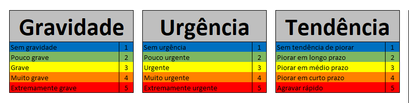
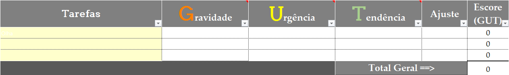
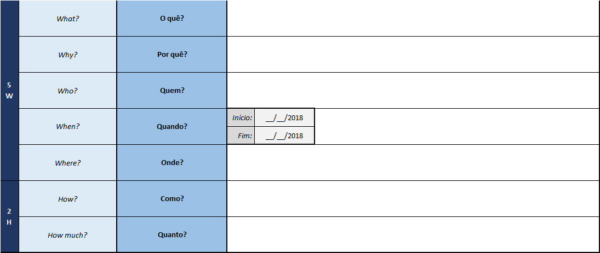
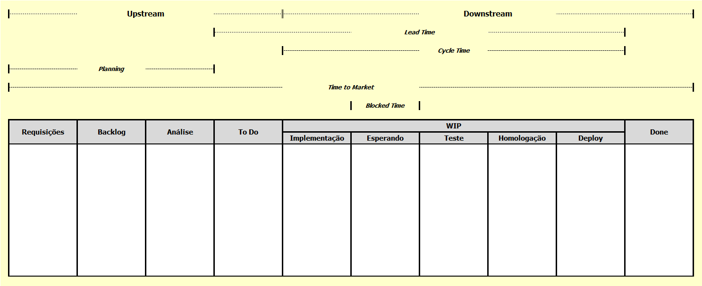

$$\color{Blue} \Huge Cards$$

_por Giovani Perotto Mesquita - 05/11/2024_

**Índice**

1. [Kanban Cards](#_toc001)
    1. [Prioridade](#_toc0011)
        1. [MoSCoW](#_toc00111)
        1. [GUT](#_toc00112)
    1. [Tipos de Cards](#_toc0013)
    1. [User Story](#_toc0014)
        1.  [5W2H](#_toc00141)
1. [Base de dados](#_toc002)

# Kanban Cards[↩︎](#_toc000)

É o componente central na metodológia Kanban, é utilizado para registrar a tarefa, ajudando na visualização e o progresso dentro do quadro. Dependendo do tipo card Kanban poderemos ter variações nas informações contidas. Idealmente o Card deve conter as informações essenciais, com a finalidade de representar o trabalho.

As informações comumente utilizadas em um card visual são:

- __Título__: Nome da tarefa.
- __Descrição__: Detalhes adicionais sobre a tarefa, em caso de kanban da área de TI utilizamos um user story.
- __Responsável__: A pessoa designada para realizar a tarefa, lembrando que a resposabilidade é sempre coletiva.
- __Prazos__: Datas de início e conclusão esperadas.
- __Comentários/Notas__: Observações adicionais que possam ser relevantes.
- __Etiquetas/Tags__: Categorias ou marcadores para organizar melhor as tarefas.
- __Prioridade__: Indicador da necessidade do card. Podemos usar as técnicas MoSCoW ou GUT.

## Prioridade[↩︎](#_toc000)

### MoSCoW[↩︎](#_toc000)

Uma boa ferramenta de priorização é a chamada técnica de“**M**o**SC**o**W**”. A palavra moscow é um anagrama para:

### GUT[↩︎](#_toc000)

**GUT**, sigla para **G**ravidade, **U**rgência e **T**endência, é uma ferramenta utilizada na priorização das estratégias, tomadas de decisão e solução de problemas de organizações/projetos. 

- Listar forças;
- Dar uma nota, de 1 a 5 para a gravidade de cada força;
- Dar uma nota, de 1 a 5 para a urgência de cada força;
- Dar uma nota, de 1 a 5 para a tendência de cada força;
- Multiplicar os resultados (gravidade x urgência x tendência) de cada força;
- Fazer a média dos resultados das forças;
- Repetir os passos acima com as fraquezas, oportunidades e ameaças

- **Gravidade** (G): trata do impacto que o problema gerará nos envolvidos, podendo ser os colaboradores, os processos, tarefas, resultados da empresa etc. O quão grave é/será para a empresa quando ocorrer?
- **Urgência** (U): é o prazo, ou o tempo disponível para a resolução do problema. Aqui não tem segredo: quanto menor o tempo, mais urgente será o problema que deverá ser resolvido. O recomendado é fazer a pergunta: Isso pode esperar?
- **Tendência** (T): trata da probabilidade (ou do potencial) que o problema tem de crescer com o passar do tempo. Aqui é feita uma previsão da evolução do problema. A pergunta a ser feita é: Se eu não resolver isso hoje, o problema vai piorar aos poucos ou bruscamente?

## Tipos de Cards[↩︎](#_toc000)

Os tipos de Cards serão aqueles os quais fazem sentido para a sua equipe, contudo mais usualmente é encontrado tipos simplificados afim de facilitar a leitura no board. Um modelo muito encontrado e o de 3 tipos:

- __Tarefa__ (Feature): Adiciona valor ao projeto. Reperesenta uma ação específica que necessita ser realizada para atender um requisito, comumente escrita em forma de user story.
- __Bug__ (Fix): Não adiciona valor, evitável (termina com o desperdício). Representa qualquer ação que deva ser realizada, cuja a origem seja uma correção de uma tarefa anterior.
- __Preparação__ (Capabilite): Não Adiciona Valor, mas é inevitável. Representa uma ação que deve ocorrer para que uma tarefa ou uma necessiade da equipe seja efetuada. Entre exemplos podemos citar: POC, treinamento, hardware, aquisições, servidores, etc ...

Lembrando que um block não é uma capabilite, uma trata-se de uma alocação de tempo para uma preparação e a outra trata-se de um impedimento sobre uma tarefa.

Estes cards também podem possuir cores distintas para melhor acompanhamento no board.

## User Story[↩︎](#_toc000)

Trata-se de uma lista de input onde tudo o que precisa ser feito estará lá. Neste momento, é importante que tarefas muito grandes ou muito complexas sejam dividas em tarefas menores que possam ser realizadas a tempo e com qualidade.

Uma boa ferramenta para compreender e padronizar as tarefas é a “User Story” (ou história do usuário). Nada mais é do que uma maneira simples de sintetizar em uma frase o que precisa ser feito. Podemos utilizar a écnica 5W2H para realizar o levantamento para a criação de uma user story.

## 5W2H[↩︎](#_toc000)

5W2H é uma ferramenta de gestão em formato de checklist com perguntas importantes sobre o projeto que será desenvolvido ou o problema que será resolvido. A sigla se refere a cinco palavras que começam com W e duas com H em inglês, sendo elas: What, Why, Where, When, Who, How, How much.

Em português as siglas são interpretadas da seguinte maneira:

- **What** – O que? Qual tarefa será realizada.
- **Why** – Por que? A razão de realizar a tarefa.
- **Where** – Onde? Onde será realizada.
- **When** – Quando? Quando será realizada e o seu cronograma
- **Who** – Quem? Quem serão as pessoas responsáveis pela tarefa.
- **How** – como? Qual será o processo para realizar a tarefa.
- **How much?** – Quanto? Quais serão os custos para realizar a tarefa.

# Base de dados[↩︎](#_toc000)

Afim de extrair [métricas](Metricas.html) sobre os cards, é necessário preservar os status que o card passa, bem como informações de tempo para o inicio e fim.

