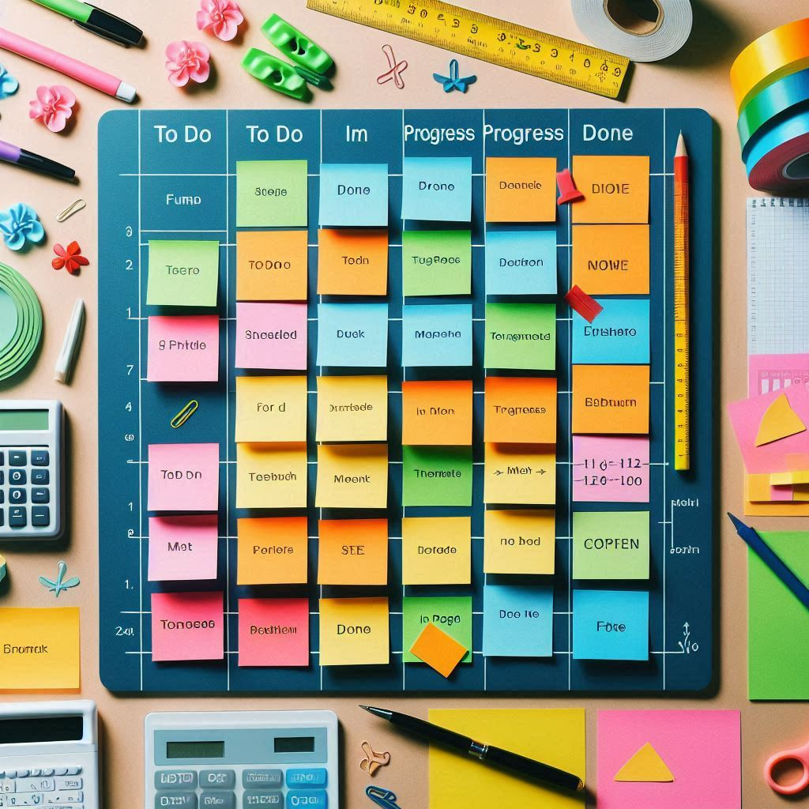

$$\color{Blue} \Huge Kanban\ em \ Métricas$$

A história do Kanban é fascinante e remonta ao Japão! Aqui está um breve resumo:

- Origem: O Kanban surgiu na década de 1940 na fábrica de automóveis Toyota. A palavra "Kanban" significa "cartão visual" em japonês.
- Propósito Inicial: Foi desenvolvido para melhorar a eficiência e reduzir desperdícios no processo de produção. Os primeiros cartões Kanban eram usados para sinalizar a necessidade de reposição de estoque.
- Expansão: Com o tempo, a metodologia se espalhou para outros setores e áreas, incluindo a gestão de projetos.
- Princípios Fundamentais: O Kanban se baseia na visualização do fluxo de trabalho, limitação do trabalho em andamento (WIP), fluxo contínuo e melhoria contínua.

Hoje, o Kanban é amplamente utilizado como uma abordagem ágil para gerenciar projetos, proporcionando uma visão clara e intuitiva do progresso das tarefas.

# Índice

1. [Work In Progress (WIP)](#_toc001)
1. [Lead Time](#_toc002)
1. [Cycle Time](#_toc003)
1. [Throughput](#_toc004)
1. [Blocked Time](#_toc005)
1. [Defect Time](#_toc006)
1. [Time to Market](#_toc007)
1. [Customer Satisfaction](#_toc008)
1. [Employee Engagement](#_toc009)
1. [Cost of Delay](#_toc010)
1. [Discart Rate](#_toc011)
1. [Blocked Rate](#_toc012)
1. [Flow Efficiency](#_toc013)
1. [Little's Law](#_toc014)

# Work In Progress (WIP)[↩︎](#_toc000)

$$\large \boxed{WIP = n}$$

Monitora a quantidade de tarefas em andamento ao mesmo tempo. Limitar o WIP pode ajudar a melhorar a eficiência e evitar sobrecarregar a equipe.

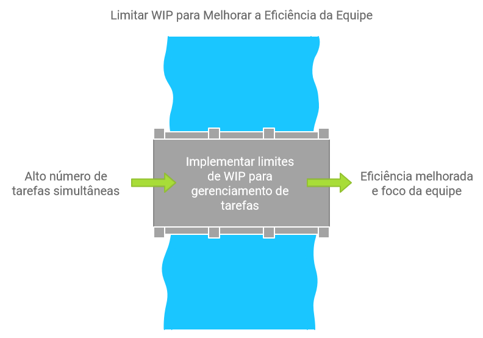

# Lead Time[↩︎](#_toc000)

$$\large \boxed{\text{Lead Time} = \text{Data de Conclusão} - \text{Data de Início}}$$

Mede o tempo total desde o início até a conclusão de uma tarefa. Ajuda a identificar e resolver gargalos no processo.

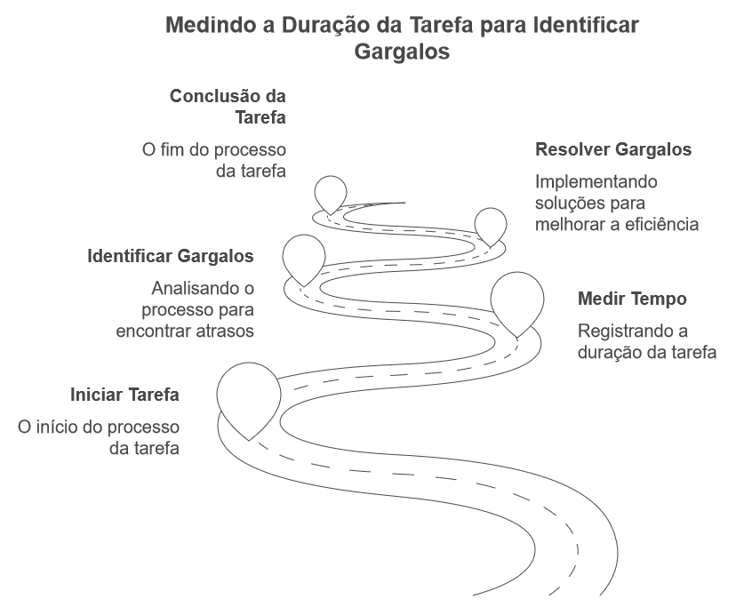
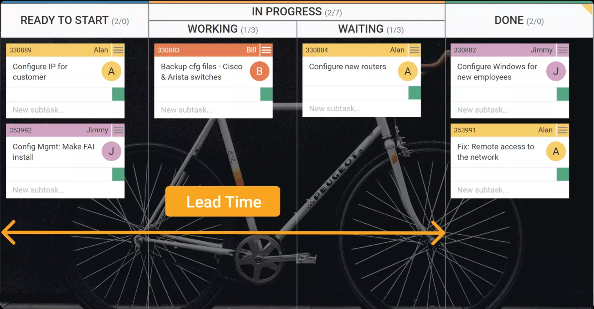

# Cycle Time[↩︎](#_toc000)

$$\large \boxed{\text{Cycle Time} = \text{Data de Conclusão} - \text{Data de Início do Trabalho}}$$

Mede o tempo que uma tarefa leva para ser concluída desde que começa a ser trabalhada. Ideal para medir a eficiência e ajustar os processos.

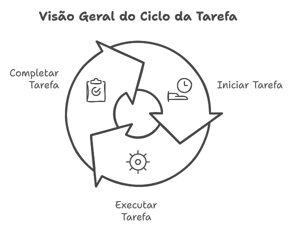
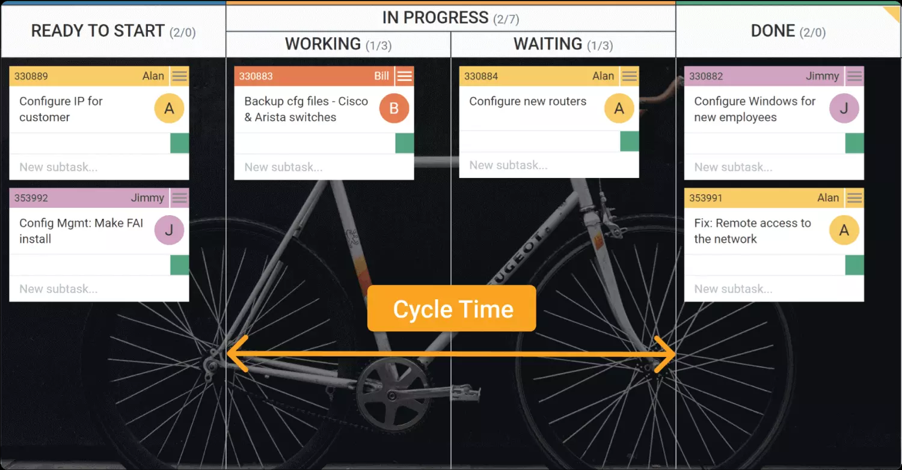
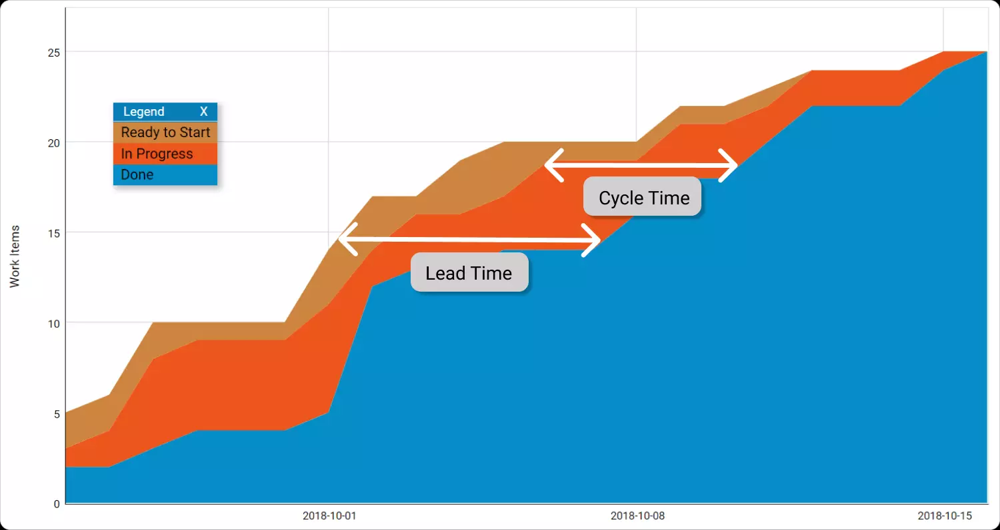

# Throughput[↩︎](#_toc000)

$$\large \boxed{\text{Throughput} = \frac{\text{Total de Tarefas Concluídas}}{\text{Período de Tempo}}}$$

Conta o número de tarefas concluídas em um período específico. Dá uma visão clara da capacidade de entrega da equipe.

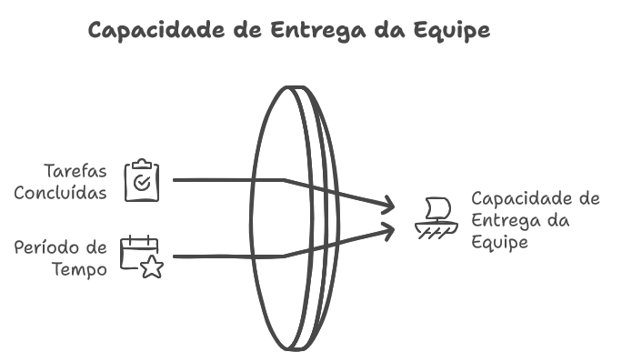

# Blocked Time[↩︎](#_toc000)

$$\large \boxed{\text{Blocked Time} = \text{Data de Desbloqueio} - \text{Data de Bloqueio}}$$

Mede quanto tempo uma tarefa fica bloqueada durante seu ciclo de vida. Ajuda a identificar problemas frequentes que estão atrasando o trabalho.

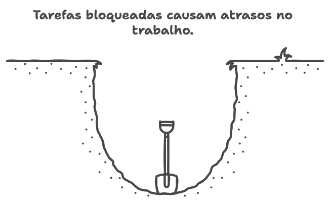

# Defect Rate[↩︎](#_toc000)

$$\large \boxed{\text{Defect Rate} = \frac{\text{Número de Defeitos}}{\text{Total de Unidades}}}$$

Monitora o número de defeitos por unidade de trabalho. Essencial para manter a qualidade.

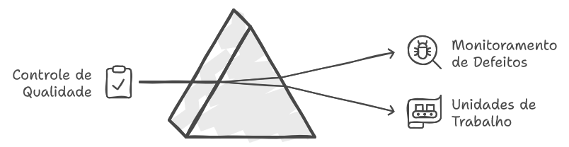

# Time to Market[↩︎](#_toc000)

$$\large \boxed{\text{Time to Market} = \text{Data de Lançamento} - \text{Data de Início do Projeto}}$$

Mede o tempo desde a ideia inicial até a entrega ao cliente. Útil para projetos voltados ao cliente.

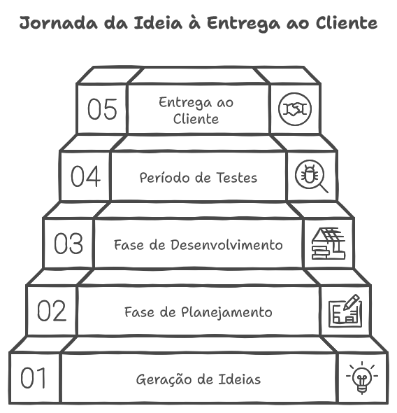

# Customer Satisfaction[↩︎](#_toc000)

$$\large \boxed{\text{Customer Satisfaction} = \frac{\sum \text{Pontuações de Satisfação}}{\text{Número Total de Respondentes}}}$$

Pode ser medido por meio de pesquisas ou feedback direto, refletindo a satisfação do cliente com os entregáveis.

# Employee Engagement[↩︎](#_toc000)

$$\large \boxed{\text{Employee Engagement} = \frac{\sum \text{Pontuações de Engajamento}}{\text{Número Total de Funcionários}}}$$

Avalia o engajamento e a moral da equipe, que podem impactar a produtividade.

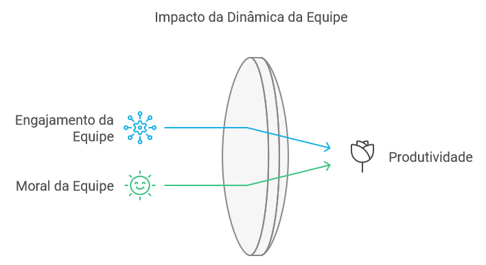

# Cost of Delay[↩︎](#_toc000)

$$\large \boxed{\text{Cost of Delay} = \frac{\text{Valor do Trabalho Não Realizado}}{\text{Tempo de Atraso}}}$$

Calcula o impacto financeiro das tarefas atrasadas, ajudando a priorizar o trabalho de alto valor.

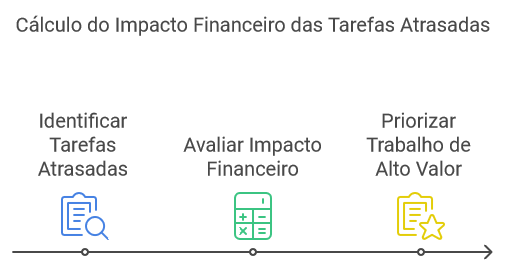

# Discard Rate[↩︎](#_toc000)

$$\large \boxed{\text{Discard Itens} = n}$$

$$\large \boxed{\text{Discard Rate \%} = \frac{\text{Itens Descartados}}{\text{Itens Totais Processados}}* 100}$$

A taxa de descarte é a métrica Kanban que mede o número de opções que são descartadas e, portanto, eliminadas do processo upstream, antes do ponto de compromisso.

# Blockers Rate[↩︎](#_toc000)

$$\large \boxed{\text{Blockers Itens} = n}$$

$$\large \boxed{\text{Blockers Rate \%} = \frac{\text{Itens Bloqueados}}{\text{Itens Totais Processados}}* 100}$$

Dependências e bloqueadores param o fluxo normal de trabalho e introduzem muita variabilidade no sistema. Algo que é evidenciado com uma longa cauda no histograma do Lead Time.

# Flow Efficiency[↩︎](#_toc000)

$$\large \boxed{\text{Flow Efficiency \%} = \frac{\text{Tempo de Trabalho Real}}{\text{Tempo Total de Processamento}}* 100}$$

- Quantifique o Tempo de Trabalho Real (Working Time): Esse é o tempo total que as tarefas estão ativamente sendo trabalhadas.
- Quantifique o Tempo Total de Processamento (Total Time): Esse é o tempo total que as tarefas passam no processo, incluindo o tempo ocioso ou bloqueado.

Aumentar a eficiência do fluxo no Kanban pode levar a melhorias significativas no processo e na entrega dos projetos.

# Little’s Law[↩︎](#_toc000)

$$\large \boxed{\text{AVG WIP} = \text{Throughput} * \text{AVG Cycle Time}}$$

$$\large \boxed{\text{AVG Cycle Time} = \frac{\text{AVG WIP}}{\text{Throughput}}}$$

A Lei de Little explica a relação entre o tamanho da fila, o tempo de espera e o tempo de processamento.