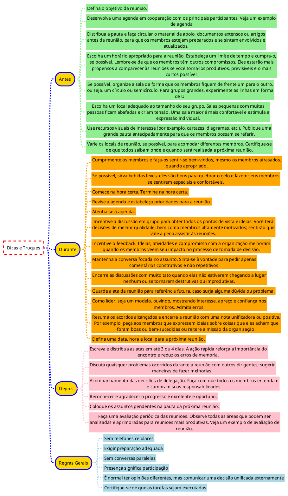

```plantuml
@startmindmap
<style>
node {
    BackgroundColor gold
    HorizontalAlignment center
    LineColor blue
    LineThickness 3.0
    Margin 3
    MaximumWidth 600
    Padding 12
    RoundCorner 40
}

rootNode {
    BackgroundColor white
    LineColor red
    LineStyle 8.0;3.0
    LineThickness 1.0
    RoundCorner 0
    Shadowing 0.0
}

leafNode {
    BackgroundColor gold
    LineColor none
    Padding 3
    RoundCorner 0
}

arrow {
    ;LineStyle 4
    ;LineThickness 0.5
    LineColor blue
    LineThickness 3.0
}
</style>

* Dicas e Truques

<style>
leafNode {
    BackgroundColor lightgreen
}

arrow {
    LineColor lightgreen
}
</style>

** Antes
*** Defina o objetivo da reunião.
*** Desenvolva uma agenda em cooperação com os principais participantes. Veja um exemplo de agenda
*** Distribua a pauta e faça circular o material de apoio, documentos extensos ou artigos antes da reunião, para que os membros estejam preparados e se sintam envolvidos e atualizados.
*** Escolha um horário apropriado para a reunião. Estabeleça um limite de tempo e cumpra-o, se possível. Lembre-se de que os membros têm outros compromissos. Eles estarão mais propensos a comparecer às reuniões se você torná-los produtivos, previsíveis e o mais curtos possível.
*** Se possível, organize a sala de forma que os membros fiquem de frente um para o outro, ou seja, um círculo ou semicírculo. Para grupos grandes, experimente as linhas em forma de U.
*** Escolha um local adequado ao tamanho do seu grupo. Salas pequenas com muitas pessoas ficam abafadas e criam tensão. Uma sala maior é mais confortável e estimula a expressão individual.
*** Use recursos visuais de interesse (por exemplo, cartazes, diagramas, etc.). Publique uma grande pauta antecipadamente para que os membros possam se referir.
*** Varie os locais de reunião, se possível, para acomodar diferentes membros. Certifique-se de que todos saibam onde e quando será realizada a próxima reunião.

<style>
leafNode {
    BackgroundColor orange
}

arrow {
    LineColor orange
}
</style>

** Durante
*** Cumprimente os membros e faça-os sentir-se bem-vindos, mesmo os membros atrasados, quando apropriado.
*** Se possível, sirva bebidas leves; eles são bons para quebrar o gelo e fazem seus membros se sentirem especiais e confortáveis.
*** Comece na hora certa. Termine na hora certa.
*** Revise a agenda e estabeleça prioridades para a reunião.
*** Atenha-se à agenda.
*** Incentive a discussão em grupo para obter todos os pontos de vista e ideias. Você terá decisões de melhor qualidade, bem como membros altamente motivados; sentirão que vale a pena assistir às reuniões.
*** Incentive o feedback. Ideias, atividades e compromisso com a organização melhoram quando os membros veem seu impacto no processo de tomada de decisão.
*** Mantenha a conversa focada no assunto. Sinta-se à vontade para pedir apenas comentários construtivos e não repetitivos.
*** Encerre as discussões com muito tato quando elas não estiverem chegando a lugar nenhum ou se tornarem destrutivas ou improdutivas.
*** Guarde a ata da reunião para referência futura, caso surja alguma dúvida ou problema.
*** Como líder, seja um modelo, ouvindo, mostrando interesse, apreço e confiança nos membros. Admita erros.
*** Resuma os acordos alcançados e encerre a reunião com uma nota unificadora ou positiva. Por exemplo, peça aos membros que expressem ideias sobre coisas que eles acham que foram boas ou bem-sucedidas ou reitere a missão da organização.
*** Defina uma data, hora e local para a próxima reunião.

<style>
leafNode {
    BackgroundColor pink
}

arrow {
    LineColor pink
}
</style>

** Depois
*** Escreva e distribua as atas em até 3 ou 4 dias. A ação rápida reforça a importância do encontro e reduz os erros de memória.
*** Discuta quaisquer problemas ocorridos durante a reunião com outros dirigentes; sugerir maneiras de fazer melhorias.
*** Acompanhamento das decisões de delegação. Faça com que todos os membros entendam e cumpram suas responsabilidades.
*** Reconhecer e agradecer o progresso é excelente e oportuno.
*** Coloque os assuntos pendentes na pauta da próxima reunião.
*** Faça uma avaliação periódica das reuniões. Observe todas as áreas que podem ser analisadas e aprimoradas para reuniões mais produtivas. Veja um exemplo de avaliação de reunião.

<style>
leafNode {
    BackgroundColor lightblue
}

arrow {
    LineColor lightblue
}
</style>

** Regras Gerais
*** Sem telefones celulares
*** Exigir preparação adequada
*** Sem conversas paralelas
*** Presença significa participação
*** É normal ter opiniões diferentes, mas comunicar uma decisão unificada externamente
*** Certifique-se de que as tarefas sejam executadas
@endmindmap
```