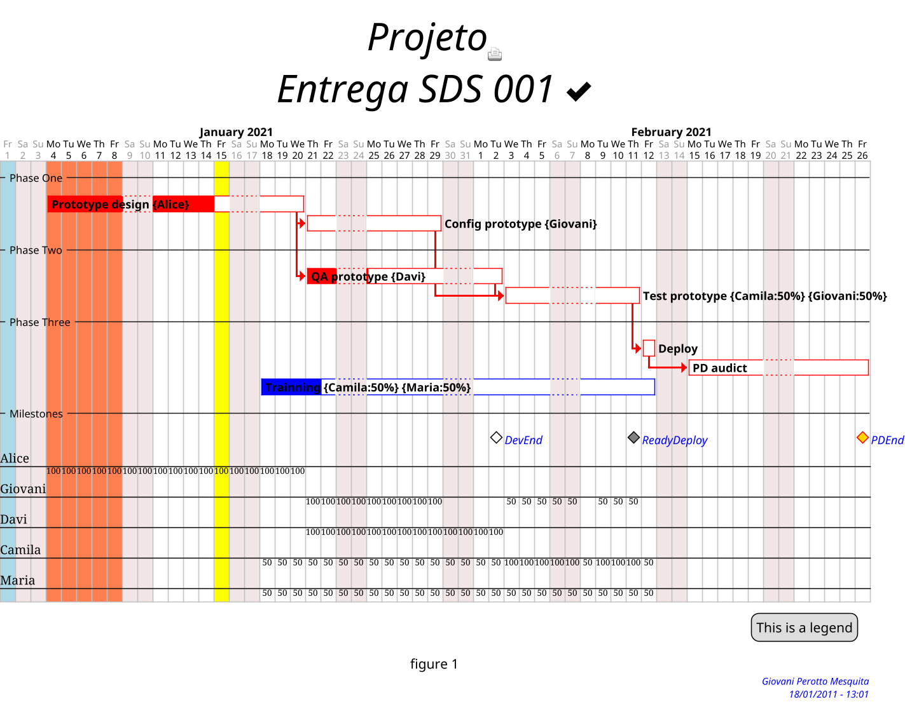

<br>

<div align="center">

<!---
<span style="color:blue;font-size:xxx-large">Building Gant diagrams with [PlantUML](https://plantuml.com/sitemap)</spam><br>
<br>
--->

<br>
by [](mailto:giovanipm@gmail.com)

</div>

<div align="right">

[](https://plantuml.com/)
[](https://web.archive.org/web/20190417093012/http://www.wikicreole.org/wiki/Home)
[](https://graphviz.org/)
<br>Try install using:<br>
[](https://chocolatey.org/install)
<br>To see on Firefox browser:<br>
[](https://www.mozilla.org/pt-BR/firefox/new/)
[](https://addons.mozilla.org/en-US/firefox/addon/plantuml-visualizer/?utm_source=addons.mozilla.org&utm_medium=referral&utm_content=search)
[](https://addons.mozilla.org/en-US/firefox/addon/plantuml-extension/?utm_source=addons.mozilla.org&utm_medium=referral&utm_content=search)

</div>

# Language specification

## Requeriments

- Light [Creole](https://plantuml.com/creole) engine syntax;
- [Common PlantUML commands](https://plantuml.com/commons);
- [Gant PlantUML standards](https://plantuml.com/gantt-diagram)
- [Graphviz](https://graphviz.org/)

## Gant theme customization

```CSS
<style>

  ganttDiagram {

  	task {
  		...
  	}

  	milestone {
  		...
  	}

  	note {
  		...
  	}

  }

  footer {
   ...
  }

  title {
    ...
  }

  legend {
   ...
  }

  caption {
    ...
  }

</style>

skinparam ...
```
- **style** - Looks like CSS format
  - **ganttDiagram**
    - **task**
      - **FontName** *fontname*
      - **FontColor** *[color](https://www.w3.org/TR/css-color-4/#named-colors)*
      - **FontSize** *size*
      - **FontStyle** <ins>(bold|italics|monospaced|stroked|underlined)</ins>
      - **BackGroundColor** *[color](https://www.w3.org/TR/css-color-4/#named-colors)*
      - **LineColor** *[color](https://www.w3.org/TR/css-color-4/#named-colors)*
  	- **milestone**
  		- **FontColor** *[color](https://www.w3.org/TR/css-color-4/#named-colors)*
  		- **FontSize** *size*
  		- **FontStyle** <ins>(bold|italics|monospaced|stroked|underlined)</ins>
  		- **BackGroundColor** *[color](https://www.w3.org/TR/css-color-4/#named-colors)*
  		- **LineColor** *[color](https://www.w3.org/TR/css-color-4/#named-colors)*
  	- **note**
      - **FontColor** *[color](https://www.w3.org/TR/css-color-4/#named-colors)*
      - **FontSize** *size*
      - **LineColor** *[color](https://www.w3.org/TR/css-color-4/#named-colors)*
      - **BackGroundColor** *[color](https://www.w3.org/TR/css-color-4/#named-colors)*
  - **footer**
    - **HorizontalAlignment** <ins>(left|center|right)</ins>
  - **title**
    - **FontColor** *[color](https://www.w3.org/TR/css-color-4/#named-colors)*
    - **FontSize** *size*
    - **FontStyle** <ins>(bold|italics|monospaced|stroked|underlined)</ins>
    - **HorizontalAlignment** <ins>(left|center|right)</ins>
  - **legend**
    - **FontSize** *size*
    - **BackGroundColor** *[color](https://www.w3.org/TR/css-color-4/#named-colors)*
    - **Margin** *number*
    - **Padding** *number*
  - **caption**
    - **FontSize** *size*
- **skinparam** - Parameters
    - **footerFontColor** *[color](https://www.w3.org/TR/css-color-4/#named-colors)*
    - **footerFontSize** *size*
    - **footerFontStyle** <ins>(bold|italics|monospaced|stroked|underlined)</ins>
    - **titleBackgroundColor** *[color](https://www.w3.org/TR/css-color-4/#named-colors)*
    - **titleBorderColor** *[color](https://www.w3.org/TR/css-color-4/#named-colors)*
    - **titleBorderRoundCorner** *number*
    - **titleBorderThickness** *number*

<div align="center">:star2:</div>

## Project initialization

- **title**<br>
Defines the title of Gant graph, to be showed above the graph.
>**title** *string*
>- - -
> ex.:<br>
>    title My first\nProject<br>

|Before|After|
| :----: | :----: |
|  |  |
- - -
- **footer**<br>
Defines the footer message, to be showed under the graph.
>**footer** *string*
>- - -
>ex.:<br>
>    footer Giovani Perotto Mesquita\n18/01/2011 - 13:01<br>

|Before|After|
| :----: | :----: |
|  |  |
- - -
- **scale**<br>
Defines the start scale, to be showed. Useful when you need print, or show the graph.
>**scale** *factor*<br>
>or <br>
>**scale** *fraction*<br>
>or <br>
>**scale** *number* **width**<br>
>or <br>
>**scale** *number* **height**<br>
>or <br>
>**scale** _number_**\***_number_<br>
>or <br>
>**scale max** *number* **width**<br>
>or <br>
>**scale max** *number* **height**<br>
>plantuml<br>
>- - -
>ex.:<br>
>    scale 1.5<br>
>    scale 2/3<br>
>    scale 200 width<br>
>    scale 200 height<br>
>    scale 200*100<br>
>    scale max 300*200<br>
>    scale max 1024 width<br>
>    scale max 800 height<br>

|Before|After|
| :----: | :----: |
|  |  |
- - -
- **hide**<br>
Hides the bottom time information under the graph, does not affect the time information on the top.
>**hide footbox**
>- - -
>ex.:<br>
>    hide footbox<br>

|Before|After|
| :----: | :----: |
|  |  |
- - -
- **printscale**<br>
Useful for condesing the Gant graph timeline, useful for large projects.
>**printscale** <ins>(diary|weekly|monthly)</ins><br>
>- - -
>ex.:<br>
>    printscale monthly<br>

|Before|After|
| :----: | :----: |
|  |  |
- - -
- **project**<br>
Defines when the project starts.
>**project starts the** *date*<br>
>- - -
>ex.:<br>
>    project starts the 2021/01/01<br>

|Before|After|
| :----: | :----: |
| |  |
- - -
- **caption**<br>
Defines the graph caption, useful when need export to a document.
>**caption** *description*
>- - -
>ex.:<br>
>    caption figure 1<br>

|||
| :----: | :----: |
|Before|  |
|After|  |
- - -
- **today**<br>
Defines the current day to be showed in the graph.
>**today is** *date* **and is colored in** *[color](https://www.w3.org/TR/css-color-4/#named-colors)*<br>
>or<br>
>**today is** *day(s)* **days after start and is colored in** *[color](https://www.w3.org/TR/css-color-4/#named-colors)*
>- - -
>ex.:<br>
>    today is 2021/01/20 and is colored in Yellow<br>
>or<br>
>    today is 14 days after start and is colored in Yellow<br>

|||
| :----: | :----: |
|Before|  |
|After|  |

<div align="center">:star2:</div>

## Comments

- **comment**<br>
Defines a line comment in the graph script, do not affect the graph showed.
>**'** *comment*
>- - -
>ex.:<br>
>    ' Comentary<br>

<div align="center">:star2:</div>

## Legends

- **legend**<br>
Defines a legend.
>**legend** (left|right|top|bottom|center)<br>
>  ...<br>
>**endlegend**<br>
>- - -
>ex.:<br>
>    legend right<br>
>      Short<br>
>      legend<br>
>    endlegend<br>

|||
| :----: | :----: |
|Before|  |
|After|  |

<div align="center">:star2:</div>

## Coloring columns date

- **colored**<br>
Useful to make in evidence some columns in the graph.
>*date* **is colored in** *[color](https://www.w3.org/TR/css-color-4/#named-colors)*<br>
>or<br>
>*date* **to** *date* **are colored in** *[color](https://www.w3.org/TR/css-color-4/#named-colors)*<br>
>- - -
>ex.:<br>
>    2021/01/01 is colored in lightblue<br>
>    2021/01/01 to 2021/01/10 are colored in lightblue<br>

|||
| :----: | :----: |
|Before|  |
|After|  |

<div align="center">:star2:</div>

## Sprites

- **user sprite**<br>
Useful to put some image in the graph.
>**sprite $**_name_ **[**_size_**]** _sprite-code_
>- - -
>ex.:<br>
>    sprite $printer [15x15/8z] NOtH3W0W208HxFz_kMAhj7lHWpa1XC716sz0Pq4MVPEWfBHIuxP3L6kbTcizR8tAhzaqFvXwvFfPEqm0<br>

|||
| :----: | :----: |
|Before|  |
|After|  |

<div align="center">:star2:</div>

## Close days

- **closed**<br>
Defines the days which not be used on the graph.
><ins>(sunday|monday|tuesday|wednesday|thursday|friday|saturday)</ins> **are closed**<br>
>or<br>
>*date* **is closed**<br>
>or<br>
>*date* to *date* **are closed**<br>
>- - -
>ex.:<br>
>    saturday are closed<br>
>    sunday are closed<br>
>    2021/01/01 is closed<br>
>    2021/01/04 to 2021/01/08 are closed<br>

|||
| :----: | :----: |
|before|  |
|after|  |

<div align="center">:star2:</div>

## Separators

- **-- ... --**<br>
Defines separators in the graph, useful to segregade phases, sectors, groups or others.
>**--** *name* **--**
>- - -
>ex.:<br>
>    -- Phase One --<br>

|||
| :----: | :----: |
|before|  |
|after|  |

<div align="center">:star2:</div>

## Tasks

- **task**<br>
Defines the graph tasks.
    - **dinamic**<br>
    These tasks will be sequenced autocmatly using the project starts and the task flow.
    >[*taskname*] **lasts** *day(s)* **days**
    >- - -
    >ex.:<br>
    >    [PlantUML1] lasts 13 days<br>
    - **fixed**<br>
    These tasks have a fixed beginning and end.
    >[*taskname*] **starts** *date*<br>
    >[*taskname*] **ends** *date*
    >- - -
    >ex.:<br>
    >    [PlantUML2] starts 2021/01/18<br>
    >    [PlantUML2] ends 2021/02/12

|||
| :----: | :----: |
|before|  |
|after|  |

- - -
- **colored**<br>
Defines the task line and it background colors.
>[*taskname*] **is colored in** *[color](https://www.w3.org/TR/css-color-4/#named-colors)* **/** *[color](https://www.w3.org/TR/ss-color-4#named-colors)*<br>
>- - -
>ex.:
>    [PlantUML1] is colored in Red/Red

|||
| :----: | :----: |
|before|  |
|after|  |
- - -
- **completed**<br>
Defines how much progress occur in the task, the percent will be showed in backgroud color.
>[*taskname*] **is** *%* **completed**
>- - -
>ex.:
>    [PlanUML1] is 70% completed

|||
| :----: | :----: |
|before|  |
|after|  |
- - -
- **links**<br>
Useful to redirect from the task to out of the graph.
>[*taskname*] **links to** [[*link*]]
>- - -
>ex.:<br>
>    [PlantUML1] links to [[http://plantuml.com]]<br>
- - -
- **resource**<br>
Defines who will do the task and how much effort will be necessary. Under the graph wil be showed the resources and how nuch allocation used.
>[*taskname*] **on {** *user* **:** *%* **} lasts** *day(s)* **days**
>- - -
>ex.:<br>
>    [PlantUML1] on {User1:50}{User2:50} lasts 6 days<br>

|||
| :----: | :----: |
|before|  |
|after|  |
- - -
- **pause**<br>
Defines a pause in the task, there is a semantic difference between "pause" and "closed days". "Pause" denotes a task suspension, in the other way "closed days" inform the date is not available to work in the whole project.
>[*taskname*] **pause on** <ins>(sunday|monday|tuesday|wednesday|thursday|friday|saturday)</ins><br>
>or<br>
>[*taskname*] **pause on** *date*
>- - -
>ex.:<br>
>    [PlantUML1] pauses on monday<br>
>or<br>
>    [PlantUML1] pauses on 2021/01/12<br>

|||
| :----: | :----: |
|before|  |
|after|  |
- - -
- **note**<br>
Defines a note to be showed under the task, useful to bring more information.
>**note bottom**<br>
>*...*<br>
>**end note**
>- - -
>ex.:<br>
>    note bottom<br>
>      memo1 ...<br>
>      memo2 ...<br>
>      explanations1 ...<br>
>      explanations2 ...<br>
>    end note<br>

|||
| :----: | :----: |
|before|  |
|after|  |

<div align="center">:star2:</div>

## Flows

- **link**<br>
Defines which task will succeded after other.
>[*taskname*] **starts at** [*taskname*]**'s end**<br>
>or<br>
>[*taskname*] **starts at** [*taskname*]**'s end with** *[color](https://www.w3.org/TR/css-color-4/#named-colors)* <ins>(bold|dashed|dotted)</ins> **link**
>- - -
>ex.:<br>
>    [PlantUML2] starts at [PlantUML1]'s end<br>
>or<br>
>    [PlantUML2] starts at [PlantUML1]'s end with red bold link<br>

|||
| :----: | :----: |
|before|  |
|after|  |

<div align="center">:star2:</div>

## Milestones

- **milestone**<br>
Defines gant milestones.
>[*milestonename*] **happens at** [*taskname*]**'s end**
>- - -
>ex.:
>    [Milestone1] happens at [PlantUML1]'s end

|||
| :----: | :----: |
|before|  |
|after|  |

<div align="center">:star:</div>
<div align="center">:star::star:</div>

# Example

