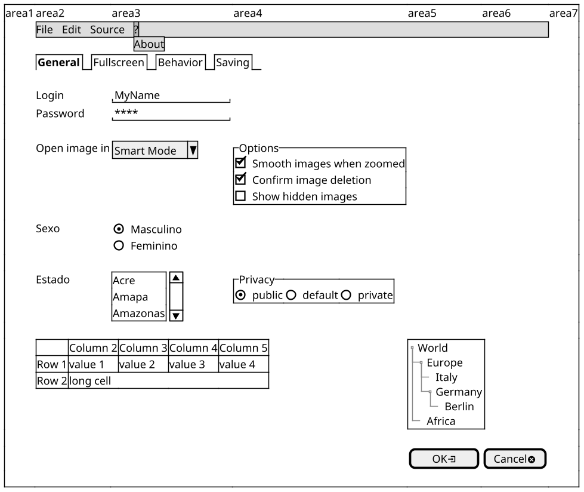

<div align="center">

<br>
by [](mailto:giovanipm@gmail.com)

</div>

<div align="right">

[](https://plantuml.com/)
[](https://web.archive.org/web/20190417093012/http://www.wikicreole.org/wiki/Home)
[](https://graphviz.org/)
<br>Try install using:<br>
[](https://chocolatey.org/install)
<br>To see on Firefox browser:<br>
[](https://www.mozilla.org/pt-BR/firefox/new/)
[](https://addons.mozilla.org/en-US/firefox/addon/plantuml-visualizer/?utm_source=addons.mozilla.org&utm_medium=referral&utm_content=search)
[](https://addons.mozilla.org/en-US/firefox/addon/plantuml-extension/?utm_source=addons.mozilla.org&utm_medium=referral&utm_content=search)

</div>

# Language specification

## Requeriments

- Light [Creole](https://plantuml.com/creole) engine syntax;
- [Common PlantUML commands](https://plantuml.com/commons);
- [Salt PlantUML standards](https://plantuml.com/salt)
- [Graphviz](https://graphviz.org/)

## Salt Wireframe

### Basic Widget

- **Text**
  create a text representation.
  >_string_
  >- - -
  >ex.:<br>
  >```dos
  >  This is a text
  >```

  

- **Button**
  create a button representation.
  >**[**_string_**]**
  >- - -
  >ex.:<br>
  >```dos
  >  [This is my button]
  >```

  

- **Radio Button**
  create a radio button representation.
  >**()** _string_<br>
  >or<br>
  >**(X)** _string_<br>
  >- - -
  >ex.:<br>
  >```dos
  >  ()  Unchecked radio
  >  (X) Checked radio
  >```

  

- **Check Box**
  create a check box representation.
  >**[]** _string_<br>
  >or<br>
  >**[X]** _string_<br>
  >- - -
  >ex.:<br>
  >```dos
  >  []  Unchecked box
  >  [X] Checked box
  >```

  

- **Input Box**
  create a input box representation.
  >**"**_string_**"**<br>
  >- - -
  >ex.:<br>
  >```dos
  >  "Enter text here   "
  >```

  

- **Droplist**
  create a input box representation.
  >**^**_string_**^**<br>
  >- - -
  >ex.:<br>
  >```dos
  >  ^This is a droplist^
  >```

  

### Using Grid

Manage colunms to show and organize like a table, in a screen could be used in the aligment of the widgets or even other grids.<br>

- **Grid**
  A table is automatically created when you use an opening bracket **{**. And you have to use **|** to separate columns.<br>
  >**{ | | | }**<br>
  >- - -
  >ex.<br>
  >```dos
  >{
  >  Login    | "MyName   "
  >  Password | "****     "
  >  [Cancel] | [  OK   ]
  >}
  >```

  

- **Show Lines**
  Just after the opening bracket, you can use a character to define if you want to draw lines or columns of the grid<br>
  >|Symbol|Result|
  >|:----:|------|
  >|#| To display all vertical and horizontal lines|
  >|!|	To display all vertical lines|
  >|-|	To display all horizontal lines|
  >|+|	To display external lines|
  >- - -
  >ex.<br>
  >```dos
  >{+
  >  Login    | "MyName   "
  >  Password | "****     "
  >  [Cancel] | [  OK   ]
  >}
  >```

  

- **Group Box**
  Create a group box representation<br>
  >**{^"**_string_**"** ... **}**<br>
  >- - -
  >ex.<br>
  >```dos
  >{^"My group box"
  >  Login    | "MyName   "
  >  Password | "****     "
  >  [Cancel] | [  OK   ]
  >}
  >```

  

- **Scroll Bars**
  You can use {S notation for scroll bar<br>
  >**{S** _..._ **}**<br>
  >|Symbol|Result|
  >|:----:|------|
  >|S| for horizontal and vertical scrollbars|
  >|SI|	for vertical scrollbar only|
  >|S-|	for horizontal scrollbar only|
  >- - -
  >ex.<br>
  >```dos
  >{S
  >  Message
  >  .
  >  .
  >  .
  >  .
  >}
  >```

  

- **Line separators**
  You can use several horizontal lines as separator.<br>
  >|Symbol|Result|
  >|:----:|------|
  >|..| Dot line|
  >|==|	Double line|
  >|~~|	Strong line|
  >|--|	Normal line|
  >- - -
  >ex.<br>
  >```dos
  >{
  >  Text1
  >  ..
  >  "Some field"
  >  ==
  >  Note on usage
  >  ~~
  >  Another text
  >  --
  >  [Ok]
  >}
  >```

  

- **Tree**
  To have a Tree, you have to start with {T and to use + to denote hierarchy.<br>
  >**{T** ... **}**<br>
  >- - -  
  >ex.<br>
  >```dos
  >{T
  >   + World
  >   ++ America
  >   +++ Canada
  >   +++ USA
  >   ++++ New York
  >   ++++ Boston
  >   +++ Mexico
  >   ++ Europe
  >   +++ Italy
  >   +++ Germany
  >   ++++ Berlin
  >   ++ Africa
  >}
  >``` 

  

- **Tree table**
 You can combine trees with tables.<br>
  >**{T | | }**<br>
  >- - -  
  >ex.<br>
  >```dos
  >{T
  >  +Region        | Population    | Age
  >  + World        | 7.13 billion  | 30
  >  ++ America     | 964 million   | 30
  >  +++ Canada     | 35 million    | 30
  >  +++ USA        | 319 million   | 30
  >  ++++ NYC       | 8 million     | 30
  >  ++++ Boston    | 617 thousand  | 30
  >  +++ Mexico     | 117 million   | 30
  >  ++ Europe      | 601 million   | 30
  >  +++ Italy      | 61 million    | 30
  >  +++ Germany    | 82 million    | 30
  >  ++++ Berlin    | 3 million     | 30
  >  ++ Africa      | 1 billion     | 30
  >}
  >```
  >or
  >```dos
  >{
  >  ..
  >  == with T!
  >  {T!
  >  +Region        | Population    | Age
  >  + World        | 7.13 billion  | 30
  >  ++ America     | 964 million   | 30
  >  }
  >  ..
  >  == with T-
  >  {T-
  >    +Region        | Population    | Age
  >    + World        | 7.13 billion  | 30
  >    ++ America     | 964 million   | 30
  >  }
  >  ..
  >  == with T+
  >  {T+
  >    +Region        | Population    | Age
  >    + World        | 7.13 billion  | 30
  >    ++ America     | 964 million   | 30
  >  }
  >  ..
  >  == with T#
  >  {T#
  >    +Region        | Population    | Age
  >    + World        | 7.13 billion  | 30
  >    ++ America     | 964 million   | 30
  >  }
  >  ..
  >}
  >```

  
  <br>or<br>
  

- **Advanced table**
  >**{# | | }**<br>
  >|Symbol|Result|
  >|:----:|------|
  >|*| to indicate that a cell with span with left|
  >|.| to denotate an empty cell|
  >- - -  
  >ex.<br>
  >```dos
  >{#
  >  . | Column 2 | Column 3
  >  Row header 1 | value 1 | value 2
  >  Row header 2 | A long cell | *
  >}
  >``` 

  

- **Enclosing brackets**
  You can define subelements by opening a new opening bracket.<br>
  >**{# | { | | } | }**<br>
  >- - -  
  >ex.<br>
  >```dos
  >{
  >  Name         | "                 "
  >  Modifiers:   | { (X) public | () default | () private | () protected
  >                  [] abstract | [] final   | [] static }
  >  Superclass:  | { "java.lang.Object " | [Browse...] }
  >}
  >``` 

  

### Adding tabs

- **Tabs**
  You can add tabs using {/ notation. Note that you can use HTML code to have bold text.<br>
  >**{/ | | }**
  >- - -
  >ex.<br>
  >```dos
  >{+
  >  {/ <b>General | Fullscreen | Behavior | Saving }
  >  {
  >    { Open image in: | ^Smart Mode^ }
  >    [X] Smooth images when zoomed
  >    [X] Confirm image deletion
  >    [ ] Show hidden images
  >  }
  >  [Close]
  >}
  >```  

  

- **Vertical Tabs**
  You can add tabs using {/ notation. Note that you can use HTML code to have bold text.<br>
  >**{/<br>
  >  ...<br>
  >  ...<br>
  >} |**
  >- - -
  >ex.<br>
  >```dos
  >{+
  >  {/ <b>General
  >     Fullscreen
  >     Behavior
  >     Saving } |
  >  {
  >    { Open image in: | ^Smart Mode^ }
  >    [X] Smooth images when zoomed
  >    [X] Confirm image deletion
  >    [ ] Show hidden images
  >  }
  >  [Close]
  >}
  >```  

  

### Using menu

- **Menus**
  You can add a menu by using {* notation. 
  >**{\* | | }**
  >- - -
  >ex.<br>
  >```dos
  >{+
  >  {* File | Edit | Source | Refactor }
  >  {
  >    { Open image in: | ^Smart Mode^ }
  >    [X] Smooth images when zoomed
  >    [X] Confirm image deletion
  >    [ ] Show hidden images
  >  }
  >  [Close]
  >}
  >```  

  

- **Open Menus**
  >**{\* | | }**
  >- - -
  >ex.<br>
  >```dos
  >{+
  >  {* File | Edit | Source | Refactor
  >     File | New | Open File | - | Close | Close All }
  >  {
  >    { Open image in: | ^Smart Mode^ }
  >    [X] Smooth images when zoomed
  >    [X] Confirm image deletion
  >    [ ] Show hidden images
  >  }
  >  [Close]
  >}
  >```  

  

### OpenIconic

- **OpenIconic**
  OpenIconic is a very nice open source icon set. Those icons have been integrated into the creole parser, so you can use them out-of-the-box. You can use the following syntax: <&ICON_NAME>.<br>
  ```plantuml
    @startuml
    listopeniconic
    @enduml
  ```
  >**<**_icon name_**>**
  >- - -
  >ex.<br>
  >```dos
  >{
  >  Login<&person> | "MyName   "
  >  Password<&key> | "****     "
  >  [Cancel <&circle-x>] | [OK <&account-login>]
  >}
  >```  

  

### Pseudo sprite

- **Pseudo sprite**
  Using << and >> you can define a pseudo-sprite or sprite-like drawing and reusing it latter. <br>
  >**<<**_sprite name_<br>
  >  ............<br>
  >  .XXXXX......<br>
  >  .X...X......<br>
  >  .XXXXXXXXXX.<br>
  >  .X........X.<br>
  >  .X........X.<br>
  >  .X........X.<br>
  >  .X........X.<br>
  >  .XXXXXXXXXX.<br>
  >  ............<br>
  >  **>>**<br>
  >- - -
  >ex.<br>
  >```dos
  >{
  >  <<folder
  >    ............
  >    .XXXXX......
  >    .X...X......
  >    .XXXXXXXXXX.
  >    .X........X.
  >    .X........X.
  >    .X........X.
  >    .X........X.
  >    .XXXXXXXXXX.
  >    ............
  >  >>
  >  reusing
  >  <<folder>>
  >}
  >```  

  

- **Convert image to sprite**
  How convert a image to sprite.<br>
  1. Get some image
  2. Reduce to  the color to **B/W**
  3. Change the resolution: horizontal to **50%** and stay with vertical in **100%**
  4. Change the file resolution so that it has a maximum size of **500 Kb**
  5. Go to website [Convert Images to Ascii Art](https://manytools.org/hacker-tools/convert-images-to-ascii-art "Convert Images to Ascii Art")
  6. Click the button **Browse...** and select your image
  7. In **Width of output (in characters, max 200)** put 200
  8. Click in the button **Convert!**
  9. Click in the button **Download ASCII (.TXT)**
  10. Open the downloaded file
  11. Replace all different character of **space** (!@#$%^&*()_+-=/\,.:;) by **X** (x in uppercase)
  12. Replace all **space** character to **.** (point)
  13. Save the downloaded file
  14. Get the content of downloaded file, and use as content in your sprite definition

  Ex.:
  ||||
  |:----:|:----:|:----:|
  | ![example](http://www.plantuml.com/plantuml/png/xTrHYXj74CRnzpw5Jr0dCCR7gDU5c11m4l3kMyZTys86zaEb_topLMuXKWz1JAQhwkTMhuH6q_hw-lRou-trvVlR-lJF-lJvy-y_lltvnzyhXYD_HWp732JlnnXadZ3FMIE63PhLhzXZMKC8__JTaCijDLjMfs9-_0oafuacoXgkxvwKyn2dTDwFVWj3YE4QperiXm233H2SUWu2NMoZh2w6Bw4iFH1mw46V8gDyYWT1XXwo6982A0qGBiWKOXIPco30a0Yoy9a-XI7aAFe32wN8gvBLm2WiG8tpq3R8MKPHjJXeFFEQ8FuIeB0NKGS46201Hz-ah6678G6A0G570yEIf2LPOmw8PWb0V0Oxh6pd9MlGqV_qOiYyOrgoJZgotn7P8m58ieCXBP9a2KD67QsIjTFHALaTZdw8BrbR7OsIjTVH9rbTZca8ITPcHvk48F4ma70XUkAWmozGInOv8Xu24W6ITSTXB9I88KdT3qDkV2RhGjwDU_z8pZUoQpjt8JeG9LLVyiPJ7ZYGkXs1L0vfqe147928p7p_A28SYTHNIGrHXnuWo27usM--rqGO42ckhXfIzKtrmeFe2CvSoMg8Ea3YGb8kwm0aecwcXgYZfZ145xj2aY5QaoGBdrZIB3lqpo-laO3fi27guCm0YOXJaE1Y95au8PmT8FpdDy9X4AHmq2MpeYbP3ySX65CpIB9qGgnhC03HelLxrxe2GL8WKhJrSbB3HJ6UakLDY5RhWm13euIeyombkY26Gbgj87akOYAC-WL4b1ieo80fKKYa4-CA0m8JWh53eV_iFcJCShbg2SbhqQ_W48Wn8H23282aG21ljwQdr1I4EBrL1AA-_U5FYK3Qopm1969UygmGcQQ-6ZaeaQO5qbiZSr8YNKz1Zlnx8EsEVWb1fbVc_29PaSy7gKvyb8xl7gyXrdr3-3Qh_iHA3jCjLox4lq7bAYHAI97FWbovC_qy9002jUv0ZET73Obs24m-GwhE0H9N8747WXz40gI0utAaLoJjcI0rMrej815sgmOaRKWMZGX4PgWOJwtw43scaA8FFLf3Yl7P1icFGTA65D432OR0rKM6aACVaXOa9o5XGEIY8a3obqBu1L4X4UEGO4WH-KiXOKESrsu38aVsGyI147dG1uac27vreXy2Rr4kG-8Q9Az1qeCKRSW99kG014E28P4Ln7-BSWKI5o5n3v8F2CcFGaHYGCA4QFV-kr-2sAswa8mZ418N8BKaDa2WZvCGSHkG8Wf85X0vgtO815wTso4946X48UMdyJS7Ru0KsPpB2ZV6xe1anG18ASaQ8X8FaWJ9h1aCqHIv9RYHg23REzv_URe__eSymtTH9h-CeZ4r8HEGE1FJaEWdZ6cYW1p0ViICPk3BcV7H6814lsB84WeHIRzYo49VAOz-nGWb2eWWkndz5hxj8an6ZoXDIdH0f6WBHD8Q4o8GaXICHWXGO49yY9HgafJvVOXAaD4D0GeuJ8YMw8Te6LuX2b49Cmg8tWMgDM_AeHHF24CuDq1Ixtgz0O5oXQE0WAJ8gnAzILh_4pe0ixgtWOlHOBYGA25CqGRxjae0oD4zG1o9EYg8If2X4baP1-dGPDOEfjIxS8047G3HH-LE2I1HHmrHA3EEu3KYUHYYoM-uWY1PeL1YGhpaHMi2AIHGoOOSppG3KlLZxA_53fKe9ANpp128axvq2AIOjlmO93eWMNK84F_QoFoD-3BW-NS5B2Jza7w7GlP8EXm06PQOsS7n-9koIYicHEI-fD_1s-JsI-RdWo4icOUmWo7zadu7G-ObWuvONAXVCl534Qlv9o9oti6GUScS8zRqpwZq_vGAGA1WiwHvEgP-esTeEW2oGTBYy26HGF4KGpiFhkxD1s53J2y5Cm32anAaEDyc_l_X7wqBVaQWXHdi88XFGGMVN9JhXKHHpc001MhrGEhqr_SyqWJ0Q8401Hb08KO_XBV7yC8h090kIbu9Wz4AuPiQZA2y_H2a-1Z8sGi12jHb0QJp8JsMpObMLmUPyoa8qcV9_h5p45uC_MD68Rom_HEtG_g_L3yAuPWr0AGz-Wrx8E29eLYVldnP_wwlt_xwxVNb-zj_) |  |  |
  ||||

## Using Salt with other graphs in PlantUML

- **salt**
  Could be used in other graphs, using the command salt.
  > **{{ salt {**<br>
  > ..<br>
  > **}**<br>
  > **}}**<br>
  >- - -
  >ex.<br>
  >```dos
  >{
  >  @startuml
  >  rectangle r as "
  >    Text as top
  >    ..
  >    {{
  >      salt
  >      {
  >        {T+
  >          <&folder>Folder1
  >        }
  >      }
  >    }}
  >  "
  >  @enduml
  >}
  >```  

  
  <br>or<br>
  ```plantuml
  @startuml
  foo->Bar
  legend left
  {{
  salt
  {
    Login    | "MyName   "
    Password | "****     "
    [Cancel] | [  OK   ]
  }
  }}
  end legend
  @enduml
  ```
  <br>or<br>
  ```plantuml
  @startuml
  class foo
  note left
  {{
  salt
  {
    Login    | "MyName   "
    Password | "****     "
    [Cancel] | [  OK   ]
  }
  }}
  end note
  @enduml
  ```

## Example


