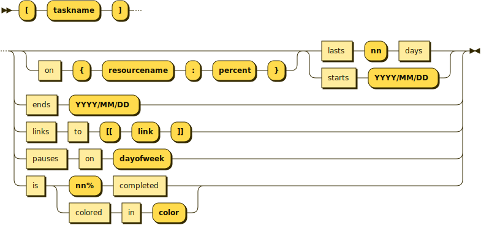
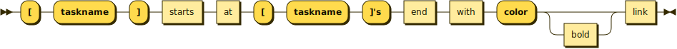
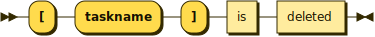

**watching:**


```
watching ::= today is ( ( 'YYYY/MM/DD' | 'nn' days after starts ) and is )? colored in 'color'
```

**closed:**


```
closed   ::= ( 'YYYY/MM/DD' ( to 'YYYY/MM/DD' )? is | 'dayofweek' are ) closed
```

referenced by:

* closed

**colored:**


```
colored  ::= 'YYYY/MM/DD' ( to 'YYYY/MM/DD' are | is ) colored in 'color'
```

referenced by:

* colored
* task
* watching

**task:**



```
task     ::= '[' 'taskname' ']' ( ( on '{' 'resourcename' ':' 'percent' '}' )? ( lasts 'nn' days | starts 'YYYY/MM/DD' ) | ends 'YYYY/MM/DD' | links to '[[' 'link' ']]' | pauses on 'dayofweek' | is colored in 'color' )
```

**flow:**



```
flow     ::= '[' 'taskname' ']' starts at '[' 'taskname' ']' "'s" end with 'color' bold? link
```

## 
 <sup>generated by [RR - Railroad Diagram Generator][RR]</sup>

[RR]: https://www.bottlecaps.de/rr/ui