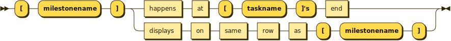

**closed:**


```
closed   ::= ( 'YYYY/MM/DD' ( to 'YYYY/MM/DD' )? is | 'dayofweek' are ) closed
```

referenced by:

* closed

**colored:**


```
colored  ::= 'YYYY/MM/DD' ( to 'YYYY/MM/DD' are | is ) colored in 'color'
```

referenced by:

* colored
* task
* watching

**deleted:**


```
deleted  ::= '[' 'taskname' ']' is deleted
```

referenced by:

* deleted

**divider:**


```
divider  ::= '--' 'phasename' '--'
```

**flow:**


```
flow     ::= '[' 'taskname' ']' starts at '[' 'taskname' "]'s" end with 'color' bold? link
```

**milestone:**



```
milestone
         ::= '[' 'milestonename' ']' ( happens at '[' 'taskname' "]'s" end | displays on same row as '[' 'milestonename' ']' )
```

**task:**


```
task     ::= '[' 'taskname' ']' ( ( on '{' 'resourcename' ':' 'percent' '}' )? ( lasts 'nn' days | starts 'YYYY/MM/DD' ) | ends 'YYYY/MM/DD' | links to '[[' 'link' ']]' | pauses on 'dayofweek' | is ( 'nn%' completed | colored in 'color' ) )
```

**watching:**


```
watching ::= today is ( ( 'YYYY/MM/DD' | 'nn' days after starts ) and is )? colored in 'color'
```

**end:**


```
end      ::=
```

referenced by:

* flow
* milestone

## 
 <sup>generated by [RR - Railroad Diagram Generator][RR]</sup>

[RR]: https://www.bottlecaps.de/rr/ui