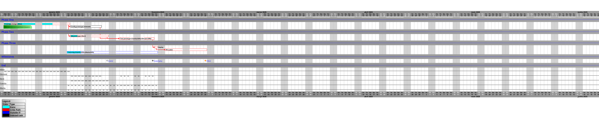

```plantuml
@startgantt
' *************************************************************************
' **                        Style Section                                **
' *************************************************************************
' colors
''
'' Colors taken from the css file of the BS theme
''
!$BLUE = "#446e9b"
!$INDIGO = "#6610f2"
!$PURPLE = "#6f42c1"
!$PINK = "#e83e8c"
!$RED = "#cd0200"
!$ORANGE = "#fd7e14"
!$YELLOW = "#d47500"
!$GREEN = "#3cb521"
!$TEAL = "#20c997"
!$CYAN = "#3399f3"
!$WHITE = "#ffffff"
!$GRAY = "#777777"
!$GRAYDARK = "#333333"
!$PRIMARY = "#446e9b"
!$SECONDARY = "#999999"
!$SUCCESS = "#3cb521"
!$INFO = "#3399f3"
!$WARNING = "#d47500"
!$DANGER = "#cd0200"
!$LIGHT = "#eeeeee"
!$DARK = "#333333"

' Styles
<style>

  ganttDiagram {
  	task {
  		FontName Tahoma
  		FontColor black
  		FontSize 10
  		FontStyle bold
  		BackGroundColor Aqua
  		LineColor black
  	}
    'undone {
    '  BackGroundColor red
    '}
  	milestone {
      FontName Tahoma
  		FontColor blue
  		FontSize 10
  		FontStyle italic
  		BackGroundColor gold
  		LineColor red
  	}
	  separator {
      FontName Tahoma
		  LineColor blue
		  BackGroundColor gray\white
		  FontSize 16
		  FontStyle bold
		  FontColor blue
	  }
  	note {
      FontName Tahoma
  		FontColor DarkGreen
  		FontSize 10
  		LineColor lightgreen
      BackGroundColor green\lightgreen
  	}
    timeline {
	    BackgroundColor gray\lightgray
      FontStyle bold
	  }
	  closed {
		  FontColor white
      BackGroundColor lightgray
	  }
  }
  footer {
    HorizontalAlignment right
  }
  title {
    FontName Tahoma
    FontColor blue
    FontSize 40
    FontStyle italic
    HorizontalAlignment center
  }
  legend {
    BackGroundColor gray\white
    FontName Tahoma
    FontStyle bold
    LineColor gray
    BorderRoundCorner 8
	  BorderThickness 1
  }

</style>

skinparam footerFontColor blue
skinparam footerFontSize 10
skinparam footerFontStyle italic
'skinparam titleBackgroundColor Aqua-CadetBlue
'skinparam titleBorderColor blue
'skinparam titleBorderRoundCorner 15
'skinparam titleBorderThickness 2

' sprites
sprite $printer [15x15/8z] NOtH3W0W208HxFz_kMAhj7lHWpa1XC716sz0Pq4MVPEWfBHIuxP3L6kbTcizR8tAhzaqFvXwvFfPEqm0

' *************************************************************************
' **                        Setup Section                                **
' *************************************************************************
' Variables
!$now = %now()
!$nowbr = %date("dd/MM/YYYY HH:mm:ss", $now - 3*3600)

' Initialization
caption Cronograma /'change'/
title <<Project Name>> /'change'/
footer <<Project Manager>>\n$nowbr /'change'/
'hide footbox
'hide ressources footbox
project starts 2025/01/01 /'change'/
scale 1 /'project zoom'/
'Label on last column and left aligned
'Label on first column and left aligned
language pt /'language'/

' Project Scale
printscale daily zoom 1.5
'printscale weekly zoom 6

' Day watching
'today is YYYY/MM/DD and is colored in Yellow
'today is 14 days after start and is colored in Yellow
today is colored in Yellow

' Working Days
saturday are closed
sunday are closed
'YYYY/MM/DD is closed
'YYYY/MM/DD to YYYY/MM/DD is closed
'************2025************
2025/01/01 is closed /'Ano novo'/
2025/02/02 is closed /'Navegantes'/
'2025/04/18 is closed /'Sexta-feira santa'/
'2025/04/20 is closed /'Tiradentes'/
'2025/05/01 is closed /'Trabalho'/
'2025/09/07 is closed /'Independencia'/
'2025/10/12 is closed /'Aparecida'/
'2025/11/02 is closed /'Finados'/
'2025/11/15 is closed /'Proclamação'/
'2025/11/20 is closed /'Consciencia'/
'2025/12/25 is closed /'Natal'/

' Colored Days
'YYYY/MM/DD is colored in lightblue
'YYYY/MM/DD to YYYY/MM/DD are colored in Orange
2025/01/01 are colored in lightgray
2025/02/02 are colored in lightgray
'2025/04/18 are colored in lightgray
'2025/04/20 are colored in lightgray
'2025/05/01 are colored in lightgray
'2025/09/07 are colored in lightgray
'2025/10/12 are colored in lightgray
'2025/11/02 are colored in lightgray
'2025/11/15 are colored in lightgray
'2025/11/20 are colored in lightgray
'2025/12/25 are colored in lightgray

' *************************************************************************
' **                        Tasks Section                                **
' *************************************************************************
' Tasks and separators
-- Phase One --
[Prototype design] on {Alice} lasts 13 days
  [Prototype design] links to [[http://plantuml.com]]
  note bottom
    Key user not send purchase requests
  end note
[Config prototype] on {Giovani} lasts 7 days
-- Phase Two --
[QA prototype] on {Davi} lasts 9 days
[Test prototype] on {Camila:50}{Giovani:50} lasts 6 days
  [Test prototype] pauses on monday
  [Test prototype] pauses on friday
-- Phase Three --
[Deploy] lasts 1 day
[PD audict] lasts 10 days
[Trainning] on {Camila:50}{Maria:50} starts 2025/01/20
  [Trainning] ends 2025/02/14

' Tasks flow
[Config prototype] starts at [Prototype design]'s end with red bold link
[QA prototype] starts at [Prototype design]'s end with red bold link
[Test prototype] starts at [Config prototype]'s end with red bold link
  [Test prototype] starts at [QA prototype]'s end with red bold link
[Deploy] starts at [Test prototype]'s end with red bold link
[PD audict] starts at [Deploy]'s end with red bold link

' Tasks progress
[Prototype design] is 77% completed
[Config prototype] is 0% completed
[QA prototype] is 22% completed
[Test prototype] is 0% completed
[Deploy] is 0% completed
[PD audict] is 0% completed
[Trainning] is 20% completed

' Milestones
-- Milestones --
[DevEnd] happens at [Prototype design]'s end
  [DevEnd] happens at [QA prototype]'s end
[ReadyDeploy] happens at [Test prototype]'s end
  [ReadyDeploy] displays on same row as [DevEnd]
[PDEnd] happens at [PD audict]'s end
  [PDEnd] displays on same row as [ReadyDeploy]
-- End --

' Colors
[Prototype design] is colored in Aqua/Red
[Config prototype] is colored in Aqua/Red
[QA prototype] is colored in Aqua/Red
[Test prototype] is colored in Aqua/Red
[Deploy] is colored in Aqua/Red
[PD audict] is colored in Aqua/Red
[Trainning] is colored in Aqua/Blue
[DevEnd] is colored in White/Black
[ReadyDeploy] is colored in Gray/Black

' Tasks Deleted
[Config prototype] is deleted

legend left
Legend:
|= Color  |= Type           |
|<#Aqua>  | Done            |
|<#Red>   | Critic Path     |
|<#blue>  | Outside IT      |
|<#black> | Deleted task    |
end legend
@endgantt
```