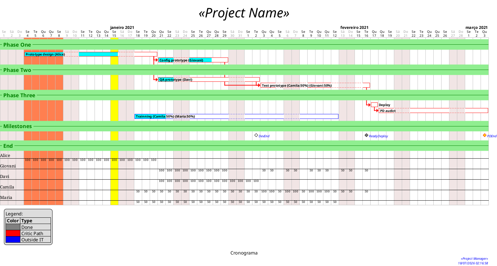

```plantuml
@startgantt
' *************************************************************************
' **                        Style Section                                **
' *************************************************************************
' Styles
<style>

  ganttDiagram {
  	task {
  		FontName Tahoma
  		FontColor black
  		FontSize 10
  		FontStyle bold
  		BackGroundColor Aqua
  		LineColor blue
  	}
  	milestone {
      FontName Tahoma
  		FontColor blue
  		FontSize 10
  		FontStyle italic
  		BackGroundColor gold
  		LineColor red
  	}
	separator {
		LineColor green
		BackGroundColor lightgreen
		FontSize 16
		FontStyle bold
		FontColor green
	}
  	note {
      FontName Tahoma
  		FontColor DarkGreen
  		FontSize 10
  		LineColor lightgreen
        BackGroundColor orange\yellow
  	}
  }
  footer {
    HorizontalAlignment right
  }
  title {
    FontName Tahoma
    FontColor black
    FontSize 40
    FontStyle italic
    HorizontalAlignment center
  }

</style>

skinparam footerFontColor blue
skinparam footerFontSize 10
skinparam footerFontStyle italic
'skinparam titleBackgroundColor Aqua-CadetBlue
'skinparam titleBorderColor blue
'skinparam titleBorderRoundCorner 15
'skinparam titleBorderThickness 2

' sprites
sprite $printer [15x15/8z] NOtH3W0W208HxFz_kMAhj7lHWpa1XC716sz0Pq4MVPEWfBHIuxP3L6kbTcizR8tAhzaqFvXwvFfPEqm0

' *************************************************************************
' **                        Setup Section                                **
' *************************************************************************
' Initialization
caption Cronograma /'change'/
title <<Project Name>> /'change'/
!$now = %now()
!$nowbr = %date("dd/MM/YYYY HH:mm:ss", $now - 3*3600)
footer <<Project Manager>>\n$nowbr /'change'/
hide footbox
'hide ressources footbox
project starts 2021/01/01 /'change'/
scale 1 /'project zoom'/

' Language
language pt

' Project View
printscale daily zoom 1.5
'printscale weekly zoom 6

' Day watching
'today is 2021/01/20 and is colored in Yellow
today is 14 days after start and is colored in Yellow

' Working Days
saturday are closed
sunday are closed
2021/01/01 is closed
'2021/01/25 to 2021/01/26 is closed

' Colored Days
'2021/01/01 is colored in lightblue
2021/01/04 to 2021/01/08 are colored in coral

' *************************************************************************
' **                        Tasks Section                                **
' *************************************************************************
' Tasks and separators
-- Phase One --
[Prototype design] on {Alice} lasts 13 days
  [Prototype design] links to [[http://plantuml.com]]
[Config prototype] on {Giovani} lasts 7 days
-- Phase Two --
[QA prototype] on {Davi} lasts 9 days
[Test prototype] on {Camila:50}{Giovani:50} lasts 6 days
  [Test prototype] pauses on monday
  [Test prototype] pauses on friday
-- Phase Three --
[Deploy] lasts 1 day
[PD audict] lasts 10 days
[Trainning] on {Camila:50}{Maria:50} starts 2021/01/18
  [Trainning] ends 2021/02/12

' Tasks flow
[Config prototype] starts at [Prototype design]'s end with red bold link
[QA prototype] starts at [Prototype design]'s end with red bold link
[Test prototype] starts at [Config prototype]'s end with red bold link
  [Test prototype] starts at [QA prototype]'s end with red bold link
[Deploy] starts at [Test prototype]'s end with red bold link
[PD audict] starts at [Deploy]'s end with red bold link

' Tasks progress
[Prototype design] is 77% completed
[Config prototype] is 70% completed
[QA prototype] is 22% completed
[Test prototype] is 0% completed
[Deploy] is 0% completed
[PD audict] is 0% completed
[Trainning] is 20% completed

' Milestones
-- Milestones --
[DevEnd] happens at [Prototype design]'s end
  [DevEnd] happens at [QA prototype]'s end
[ReadyDeploy] happens at [Test prototype]'s end
  [ReadyDeploy] displays on same row as [DevEnd]
[PDEnd] happens at [PD audict]'s end
  [PDEnd] displays on same row as [ReadyDeploy]
-- End --

' Colors
[Prototype design] is colored in Aqua/Red
[Config prototype] is colored in Aqua/Red
[QA prototype] is colored in Aqua/Red
[Test prototype] is colored in Aqua/Red
[Deploy] is colored in Aqua/Red
[PD audict] is colored in Aqua/Red
[Trainning] is colored in Aqua/Blue
[DevEnd] is colored in White/Black
[ReadyDeploy] is colored in Gray/Black

legend left
Legend:
|= Color |= Type           |
|<#gray> | Done            |
|<#Red>  | Critic Path     |
|<#blue> | Outside IT      |
end legend
@endgantt
```