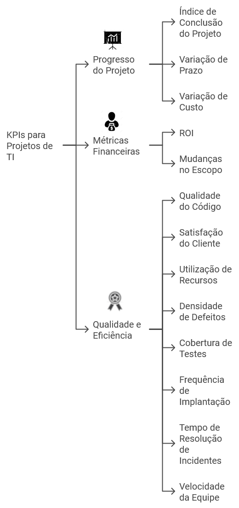

# KPIs para Projetos de TI

1. **Índice de Conclusão do Projeto:** Mede a porcentagem de tarefas concluídas em relação ao total de tarefas planejadas.
1. **Variação de Prazo:** Avalia a diferença entre as datas planejadas e as reais para a conclusão das tarefas. Isso ajuda a entender se o projeto está no prazo.
1. **Variação de Custo:** Compara os custos reais do projeto com os custos planejados, ajudando a monitorar o orçamento.
1. **Qualidade do Código:** Pode ser medida através do número de bugs ou defeitos encontrados durante o desenvolvimento e testes.
1. **Satisfação do Cliente:** Pode ser avaliada através de pesquisas de feedback, ajudando a entender se o projeto está atendendo às expectativas dos stakeholders.
1. **Retorno sobre o Investimento (ROI):** Mede a rentabilidade do projeto em relação aos recursos investidos.
1. **Mudanças no Escopo:** Mede o número de mudanças no escopo do projeto. Mudanças frequentes no escopo podem indicar problemas no planejamento do projeto ou na coleta de requisitos.
1. **Utilização de Recursos:** Monitora quão efetivamente os recursos do projeto (como membros da equipe, ferramentas e tecnologias) estão sendo utilizados.
1. **Densidade de Defeitos:** Calcula o número de defeitos por unidade de tamanho do software (por exemplo, por mil linhas de código).
1. **Cobertura de Testes:** Avalia a porcentagem do código que é coberto por testes automatizados.
1. **Frequência de Implantação:** Mede a frequência com que novas atualizações ou funcionalidades são implantadas no ambiente de produção.
1. **Tempo de Resolução de Incidentes:** Monitora o tempo médio necessário para resolver incidentes ou problemas. Tempos de resolução mais rápidos indicam processos de suporte e resolução de problemas mais eficientes.
1. **Velocidade da Equipe:** Mede a quantidade de trabalho que uma equipe pode realizar durante um período específico, geralmente usando pontos de história em projetos ágeis.