

https://www.dummyimage.com/600x80/ffffff/000000.png&text=The+Hitchhiker's+Guide
https://www.dummyimage.com/600x80/ffffff/000000.png&text=to+the
https://www.dummyimage.com/600x80/ffffff/000000.png&text=Structured+Query+Language

<div align="center" style="font-size: 40px;">
The Hitchhiker's Guide<br>
to the<br>
Structured Query Language
</div>

**Índice**

1. [Pré requisitos](#_toc375138803)
    1. [Softwares](#_toc375138804)
    1. [Permissões](#_toc375138805)
    1. [Nivelamento](#_toc375138806)
    1. [Configurações](#_toc375138807)
1. [Start from the begin](#_toc375138808)
    1. [O que é SQL](#_toc375138809)
    1. [Subconjuntos do SQL](#_toc375138810)
        1. [DML - Linguagem de Manipulação de Dados](#_toc375138811)
        1. [DDL - Linguagem de Definição de Dados](#_toc375138812)
        1. [DCL - Linguagem de Controle de Dados](#_toc375138813)
        1. [DTL - Linguagem de Transação de Dados](#_toc375138814)
        1. [DQL - Linguagem de Consulta de Dados](#_toc375138815)
1. [O nosso amigo "SELECT"](#_toc375138816)
    1. [Estrutura básica do "SELECT"](#_toc375138817)
    1. [Drive table](#_toc375138818)
    1. [Join entre tabelas](#_toc375138819)
    1. [Dividir para conquistar](#_toc375138820)
    1. [A Cesar o que é de Cesar](#_toc375138821)
    1. [Operadores](#_toc375138822)
        1. [Aritméticos](#_toc375138823)
        1. [Concatenação](#_toc375138824)
        1. [Comparação](#_toc375138825)
        1. [Lógicos](#_toc375138826)
        1. [Regras de precedência](#_toc375138827)
        1. [Como mudar a precedência](#_toc375138828)
        1. [Separando abacaxis de laranjas](#_toc375138829)
        1. [Diferença entre o IN e o EXISTS](#_toc375138830)
    1. [Ordem no caos](#_toc375138831)
    1. [Funções analíticas e agregadas](#_toc375138832)
        1. [Funções agregadas](#_toc375138833)
        1. [Funções analíticas no nível Jedi](#_toc375138834)
            1. [Conceitos iniciais](#_toc375138835)
            1. [Até a versão 11.2 do Oracle, este dispunha das seguintes funções analíticas:](#_toc375138836)
            1. [AVG](#_toc375138837)
            1. [CORR](#_toc375138838)
            1. [COUNT](#_toc375138839)
            1. [COVAR_POP e COVAR_SAMP](#_toc375138840)
            1. [CUME_DIST](#_toc375138841)
            1. [DENSE_RANK](#_toc375138842)
            1. [FIRST e LAST](#_toc375138843)
            1. [FIRST_VALUE](#_toc375138844)
            1. [LAG](#_toc375138845)
            1. [LAST_VALUE](#_toc375138846)
            1. [LEAD](#_toc375138847)
            1. [LISTAGG](#_toc375138848)
            1. [MAX](#_toc375138849)
            1. [MIN](#_toc375138850)
            1. [NTILE](#_toc375138851)
            1. [PERCENT_RANK](#_toc375138852)
            1. [RANK](#_toc375138853)
            1. [RATIO_TO_REPORT](#_toc375138854)
            1. [ROW_NUMBER](#_toc375138855)
            1. [STDDEV](#_toc375138856)
            1. [SUM](#_toc375138857)
            1. [VAR_POP](#_toc375138858)
            1. [VARIANCE](#_toc375138859)
    1. [Operadores de SET](#_toc375138860)
        1. [Operador UNION](#_toc375138861)
        1. [Operador INTERSECT](#_toc375138862)
        1. [Operador EXCEPT](#_toc375138863)
    1. [Having versus Where](#_toc375138864)
    1. [GROUP BY beyond the thunder dome](#_toc375138865)
    1. [Consultas Hierárquicas](#_toc375138866)
        1. [CONNECT BY na prática](#_toc375138867)
        1. [Pseudo-coluna LEVEL](#_toc375138868)
        1. [Comando START WITH](#_toc375138869)
        1. [Comando CONNECT BY PRIOR](#_toc375138870)
        1. [Conclusão](#_toc375138871)
    1. [Usando WITH para SQL complexos](#_toc375138872)
    1. [Utilização de BIND](#_toc375138873)

# <a name="_toc375138803"></a>**Pré requisitos**

## <a name="_toc375138804"></a>**Softwares**
- Oracle Client 10g (10.4.0.2) instalado, verificar se o  também tenha sido instalado (necessária reinstalação do Oracle Client caso não esteja instalado);
- Sql Developer 4.0 instalado ;
- Java 7.45 ou posterior (caso o computador usado seja 32 bits);
- Notepad++ instalado 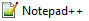;
- Microsoft Office;
## <a name="_toc375138805"></a>**Permissões**
- Possuir o perfil de consulta ao PDERP01;
- Possuir o perfil de atualização ao UXDEV1;
## <a name="_toc375138806"></a>**Nivelamento**
- Conhecimento básico de lógica de sistemas e de conjuntos;
- Conhecimento básico de DB relacional;
## <a name="_toc375138807"></a>**Configurações**
- Variável de ambiente ORACLE\_HOME apontado para o diretório de instalação do Client Oracle (caso a variável não exista, esteja vazia ou com diretório errado, é necessário efetuar a correção), exemplo:

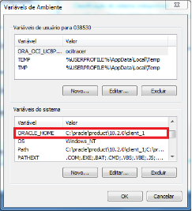

- Arquivos de configuração do Oracle Client:
  - 
  - 
- Ambientes configurados no SQLDeveloper;
# <a name="_toc375138808"></a>**Start from the begin**
## <a name="_toc375138809"></a>**O que é SQL**
*"Structured Query Language, ou Linguagem de Consulta Estruturada ou SQL, é a linguagem de pesquisa declarativa padrão para [banco de dados relacional](http://pt.wikipedia.org/wiki/Banco_de_dados_relacional "Banco de dados relacional") (base de dados relacional). Muitas das características originais do SQL foram inspiradas na [álgebra relacional](http://pt.wikipedia.org/wiki/%C3%81lgebra_relacional "Álgebra relacional").*

*...*

*A linguagem é um grande padrão de banco de dados. Isto decorre da sua simplicidade e facilidade de uso. Ela se diferencia de outras linguagens de consulta a banco de dados no sentido em que uma consulta SQL especifica a forma do resultado e não o caminho para chegar a ele. Ela é uma linguagem declarativa em oposição a outras linguagens procedurais. Isto reduz o ciclo de aprendizado daqueles que se iniciam na linguagem.*

*Embora o SQL tenha sido originalmente criado pela IBM, rapidamente surgiram vários "dialetos" desenvolvidos por outros produtores. Essa expansão levou à necessidade de ser criado e adaptado um padrão para a linguagem. Esta tarefa foi realizada pela [American National Standards Institute](http://pt.wikipedia.org/wiki/American_National_Standards_Institute "American National Standards Institute") (ANSI) em [1986](http://pt.wikipedia.org/wiki/1986 "1986") e [ISO](http://pt.wikipedia.org/wiki/Organiza%C3%A7%C3%A3o_Internacional_para_Padroniza%C3%A7%C3%A3o "Organização Internacional para Padronização") em [1987](http://pt.wikipedia.org/wiki/1987 "1987")."* (fonte http://pt.wikipedia.org/wiki/SQL)
## <a name="_toc375138810"></a>**Subconjuntos do SQL**
### <a name="_toc375138811"></a>**DML - Linguagem de Manipulação de Dados**
O primeiro grupo é a [DML] (Data Manipulation Language - Linguagem de manipulação de dados). [DML] é um subconjunto da linguagem SQL que é utilizado para realizar inclusões, consultas, alterações e exclusões de dados presentes em registros. Estas tarefas podem ser executadas em vários registros de diversas tabelas ao mesmo tempo. Os comandos que realizam respectivamente as funções acima referidas são Insert, Select, Update e Delete.

|**Função**|**Comando SQL**|**Descrição do Comando**|**Exemplo**|
| :-: | :-: | :-: | :-: |
|inclusões|INSERT|é usada para inserir um registro (formalmente uma tupla) a uma tabela existente.|Insert into Pessoa (id, nome, sexo) value (7, "Aluno", "M";|
|consultas|SELECT|O Select é o principal comando usado em SQL para realizar consultas a dados pertencentes a uma tabela.|Select \* From Pessoa;|
|alterações|UPDATE|para mudar os valores de dados em uma ou mais linhas da tabela existente.|UPDATE Pessoa SET data\_nascimento = '11/09/1985' WHERE id\_pessoa = 7|
|exclusões|DELETE|permite remover linhas existentes de uma tabela.|DELETE FROM pessoa WHERE id\_pessoa = 7|

### <a name="_toc375138812"></a>**DDL - Linguagem de Definição de Dados**
O segundo grupo é a [DDL](http://pt.wikipedia.org/wiki/DDL "DDL") (Data Definition Language - Linguagem de Definição de Dados). Uma DDL permite ao utilizador definir tabelas novas e elementos associados. A maioria dos bancos de dados de SQL comerciais tem extensões proprietárias no DDL.

Os comandos básicos da DDL são poucos:

- CREATE: cria um objeto (uma [Tabela](http://pt.wikipedia.org/wiki/Tabelas_%28banco_de_dados%29 "Tabelas (banco de dados)"), por exemplo) dentro da base de dados.
- DROP: apaga um objeto do banco de dados.

Alguns sistemas de banco de dados usam o comando ALTER, que permite ao usuário alterar um objeto, por exemplo, adicionando uma coluna a uma tabela existente.

Outros comandos DDL:

- CREATE TABLE
- CREATE INDEX
- CREATE VIEW
- ALTER TABLE
- ALTER INDEX
- DROP INDEX
- DROP VIEW
### <a name="_toc375138813"></a>**DCL - Linguagem de Controle de Dados**
O terceiro grupo é o [DCL](http://pt.wikipedia.org/wiki/Linguagem_de_controle_de_dados "Linguagem de controle de dados") (Data Control Language - Linguagem de Controle de Dados). DCL controla os aspectos de autorização de dados e licenças de usuários para controlar quem tem acesso para ver ou manipular dados dentro do banco de dados.

Duas palavras-chaves da DCL:

- GRANT - autoriza ao usuário executar ou setar operações.
- REVOKE - remove ou restringe a capacidade de um usuário de executar operações.
### <a name="_toc375138814"></a>**DTL - Linguagem de Transação de Dados**
- BEGIN WORK (ou START TRANSACTION, dependendo do dialeto SQL) pode ser usado para marcar o começo de uma transação de banco de dados que pode ser completada ou não.
- COMMIT finaliza uma transação dentro de um sistema de gerenciamento de banco de dados.
- ROLLBACK faz com que as mudanças nos dados existentes desde o último COMMIT ou ROLLBACK sejam descartadas.

COMMIT e ROLLBACK interagem com áreas de controle como transação e locação. Ambos terminam qualquer transação aberta e liberam qualquer cadeado ligado a dados. Na ausência de um BEGIN WORK ou uma declaração semelhante, a semântica de SQL é dependente da implementação.
### <a name="_toc375138815"></a>**DQL - Linguagem de Consulta de Dados**
Embora tenha apenas um comando, a DQL é a parte da SQL mais utilizada. O comando SELECT permite ao usuário especificar uma consulta ("query") como uma descrição do resultado desejado. Esse comando é composto de várias cláusulas e opções, possibilitando elaborar consultas das mais simples às mais elaboradas.
# <a name="_toc375138816"></a>**O nosso amigo "SELECT"**
O nosso objetivo neste documento é o de tratar especificamente o comando SELECT, mais especificamente sobre alguns aspectos de sua DQL , riqueza de recursos disponibilizados, otimizações, boas práticas e alguns exemplos.

O comando SELECT nos possibilita realizar consultas de forma: horizontal (colunas as quais irão ser apresentadas) e vertical (através de critérios de seleção os quais irão definir o conjunto de dados). Uma forma simplista, mas para um primeiro entendimento eficiente, é o  de imaginar os dados em um DB como conjuntos (analogia oriunda da teoria dos conjuntos da matemática). 

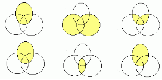

Sob esta ótica o comando SELECT, disponibiliza as operações necessárias para operacionalizar destas operações, bem com a extração dos dados.
## <a name="_toc375138817"></a>**Estrutura básica do "SELECT"**
O comando SELECT possui a seguinte sintaxe básica:

```SQL
SELECT [ALL | DISTINCT | DISTINCTROW ]
  FROM table_references
 WHERE where_condition
 GROUP BY {col_name | expr | position} [ASC | DESC], ... [WITH ROLLUP]]
HAVING where_condition]
 ORDER BY {col_name | expr | position} [ASC | DESC], ...]
```

**Dica:** *"A perfeição não é alcançada quando já não há mais nada para adicionar, mas quando já não há mais nada que se possa retirar."* Antoine de Saint\_Exupéry em O pequeno príncipe. Em outras palavras quando menos dados forem manipulados numa consulta horizontal mais rápida a mesma será.

```SQL
SELECT a.*
  FROM proddta.f4101 a;
```

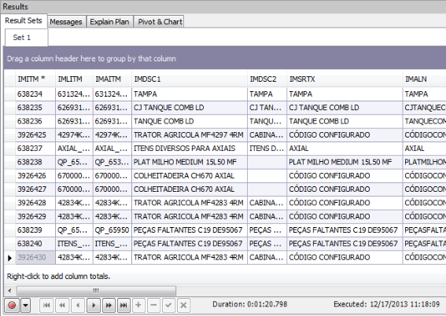

```SQL
SELECT a.imitm,
       a.imdsc1
  FROM proddta.f4101 a;
```

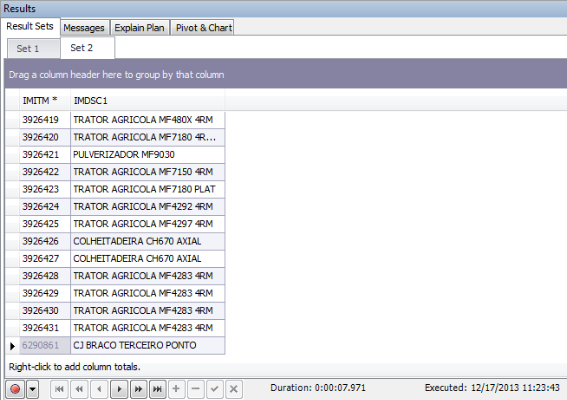

O comando SELECT irá retornar a extração de dados para a consulta realizada, baseado no plano de execução definido pelo Oracle, o qual irá considerar uma série de fatores para a sua montagem entre as quais:

- colunas retornadas;
- critérios condicionais utilizados;
- relacionamentos montados entre as tabelas;
- cláusulas do SELECT utilizadas;
- critérios de ordenação;
- utilização de variáveis BIND (otimiza os recursos do DB);
- utilização de funções;

Este plano de execução irá definir entre outras coisas:

- quais índices serão utilizados;
- tempo de resposta para a consulta;
- organização da consulta;
- precedência de execução;
- demonstrar as métricas utilizadas:
  - seletividade (Esta métrica indica (percentual) quantos registros serão filtrados pela condição, variando entre 0.0 e 1.0. O valor 0.0 indica que nenhum registro será selecionado pela condição, enquanto o valor 1.0 indica que todos os registros serão selecionados)
  - custo (O custo é uma estimativa da quantidade de recursos que o servidor consumirá para resolver a operação, como a quantidade de acessos a disco, o consumo de CPU ou banda de rede)
  - cardinalidade (Representa o número de registros, de forma estimada, em uma fonte de dados)

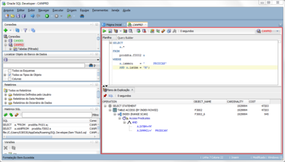

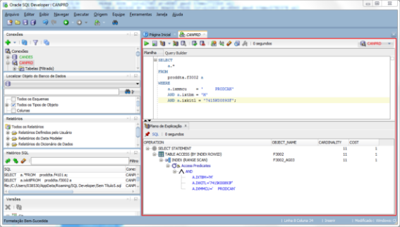

**Dica:** Na clausula WHERE (condicional) procure evitar (sempre que possível) a utilização de funções sobre campos da tabela alvo, isso poderá fazer com que o otimizador de query do Oracle não sugira o melhor índice ou realize um full scan. Por exemplo, numa clausula where, é melhor converter uma data para o formato juliano, ao invés de converter a coluna da tabela para o formato data. Sempre que possível utilize como filtro colunas pertencentes a um índice, em geral o otimizador irá tentar encontrar a melhor forma de execução para a query.
## <a name="_toc375138818"></a>**Drive table**
Toda consulta deve ser baseada sobre uma tabela principal, normalmente a lógica do otimizador irá selecionar a melhor opção para drive table. Como boa prática, convém sugerir explicitamente a drive table, geralmente será a tabela mais relevante em termos de cardinalidade e custo, tabela com o maior número de joins com outras tabelas e/ou a mais restritiva.

Podemos utilizar também sub-querys, como drive, contudo deve se utilizar estes casos com parcimônia.
## <a name="_toc375138819"></a>**Join entre tabelas**
Outra boa prática em SQL é a utilização das cláusulas de join explícitas, ao invés de joins implícitos:

- cross join (retorna a multiplicidade dos registros de ambas as tabelas)

  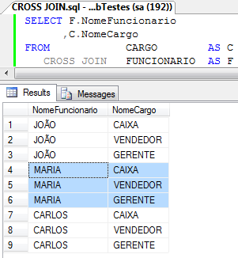

- natural join (retorna as tuplas relacionadas nas duas tabelas por colunas do mesmo nome)
- inner join (retorna tuplas existentes em ambas as tabelas) 

  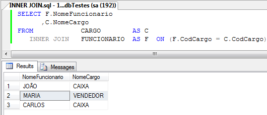

- left outer join (retorna todas tuplas da tabela esquerda)

  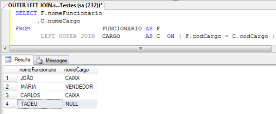

- right outer join (retorna todas tuplas da tabela direita)

  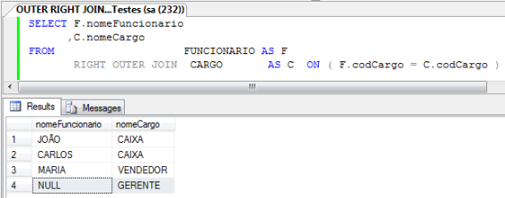

- full outer join (retorna todas tuplas das duas tabelas, independente de relação)

  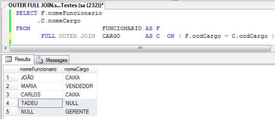

Esta prática além de evidenciar quem é a drive table, auxilio o otimizador a utilizar o índice desejado, facilita a organização e leitura de grandes SELECT e possibilita maior controle das outer join (relações m para n).

**Implícito**
```sql
SELECT a.iblitm,
       b.imdsc1
  FROM proddta.f4102 a,
       proddta.f4101 b
 WHERE b.imitm = a.ibitm
       a.ibmcu = '     PRODCAN';
```
**Explícito**
```sql
SELECT a.iblitm,
       b.imdsc1
  FROM proddta.f4102 a 
 INNER JOIN proddta.f4101 b
    ON b.imitm = a.ibitm
 WHERE a.ibmcu = '     PRODCAN';
```

## <a name="_toc375138820"></a>**Dividir para conquistar**
Em geral, as consultas tendem a possuir um certo grau de complexidade na obtenção da informação. Podemos, por exemplo, relacionar as colunas de uma tabela com a soma referente em outra tabela. Um recurso que podemos fazer uso são as  sub-querys.

```SQL
SELECT a.iblitm,
       b.imdsc1,
       c.lipqoh
 FROM proddta.f4102 a
 INNER JOIN proddta.f4101 b
       ON b.imitm = a.ibitm
 INNER JOIN (SELECT liitm,
                    limcu,
                    SUM (lipqoh) lipqoh
               FROM proddta.f41021
              GROUP BY liitm,
                       limcu) c
       ON c.liitm = a.ibitm
       AND c.limcu = a.ibmcu
 WHERE a.ibmcu = '     PRODCAN';
```

O otimizador irá tratar da melhor alternativa, contudo verifique sempre o plano de execução, desta forma garantindo a efetividade da consulta.

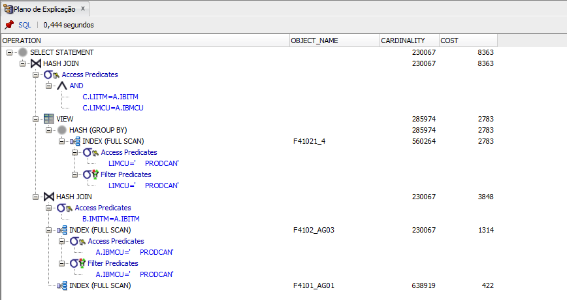

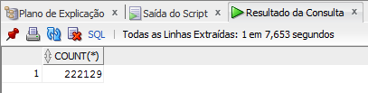

A mesma consulta poderia ser escrita sem sub-query:

```SQL
SELECT a.iblitm,
       b.imdsc1,
       SUM (lipqoh) lipqoh
  FROM proddta.f4102 a
 INNER JOIN proddta.f4101 b
       ON b.imitm = a.ibitm
 INNER JOIN proddta.f41021 c
       ON c.liitm = a.ibitm
       AND c.limcu = a.ibmcu
 WHERE a.ibmcu = '     PRODCAN'
 GROUP BY a.iblitm,
          b.imdsc1;
```

Contudo eu teria um custo de execução e cardinalidade maiores.

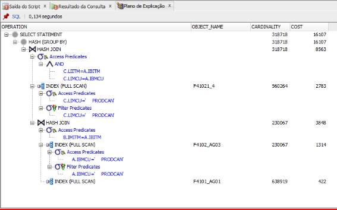

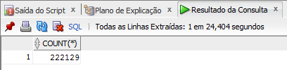
## <a name="_toc375138821"></a>**A Cesar o que é de Cesar**
Outra boa prática é a utilização de alias, tanto em tabelas quanto em colunas, com isso evitamos problemas com:

- Coincidência de colunas com o mesmo nome;
- Ocorrência de mais de uma vez a tabela em sua consulta;
- Clareza e organização das consultas;

```SQL
SELECT a.ixkitl,
       b.imdsc1 AS DESCKIT,
       a.ixlitm,
       c.imdsc1 AS DESCCOMP
  FROM proddta.f3002 a
 INNER JOIN proddta.f4101 b
    ON b.imitm = a.ixkit
 INNER JOIN proddta.f4101 c
    ON c.imitm = a.ixitm
 WHERE a.ixtbm = 'M'
   AND a.ixmmcu = '     PRODCAN'
   AND a.ixkitl = '7415K00893F';
```

## <a name="_toc375138822"></a>**Operadores**
### <a name="_toc375138823"></a>**Aritméticos**
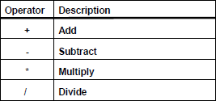

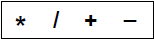
### <a name="_toc375138824"></a>**Concatenação**
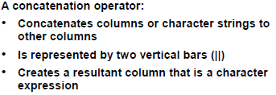
### <a name="_toc375138825"></a>**Comparação**
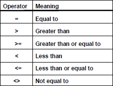

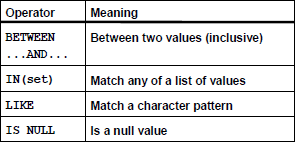
### <a name="_toc375138826"></a>**Lógicos**
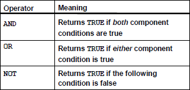
### <a name="_toc375138827"></a>**Regras de precedência**
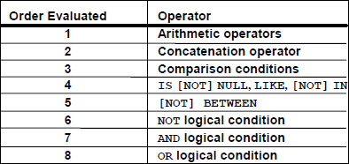
### <a name="_toc375138828"></a>**Como mudar a precedência**
A expressão delimitada por parênteses "(" e ")" será avaliada antes, independente da precedência de operadores.
## <a name="_toc375138829"></a>**Separando abacaxis de laranjas**
A cláusula where irá definir quais condições deverão serem satisfeitas pela consulta, afim de retornar os dados necessários.
### <a name="_toc375138830"></a>**Diferença entre o IN e o EXISTS**
*"Muitas vezes é que colocada a questão sobre a diferença de performance do uso do IN e do EXISTS.*

*A diferença será talvez mais evidente se se pensar em termos de como o optimizador vai executar a query e das linhas das tabelas.*

*Se usar o IN estamos a dizer que queremos que o query no IN seja o "motor" do processo. Ou seja primeiro resolver o IN e depois resolver o query externo. No caso do EXISTS é exatamente o contrário, ou seja, resolve o query externo e para cada resultado resolve o interno.* 

*Normalmente o EXISTS é melhor pois especifica uma condição de junção e normalmente usa somente índices ( se não for assim vamos sentir uma degradação da performance).
No entanto, quando o query do IN devolve poucos resultados torna-se mais rápido. Se o IN por outro lado usar junções para o query externo a performance vai-se degradar pois obrigará a executar o IN para cada resultado do query externo."* fonte http://oracleblues.blogspot.com.br/2007/02/diferena-entre-o-in-e-o-exists.html
## <a name="_toc375138831"></a>**Ordem no caos**
A cláusula ORDER BY irá ordenar a extração de dados conforme a ordem especificada.
## <a name="_toc375138832"></a>**Funções analíticas e agregadas**
### <a name="_toc375138833"></a>**Funções agregadas**
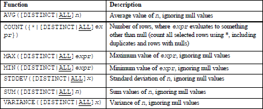

A agregação será efetuada na clausula GROUP BY.
### <a name="_toc375138834"></a>**Funções analíticas no nível Jedi**
Fonte http://certificacaobd.com.br/category/geral/dbarea/oracle-dbarea/sql-e-plsql/
#### <a name="_toc375138835"></a>***Conceitos iniciais***
Funções analíticas computam um valor agregado baseado em um número de linhas. Funções agregadas retornam uma linha para cada grupo, já funções analíticas retornam múltiplas linhas para cada grupo, ou seja, funções analíticas não agrupam resultados, ao contrário das funções agregadas.

A grande maioria das funções analíticas, também podem ser usadas como funções agregadas, e vice-versa.

Funções analíticas podem aparecer somente na lista do SELECT ou no ORDER BY
#### <a name="_toc375138836"></a>***Até a versão 11.2 do Oracle, este dispunha das seguintes funções analíticas:***
- AVG
- CORR
- COUNT
- COVAR\_POP
- COVAR\_SAMP
- CUME\_DIST
- DENSE\_RANK
- FIRST
- LAST
- FIRST\_VALUE
- LAG
- LAST\_VALUE
- LEAD
- LISTAGG
- MAX
- MIN
- NTH\_VALUE
- NTILE
- PERCENT\_RANK
- PERCENTILE\_CONT
- PERCENTILE\_DISC
- RANK
- RATIO\_TO\_REPORT
- REGR\_ (Linear Regression) Functions
- ROW\_NUMBER
- STDDEV
- STDDEV\_POP
- STDDEV\_SAMP
- SUM
- VAR\_POP
- VAR\_SAMP
- VARIANCE
#### <a name="_toc375138837"></a>***AVG***
Retorna a média de valores de determinada coluna. Recebe um valor numérico, ou não-numérico, mas que possa ser implicitamente convertido. A cláusula OVER indica que está se usando a função de forma analítica.

```sql
 --exemplo de uso do avg como função agregada
 --mostra a média salarial, por departamento
 SELECT ID_DEPARTAMENTO,
 AVG(SALARIO) AS MEDIA_SALARIO
 FROM CERTIFICACAO.TAB_EMPREGADOS
 GROUP BY ID_DEPARTAMENTO

 --exemplo de uso do avg como função analítica
 --mostra a media salarial, por idade do empregado
 SELECT ID_EMP,
 NOME_EMP,
 IDADE,
 SALARIO,
 AVG(SALARIO) OVER (PARTITION BY IDADE ORDER BY ID_EMP) MEDIA_SAL_POR_IDADE
 FROM CERTIFICACAO.TAB_EMPREGADOS
```
#### <a name="_toc375138838"></a>***CORR***
Mostra o coeficiente de correlação de Pearson, medindo o grau de correlação entre 2 valores numéricos, ou não-numéricos, mas que possam ser implicitamente convertidos. Caso o coeficiente seja 1, há uma correlação perfeita positiva entre esses 2 valores, caso -1, há uma correlação perfeita negativa entre esses 2 valores, e caso 0, indica que as 2 variáveis não dependem linearmente uma da outra. Caso o resultado se aproxime de 1, ou -1, isso indica que o 1º valor possui certa correlação com o 2º valor, o que indica que o 2º valor influencia o 1º. Quanto mais perto de 1, ou -1, mais forte é essa correlação. A cláusula OVER indica que está se usando a função de forma analítica.

```SQL
 --exemplo de uso do corr como função agregada
 --mostra se quanto mais tempo de empresa os funcionários de cada 
 --departamento tem, mais o funcionário recebe, agrupando 
 --por departamento
 SELECT ID_DEPARTAMENTO,
 CORR(SYSDATE - DATA_ADMISSAO, SALARIO) AS CORRELACAO
 FROM CERTIFICACAO.TAB_EMPREGADOS
 GROUP BY ID_DEPARTAMENTO
 ORDER BY ID_DEPARTAMENTO

 --exemplo de uso do corr como função analítica
 --mostra se quanto mais tempo de empresa os funcionários de cada 
 --departamento tem, mais o funcionário recebe, por empregado
 SELECT ID_EMP,
 TO_CHAR((SYSDATE - DATA_ADMISSAO) YEAR TO MONTH) TEMPO_DE_EMPRESA,
 CORR(SYSDATE - DATA_ADMISSAO, SALARIO) OVER (PARTITION BY ID_DEPARTAMENTO) AS CORRELACAO
 FROM CERTIFICACAO.TAB_EMPREGADOS
 ORDER BY ID_EMP
```
#### <a name="_toc375138839"></a>***COUNT***
Exibe o número de registros retornados por uma query.

```SQL
 --exemplo de uso do count como função agregada
 --mostra o numero total de empregados, agrupados por departamento
 SELECT ID_departamento,
 COUNT(*) NUM_EMP_POR_DEPT
 FROM CERTIFICACAO.TAB_EMPREGADOS
 GROUP BY ID_DEPARTAMENTO
 ORDER BY ID_DEPARTAMENTO

 --exemplo de uso do count como função analítica
 --mostra o empregado, seu departamento e a quantidade de 
 --empregados por departamento, para cada empregado
 SELECT ID_EMP,
 ID_DEPARTAMENTO,
 COUNT(*) OVER (PARTITION BY ID_departamento) AS TOTAL_DEPARTAMENTO
 FROM CERTIFICACAO.TAB_EMPREGADOS

 --exemplo de uso do count como função analítica
 --mostra informações sobre empregados, bem como a quantidade de 
 --empregados que recebem R$2000,00 a menos e R$10000,00 a mais, 
 --do que determinado empregado
 SELECT ID_EMP,
 NOME_EMP,
 SALARIO,
 COUNT(*) OVER (ORDER BY SALARIO RANGE BETWEEN 2000 PRECEDING AND 10000 FOLLOWING)
 FROM CERTIFICACAO.TAB_EMPREGADOS
```
#### <a name="_toc375138840"></a>***COVAR\_POP e COVAR\_SAMP***
Calculam a covariância da população e a covariância amostral, respectivamente, de 2 conjuntos de pares numéricos. Essas funções servem para verificar a relação entre 2 variáveis. Uma covariância positiva indica que as variáveis possuem uma relação direta, e uma covariância negativa indica que as variáveis possuem uma relação inversa.

```SQL
 --exemplo de uso do covar_pop e covar_samp como funções agregadas
 SELECT ID_DEPARTAMENTO,
 TRUNC(COVAR_POP(SYSDATE - DATA_ADMISSAO, SALARIO), 2) AS COVAR_POP,
 TRUNC(COVAR_SAMP(SYSDATE - DATA_ADMISSAO, SALARIO), 2) AS COVAR_SAMP
 FROM CERTIFICACAO.TAB_EMPREGADOS
 GROUP BY ID_DEPARTAMENTO

 --exemplo de uso do covar_pop e covar_samp como funções analítica
 SELECT ID_EMP,
 NOME_EMP,
 SALARIO,
 TRUNC(COVAR_POP(SYSDATE - DATA_ADMISSAO, SALARIO) OVER (ORDER BY SALARIO), 2) AS COV_POPULACIONAL,
 TRUNC(COVAR_SAMP(SYSDATE - DATA_ADMISSAO, SALARIO) OVER (ORDER BY SALARIO), 2) AS COV_AMOSTRA
 FROM CERTIFICACAO.TAB_EMPREGADOS
 ORDER BY ID_EMP
```
#### <a name="_toc375138841"></a>***CUME\_DIST***
Calcula a distribuição cumulativa de um valor, dentro de um grupo de valores, ou seja, calcula a posição relativa de um valor específico, dentro de um grupo de valores.

```sql
 --exemplo de uso do cume_dist como função agregada
 --calcula a distribuição cumulativa de determinado 
 --funcionário entre todos os funcionários d2 departamento 2
 SELECT CUME_DIST(2000, 2) WITHIN GROUP
 (ORDER BY SALARIO, ID_dEPARTAMENTO) AS CUME_DIST
 FROM CERTIFICACAO.TAB_EMPREGADOS

 --exemplo de uso do cume_dist como função analítica
 --mostra quem tem os menores e maiores salários, por departamento
 --no caso abaixo, quanto mais próximo de 1, menor e o 
 --salário por departamento
 SELECT ID_EMP,
 ID_DEPARTAMENTO,
 NOME_EMP,
 SALARIO,
 TRUNC(CUME_DIST() OVER (PARTITION BY ID_DEPARTAMENTO ORDER BY SALARIO DESC), 2)
 FROM CERTIFICACAO.TAB_EMPREGADOS
```
#### <a name="_toc375138842"></a>***DENSE\_RANK***
Calcula o rank de uma linha dentro de um grupo de linhas, ou seja, retorna a posição (rank) dessa linha dentro do grupo de linhas especificado pela query

```sql
 --exemplo de uso do dense_rank como função agregada
 --dado um valor, a query retorna a posição (rank) 
 --desse valor, dentro da tabela
 SELECT DENSE_RANK(10000) WITHIN GROUP (ORDER BY SALARIO DESC) POSICAO
 FROM CERTIFICACAO.TAB_EMPREGADOS

 --exemplo de uso do dense_rank como função analítica
 --mostra o rank de salário de cada funcionário, por departamento
 SELECT ID_EMP,
 NOME_EMP,
 ID_DEPARTAMENTO,
 SALARIO,
 DENSE_RANK() OVER (PARTITION BY ID_DEPARTAMENTO ORDER BY SALARIO DESC) AS RANK
 FROM CERTIFICACAO.TAB_EMPREGADOS
```
#### <a name="_toc375138843"></a>***FIRST e LAST***
Retornam o primeiro e o último valores de uma seqüência ordenada.

```sql
 --exemplo de uso do first e last como funções agregadas
 --lista, por departamento, o funcionário mais velho que tem o 
 --pior salário e o funcionário mais novo que tem o melhor salário
 SELECT ID_DEPARTAMENTO,
 MIN(SALARIO) KEEP (DENSE_RANK LAST ORDER BY IDADE) AS PIOR_SALARIO_EMP_MAIS_VELHO,
 MAX(SALARIO) KEEP (DENSE_RANK FIRST ORDER BY IDADE) AS MELHOR_SALARIO_EMP_MAIS_NOVO
 FROM CERTIFICACAO.TAB_EMPREGADOS
 GROUP BY ID_DEPARTAMENTO
 ORDER BY ID_DEPARTAMENTO

 --exemplo de uso do first e last como funções analíticas
 --lista, por funcionário, o funcionário mais velho que tem 
 --o pior salário e o mais novo que tem o melhor salário
 SELECT ID_EMP, NOME_EMP, IDADE, SALARIO,
 MIN(SALARIO) KEEP (DENSE_RANK LAST ORDER BY IDADE) 
   OVER (PARTITION BY ID_DEPARTAMENTO) AS PIOR_SALARIO_EMP_MAIS_VELHO,
 MAX(SALARIO) KEEP (DENSE_RANK FIRST ORDER BY IDADE) 
   OVER (PARTITION BY ID_DEPARTAMENTO) AS MELHOR_SALARIO_EMP_MAIS_NOVO
 FROM CERTIFICACAO.TAB_EMPREGADOS
 ORDER BY ID_EMP, NOME_EMP, IDADE, SALARIO
```
#### <a name="_toc375138844"></a>***FIRST\_VALUE***
Funciona como função analítica apenas. Retorna o primeiro valor em uma seqüência ordenada de valores.

```sql
 --exemplo de uso do first_value como função analítica
 --exibe o nome do empregado que recebe o menor salário, por 
 --departamento
 SELECT id_emp,
 nome_emp,
 salario,
 FIRST_VALUE(NOME_EMP) OVER (PARTITION BY ID_DEPARTAMENTO ORDER BY SALARIO) AS MENOR_SALARIO
 FROM CERTIFICACAO.TAB_EMPREGADOS

 --exemplo de uso do first_value como função analítica
 --exibe o nome do empregado que recebe o menor salário, 
 --por departamento.
 --perceba que, para mudar a exibição do menor salário, para o 
 --maior salário, basta colocar o desc no final do partition by
 SELECT id_emp,
 nome_emp,
 salario,
 FIRST_VALUE(NOME_EMP) OVER (PARTITION BY ID_DEPARTAMENTO ORDER BY SALARIO DESC) AS MENOR_SALARIO
 FROM CERTIFICACAO.TAB_EMPREGADOS
```
#### <a name="_toc375138845"></a>***LAG***
Funciona como função analítica apenas. Permite acessar informações de uma linha anterior à posição atual.

```sql
 --exemplo de uso do lag como função analítica
 --exibe a diferença entre o salário dos empregados, ordenado 
 --pela idade, ou seja, dado um funcionário, calcula a diferença 
 --entre esse funcionário, e primeiro mais novo do que ele
 SELECT ID_EMP,
 NOME_EMP,
 SALARIO,
 IDADE,
 LAG(SALARIO, 1, 0) OVER (ORDER BY IDADE) AS SALARIO_ANTERIOR,
 SALARIO - LAG(SALARIO, 1, 0) OVER (ORDER BY IDADE) AS DIFERENCA
 FROM CERTIFICACAO.TAB_EMPREGADOS
 ORDER BY IDADE
```
OBS1: O segundo parâmetro da cláusula LAG indica N linhas anteriores, ou seja, no exemplo acima, eu especifico 1, que significa a diferença entre o registro da linha atual e o registro n – 1. Caso eu coloque 2, a query retornará a diferença entre o registro atual e o registro n – 2, e assim por diante.
#### <a name="_toc375138846"></a>***LAST\_VALUE***
Funciona como função analítica. Ela serve para retornar o último valor de uma série ordenada de valores.

```sql
 SELECT ID_EMP,
 NOME_EMP,
 SALARIO,
 DATA_ADMISSAO,
 ID_DEPARTAMENTO,
 LAST_VALUE(NOME_EMP) 
 OVER (PARTITION BY ID_DEPARTAMENTO ORDER BY SALARIO 
   ROWS BETWEEN UNBOUNDED PRECEDING AND UNBOUNDED FOLLOWING) AS EMP_MAIOR_SAL,
 LAST_VALUE(NOME_EMP) 
 OVER (PARTITION BY ID_DEPARTAMENTO ORDER BY SALARIO DESC 
   ROWS BETWEEN UNBOUNDED PRECEDING AND UNBOUNDED FOLLOWING) AS EMP_MENOR_SAL
 FROM CERTIFICACAO.TAB_EMPREGADOS
 ORDER BY ID_DEPARTAMENTO, SALARIO
```
#### <a name="_toc375138847"></a>***LEAD***
Funciona como uma função analítica. Permite acessar mais de uma linha da mesma tabela sem a necessidade de um SELF-JOIN.

```sql
 --exemplo de uso do lead como função analítica
 --mostra, para cada empregado, o empregado contratado logo 
 --após ele, por departamento

 SELECT ID_EMP,
 NOME_EMP,
 SALARIO,
 DATA_ADMISSAO,
 ID_DEPARTAMENTO,
 NVL(LEAD(NOME_EMP) OVER (PARTITION BY ID_DEPARTAMENTO 
   ORDER BY DATA_ADMISSAO), 'ULTIMO CONTRATADO DO SETOR') AS PROXIMO_CONTRATADO
 FROM CERTIFICACAO.TAB_EMPREGADOS
```
#### <a name="_toc375138848"></a>***LISTAGG***
Ordena os dados em cada grupo, especificado pelo ORDER BY, e posteriormente concatena esses dados. Serve para transformar uma coluna em linhas. É possível usado tanto como função analítica, quanto como função agregada.

```sql
 --exemplo de uso do listagg como função agregada
 --mostra, por departamento, os empregados em ordem salarial, 
 --mas concatenados em uma linha por departamento
 --o segundo parâmetro da função LISTADD define o separador 
 --de campos

 SELECT ID_DEPARTAMENTO,
 LISTAGG(NOME_EMP, ' - ') WITHIN GROUP (ORDER BY SALARIO) AS EMPREGADOS
 FROM CERTIFICACAO.TAB_EMPREGADOS
 GROUP BY ID_DEPARTAMENTO
 ORDER BY ID_DEPARTAMENTO

 --exemplo de uso do listagg como função analítica
 --mostra, para cada empregado, os empregados que recebem a mesma faixa salarial, entre R$0,00 e R$2000,00

 SELECT ID_EMP,
 ID_DEPARTAMENTO,
 NOME_EMP, 
 SALARIO,
 LISTAGG(NOME_EMP, ' - ') WITHIN GROUP (ORDER BY SALARIO) 
 OVER (PARTITION BY ID_DEPARTAMENTO) AS LISTA
 FROM CERTIFICACAO.TAB_EMPREGADOS
 WHERE SALARIO BETWEEN 0 AND 2000
```
#### <a name="_toc375138849"></a>***MAX***
Retorna o maior valor de determinada coluna. É possível ser usado tanto como função analítica, quanto como função agregada.

```sql
 --exemplo de uso do max como função agregada
 --exibe o maior salário, por departamento

 SELECT ID_DEPARTAMENTO,
 MAX(SALARIO) AS MAIOR_SAL
 FROM CERTIFICACAO.TAB_EMPREGADOS
 GROUP BY ID_DEPARTAMENTO

 --exemplo de uso do max como função analítica
 --mostra, por empregado, o salário empregado que recebe o 
 --maior salário, por faixa de comissão.
 --por exemplo, para os funcionários que recebem comissão de 20%, 
 --mostra o maior salário entre eles

 SELECT ID_EMP,
 COMISSAO,
 NOME_EMP,
 SALARIO,
 ID_DEPARTAMENTO,
 MAX(SALARIO) OVER (PARTITION BY COMISSAO) AS MAX_SAL_POR_COMISSAO
 FROM CERTIFICACAO.TAB_EMPREGADOS
```
#### <a name="_toc375138850"></a>***MIN***
Retorna o menor valor de determinada coluna. É possível ser usado tanto como função analítica, quanto como função agregada.

```sql
 --exemplo de uso do min como função agregada
 --exibe o menor salário, por departamento

 SELECT ID_DEPARTAMENTO,
 MIN(SALARIO)
 FROM CERTIFICACAO.TAB_EMPREGADOS
 GROUP BY ID_DEPARTAMENTO

 --exemplo de uso do min como função analítica
 --mostra, por empregado, o salário do empregado que recebe 
 --o menor salário, por faixa de comissão.
 --por exemplo, para os funcionários que recebem comissão de 30%, 
 --mostra o menor salário entre eles

 SELECT ID_EMP,
 COMISSAO,
 NOME_EMP,
 SALARIO,
 ID_DEPARTAMENTO,
 MIN(SALARIO) OVER (PARTITION BY COMISSAO) AS MIN_SAL_POR_COMISSAO
 FROM CERTIFICACAO.TAB_EMPREGADOS
```
#### <a name="_toc375138851"></a>***NTILE***
Função analítica usada para dividir um conjunto ordenado de valores em N partes iguais, e cada parte representa 1/N da população.

```sql
 --exemplo de uso do NTILE como função analítica
 --divide o conjunto de dados em 4 partes iguais (quartil)
 --SELECT ID_EMP,
 NOME_EMP,
 SALARIO,
 NTILE(4) OVER (ORDER BY SALARIO DESC) QUARTIL
 FROM CERTIFICACAO.TAB_EMPREGADOS
```
#### <a name="_toc375138852"></a>***PERCENT\_RANK***
Seu retorno varia de 0 a 1. A primeira linha em qualquer conjunto possui o PERCENT\_RANK de 0. Funciona tanto como função analítica, quanto função agregada. A meu ver essa função é mais útil quando usada como função analítica, pois é possível determinar rankings para valores, que será exemplificado mais adiante:

```sql
 -- exemplo de uso do PERCENT_RANK como função agregada
 -- retorna 0, pois estou calculando o percent_rank 
 -- do menor salario

 SELECT PERCENT_RANK(200, .55) WITHIN GROUP
 (ORDER BY SALARIO, COMISSAO)
 FROM CERTIFICACAO.TAB_EMPREGADOS

 -- exemplo de uso do PERCENT_RANK como função analítica
 -- mostra os empregados com os maiores salário, por departamento.
 -- os que possuírem os maiores salários/departamento possuíram o 
 -- percent_rank = 0, e os que possuírem os menores salários de
 -- cada setor, possuirão o percent_rank = 1

 SELECT ID_EMP,
 NOME_EMP,
 ID_DEPARTAMENTO,
 SALARIO,
 PERCENT_RANK() 
 OVER (PARTITION BY ID_DEPARTAMENTO ORDER BY SALARIO DESC) 
       AS PERCENT_RANK
 FROM CERTIFICACAO.TAB_EMPREGADOS
 ORDER BY PERCENT_RANK, SALARIO
```
#### <a name="_toc375138853"></a>***RANK***
Calcula o rank (posição) de um valor em um grupo de valores. Pode funcionar tanto como função agregada e função analítica. Função útil para calcular posições dentro de um conjunto de dados, como por exemplo quem foi o funcionário que mais gastou em despesas com viagens:

```sql
 -- exemplo de uso do rank como função agregada
 -- mostra o rank de um empregado que possua um salário 
 -- de R$1000,00 dentro da tabela

 SELECT RANK(1000) WITHIN GROUP
 (ORDER BY SALARIO)
 FROM CERTIFICACAO.TAB_EMPREGADOS

 -- exemplo de uso do rank como função analítica
 -- mostra o rank dos empregados, por salário, em 
 -- cada departamento

 SELECT NOME_EMP,
 ID_DEPARTAMENTO,
 SALARIO,
 RANK() OVER (PARTITION BY ID_DEPARTAMENTO ORDER BY SALARIO DESC)  AS RANK
FROM CERTIFICACAO.TAB_EMPREGADOS
```
#### <a name="_toc375138854"></a>***RATIO\_TO\_REPORT***
Funciona como função analítica. Calcula a razão, ou proporção de um valor, em relação a soma de um conjunto de valores.

```sql
 -- exemplo de uso do RATIO_TO_REPORT como função analítica
 -- no exemplo abaixo, quanto maior for o salário,
 -- maior será o RATIO deste salário
 -- salários iguais possuem o mesmo RATIO

 SELECT NOME_EMP, 
 SALARIO,
 RATIO_TO_REPORT (SALARIO) OVER () AS RATIO 
 FROM CERTIFICACAO.TAB_EMPREGADOS
 ORDER BY SALARIO, RATIO
```
#### <a name="_toc375138855"></a>***ROW\_NUMBER***
Funciona como função analítica. Atribui um número único para cada linha.

```sql
 -- exemplo de uso do ROW_NUMBER como função analítica
 -- retorna o número da linha, por departamento, de cada
 -- empregado, ordenado pelo salário, ou seja, o empregado
 -- do setor 1, que possuir o maior salário, terá um row_number
 -- de 1. Essa ordem é definido na cláusula OVER()

 SELECT NOME_EMP,
 SALARIO,
 ID_dEPARTAMENTO,
 ROW_NUMBER() OVER(PARTITION BY ID_dEPARTAMENTO ORDER BY 
                   SALARIO DESC) AS RN
 FROM CERTIFICACAO.TAB_EMPREGADOS
```
#### <a name="_toc375138856"></a>***STDDEV***
Retorna o Desvio Padrão de um conjunto de valores. Por Desvio Padrão, entende-se:

“O desvio padrão é uma medida de dispersão usada com a média. Mede a variabilidade dos valores à volta da média. O valor mínimo do desvio padrão é 0 indicando que não há variabilidade, ou seja, que todos os valores são iguais à média.
fonte: http://stat2.med.up.pt/cursop/glossario/dpadrao.html”

```sql
 -- exemplo de uso do STDDEV como função agregada
 -- retorna o desvio padrão de todos os salários

 SELECT STDDEV(SALARIO) AS DESVIO
 FROM CERTIFICACAO.TAB_EMPREGADOS

 -- exemplo de uso do STDDEV como função analítica
 -- retorna o desvio padrão acumulado dos salários, ordenado
 -- pela data de contratação

 SELECT NOME_EMP,
 SALARIO,
 DATA_ADMISSAO,
 STDDEV(SALARIO) OVER(ORDER BY DATA_ADMISSAO)
 FROM CERTIFICACAO.TAB_EMPREGADOS
```
#### <a name="_toc375138857"></a>***SUM***
Retorna a soma de valores de determinada coluna. Esta, na minha opinião, é uma das funções mais úteis e usadas por DBAs e desenvolvedores. Pode ser usada como função agregada e analítica.

```sql
 -- exemplo do SUM como função agregada
 -- abaixo eu estou calculando o tamanho dos objetos do banco
 -- de dados, agrupando por owner
 SELECT OWNER, 
 SUM(BYTES)/1024/1024 AS TOTAL_MBS
 FROM DBA_SEGMENTS 
 GROUP BY OWNER
 ORDER BY 2 DESC

 -- exemplo do SUM como função analítica
 -- abaixo estou para cada tipo de segmento, o tamanho cumulativo
 -- de cada objeto daquele segmento
 SELECT SEGMENT_TYPE,
 SEGMENT_NAME,
 BYTES/1024/1024 AS TAMANHO_MBS,
 SUM(BYTES/1024/1024) OVER (PARTITION BY SEGMENT_TYPE ORDER BY BYTES RANGE UNBOUNDED PRECEDING)
 FROM DBA_SEGMENTS
```
#### <a name="_toc375138858"></a>***VAR\_POP***
Retorna a variância da população para um conjunto de números, após descartar os valores NULL. Pode ser usada tanto como função agregada, quanto como função analítica.

```sql
 -- exemplo de uso do VAR_POP como função agregada.
 -- retorna a variância da população dos tamanhos dos segmentos
 -- cujo owner é o sys

 SELECT VAR_POP(BYTES) 
 FROM DBA_SEGMENTS
 WHERE OWNER = 'SYS'

 -- exemplo de uso do VAR_POP como função analítica
 -- calcula a população cumulativa, agrupadas pela data 
 -- da última coleta de estatísticas da tabela

 SELECT TO_CHAR(LAST_ANALYZED, 'MM/YYYY'),
 COUNT(TABLE_NAME),
 VAR_POP (SUM(NUM_ROWS)) 
    OVER (ORDER BY TO_CHAR(LAST_ANALYZED, 'MM/YYYY')) "VAR POP"
 FROM DBA_TABLES
 WHERE OWNER = 'CERTIFICACAO'
 GROUP BY TO_CHAR(LAST_ANALYZED, 'MM/YYYY')
```
#### <a name="_toc375138859"></a>***VARIANCE***
Retorna a variância de determinado conjunto de valores. Pode ser usada tanto como função analítica, quanto como função agregada Por variância entende-se:

“[...]é uma medida da sua dispersão estatística, indicando quão longe em geral os seus valores se encontram do valor esperado.[...]
fonte: Wikipedia”

```sql
 -- exemplo de uso do VARIANCE como função agregada
 SELECT VARIANCE(BYTES/1024/1024)
 FROM DBA_SEGMENTS

 -- exemplo de uso do VARIANCE como função analítica
 SELECT SG.OWNER,
 SG.SEGMENT_NAME,
 SG.SEGMENT_TYPE,
 VARIANCE (SG.BYTES/1024/1024) 
     OVER (ORDER BY DO.CREATED) AS VARIANCIA
 FROM DBA_SEGMENTS SG JOIN DBA_OBJECTS DO 
     ON (SG.segment_name = DO.OBJECT_NAME)
 WHERE SG.SEGMENT_TYPE = 'INDEX'
 AND SG.OWNER = 'CERTIFICACAO'
```
## <a name="_toc375138860"></a>**Operadores de SET**
### <a name="_toc375138861"></a>**Operador UNION**
Em [SQL](http://pt.wikipedia.org/wiki/SQL "SQL") a cláusula UNION combina os resultados de duas consultas SQL em uma única [tabela](http://pt.wikipedia.org/wiki/Tabela "Tabela") para todas as [linhas](http://pt.wikipedia.org/wiki/Linha "Linha") correspondentes. As duas consultas devem resultar no mesmo número de colunas e em [tipos de dados](http://pt.wikipedia.org/wiki/Tipo_de_dado "Tipo de dado") compatíveis com o objetivo de unirem-se. Quaisquer registros duplicados são automaticamente removidos a menos que UNION ALL seja usado.

UNION pode ser útil em aplicações de [data warehouse](http://pt.wikipedia.org/wiki/Data_warehouse "Data warehouse") onde tabelas não são perfeitamente [normalizadas](http://pt.wikipedia.org/wiki/Normaliza%C3%A7%C3%A3o_de_dados "Normalização de dados"). Um simples exemplo poderia ser um banco de dados com as tabelas vendas2005 e vendas2006 que possuem estruturas idênticas mas são separadas devido às considerações de desempenho. Uma consulta UNION poderia combinar resultados das duas tabelas.

Observe que UNION não garante a ordem das linhas. As linhas do segundo operando pode aparecer antes, depois ou misturadas com as linhas do primeiro operando. Em situações onde uma ordem específica é desejada, ORDER BY deve ser usada.

Observe que UNION ALL pode ser muito mais rápido que UNION.

Exemplos

Dadas estas duas tabelas:

|vendas2005||
| :-: | :- |
|**pessoa**|**quantia**|
|João|1000|
|Alex|2000|
|Roberto|5000|


|vendas2006||
| :-: | :- |
|**person**|**amount**|
|João|2000|
|Alex|2000|
|Isaque|35000|

Executando esta declaração:

```sql
SELECT * FROM vendas2005
UNION
SELECT * FROM vendas2006;
```

produz este conjunto de resultados, embora a ordem das linhas podem variar devido a cláusula ORDER BY não ter sido fornecida:

|**pessoa**|**quantia**|
| :-: | :-: |
|João|1000|
|Alex|2000|
|Roberto|5000|
|João|2000|
|Isaque|35000|

Observe que há duas linhas para João devido estas linhas serem distintas através de suas colunas. Há apenas uma linha para Alex porque estas linhas não são distintas para as duas colunas.

UNION ALL fornece resultados diferentes, devido ele não eliminar duplicações. Executando esta declaração:

```sql
SELECT * FROM vendas2005
UNION ALL
SELECT * FROM vendas2006;
```

forneceria estes resultados, novamente permitindo variância para a falta de uma declaração ORDER BY:

|**pessoa**|**quantia**|
| :-: | :-: |
|João|1000|
|João|2000|
|Alex|2000|
|Alex|2000|
|Roberto|5000|
|Isaque|35000|

A discussão de [full outer join](http://pt.wikipedia.org/w/index.php?title=Join_%28SQL%29&action=edit&redlink=1 "Join (SQL) (página não existe)") também possui um exemplo que usa UNION.
### <a name="_toc375138862"></a>**Operador INTERSECT**
O operador SQL INTERSECT pega o resultado de duas consultas e retorna apenas as linhas que aparecem em ambos os conjuntos resultantes. Para propósitos de remoção de duplicação o operador INTERSECT não faz distinção entre [NULLs]. O operador INTERSECT remove linhas duplicadas do conjunto resultante final.

Exemplo

O exemplo a seguir de consulta INTERSECT retorna todas as linhas da tabela Ordens onde Quantidade está entre 50 e 100.

```sql
SELECT *
FROM   Ordens
WHERE  Quantidade BETWEEN 1 AND 100
INTERSECT
SELECT *
FROM   Ordens
WHERE  Quantidade BETWEEN 50 AND 200;
```
### <a name="_toc375138863"></a>**Operador EXCEPT**
O operador SQL EXCEPT pegas as linhas distintas de uma consulta e retorna as linhas que não aparecem em um segundo conjunto resultante. O operador EXCEPT ALL (não suportado em MSSQL) não remove duplicações. Para propósitos de eliminação de linha e remoção de duplicação, o operador EXCEPT não faz distinção entre [NULLs].

Notavelmente, a plataforma [Oracle](http://pt.wikipedia.org/wiki/Oracle "Oracle") fornece um operador MINUS que é equivalente em funcionalidade ao operador EXCEPT DISTINCT do [Padrão SQL](http://pt.wikipedia.org/w/index.php?title=SQL:2003&action=edit&redlink=1 "SQL:2003 (página não existe)"). 

Exemplo

No exemplo a seguir a consulta EXCEPT retorna todas as linhas da tabela Ordens onde Quantidade está entre 1 e 49 e aquelas com uma Quantidade entre 76 e 100.

Formulada de outra maneira, a consulta retorna todas as linhas onde a Quantidade está entre 1 e 100, além de linhas onde a quantidade está entre 50 e 75.

```sql
SELECT *
FROM   Ordens
WHERE  Quantidade BETWEEN 1 AND 100
EXCEPT
SELECT *
FROM   Ordens
WHERE  Quantidade BETWEEN 50 AND 75;
```
Alternativamente, em implementações da linguagem SQL sem o operador EXCEPT, a forma equivalente de um [LEFT JOIN](http://pt.wikipedia.org/w/index.php?title=Left_join&action=edit&redlink=1 "Left join (página não existe)") onde os valores do lado direito são [NULL][NULLs] pode ser usado em vez daquele.

Exemplo

T/O seguinte exemplo é equivalente ao exemplo acima mas sem utilização do operador EXCEPT.

```sql
SELECT o1.*
  FROM (
        SELECT *
          FROM Ordens
         WHERE Quantidade BETWEEN 1 AND 100) o1
  LEFT JOIN (
             SELECT *
               FROM Ordens
              WHERE Quantidade BETWEEN 50 AND 75) o2
         ON o1.id = o2.id
WHERE o2.id IS NULL
```
## <a name="_toc375138864"></a>**Having versus Where**
A diferença entre as cláusulas WHERE e HAVING é melhor ilustrado por um exemplo. Suponha que temos uma tabela chamada emp\_bonus como mostrado abaixo. Note que a tabela tem várias entradas para os funcionários A e B.

emp\_bonus

|**Employee** |**Bonus** |
| :- | :- |
|A |1000 |
|B |2000 |
|A |500 |
|C |700 |
|B |1250|

Se quisermos calcular o bônus total que cada funcionário recebeu, então poderíamos escrever uma instrução SQL como esta:

```sql
select employee, sum(bonus) from emp_bonus group by employee;
```
Na instrução SQL acima, você pode ver que nós usamos o "group by" com a coluna de empregado. O que o "group by" faz é permitir-nos para encontrar a soma dos bônus para cada funcionário. Usando o 'group by' em combinação com a 'soma (bônus) "declaração nos dará a soma de todos os bônus para os funcionários A, B, e C.

|**Employee** |**Sum(Bonus)** |
| :- | :- |
|A |1500 |
|B |3250 |
|C |700 |

Agora, suponha que nós queríamos encontrar os funcionários que receberam mais de US $ 1.000 em bônus para o ano de 2007. Você pode pensar que poderíamos escrever uma consulta como esta:

```sql
select employee, sum(bonus) from emp\_bonus 
group by employee where sum(bonus) > 1000;
```
O SQL acima não vai funcionar, porque a cláusula que não trabalha com agregados - como soma, média, máximo, etc.  Em vez disso, o que teremos de usar é o HAVING. O HAVING  foi adicionado ao SQL apenas para que pudéssemos comparar agregados a outros valores - o WHERE só pode ser usada com os não-agregados. Agora, o sql correta será parecido com este:

```sql
select employee, sum(bonus) from emp\_bonus 
group by employee having sum(bonus) > 1000;
```
Assim, podemos ver que a diferença entre o HAVING e WHERE em sql é que a cláusula WHERE não pode ser usado com os agregados. Uma maneira de pensar sobre isso é que a cláusula HAVING é um filtro adicional para a cláusula WHERE.

Fonte: http://www.programmerinterview.com/index.php/database-sql/having-vs-where-clause/
## <a name="_toc375138865"></a>**GROUP BY beyond the thunder dome**
No Oracle ainda nos é permitido trabalhar com múltiplas dimensões, para maior conhecimento sugiro o artigo 
## <a name="_toc375138866"></a>**Consultas Hierárquicas**
Uma consulta hierárquica relaciona um conjunto de tuplas (registros) com base em uma relação de parentesco, normalmente expressa através de ligações do tipo pai/filho estabelecidas entre os dados de uma tabela.

Para que seja possível consultar de forma hierárquica um conjunto de dados é necessário atender dois importantes requisitos: relacionar os registros logicamente e dispor de um mecanismo de consulta adequado.

O primeiro, refere-se a criação de um atributo para guardar qual é o registro “pai” da tupla. Nele será armazenado o valor da chave primária do seu ancestral direto. Caso seja o primeiro da linhagem, ou seja, “o pai de todos”, o atributo deve ficar com valor nulo.

Para que a relação estabelecida entre os registros tenha utilidade, devemos dispor de alguma ferramenta de consulta capaz de processar a relação na forma que ela foi definida, retornando os registros hierarquicamente ordenados. Contudo, sabemos de antemão que um comando SELECT convencional não é adequado para essa necessidade. Precisamos, portanto, de uma ferramenta de consulta especializada.

Pensando justamente em oferecer uma solução adequada para este problema, o banco de dados Oracle disponibiliza uma cláusula chamada **connect by**, muito poderosa na hora de realizar consultas que necessitam retornar conjuntos de dados numa ordem hierárquica preestabelecida.
### <a name="_toc375138867"></a>**CONNECT BY na prática**
Para compreender como o connect by funciona em termos práticos, vamos usar o bom e velho artifício do exemplo.

Imaginemos um simples sistema que permita criar uma nova mensagem ou comentar mensagens já existentes, sem qualquer restrição de nível. Ou seja, será possível comentar um comentário de um comentário e assim sucessivamente, conforme demonstrado na Listagem 1.

Listagem 1 - Exemplo de comentário de 5 níveis

*Usuário 1: Alguém sabe o que é equinócio?*

```
---|Resp. Usuário 2: Sei lá. Acho q tem relação com criação de equinos!
----------|Resp. Usuário 3: Concordo com o que o Usuário 2 comentou.
--------------------|Resp. Usuário 2: Alguém concordou comigo uma vez. Fato histórico :D!
---------------------------|Resp. Usuário 4: Pessoal, equinócio não tem nada a ver com equinos. Na verdade, ele refere-se ao período do ano onde os dias tem a mesma duração das noites. 
```
Nosso sistema terá apenas uma tabela para armazenar as mensagem. A estrutura dela é mostrada abaixo. Observe que o atributo PARENT\_ID é chave estrangeira e aponta para a ancestral direto da mensagem. É através do PARENT\_ID que será estabelecida a relação hierárquica entre os registros da tabela. O DDL é apresentado na Listagem 2.

*Listagem 2 - Script de criação de tabela mensagem*

```sql
CREATE TABLE
         MENSAGEM (ID_MENSAGEM NUMBER(10) NOT NULL,
         DATA_ENVIO DATE DEFAULT SYSDATE NOT NULL,
         TEXTO CLOB DEFAULT '' NOT NULL,
         LOGIN VARCHAR(200) NOT NULL,
         PARENT_ID NUMBER(10),
           PRIMARY KEY( ID_MENSAGEM),
           FOREIGN KEY ( PARENT_ID) REFERENCES MENSAGEM(ID_MENSAGEM)
)
```
Faremos uma carga inicial de dados na tabela MENSAGEM, de modo que ao final ela contenha os registros apresentados pela Tabela 1:

Tabela 1: Carga inicial de dados na tabela MENSAGEM

|ID\_MENSAGEM|DATA\_ENVIO|TEXTO|LOGIN|PARENT\_ID|
| :- | :- | :- | :- | :- |
|1|27/01/12|Alguém sabe o que é equinócio?|Usuário 1||
|2|27/01/12|Sei lá. Acho q tem relação com criação de equinos!|Usuário 2|1|
|3|27/01/12|Concordo com o que o Usuário 2 comentou.|Usuário 3|2|
|4|27/01/12|Alguém concordou comigo uma vez. Fato histórico :D!|Usuário 2|3|
|5|27/01/12|Pessoal, equinócio não tem nada a ver com equinos. Na verdade, ele refere-se ao período do ano onde os dias tem a mesma duração das noites.|Usuário 4|4|
|6|15/02/12|Qual será o campeão do Brasileirão este ano?|Usuário 23||
|7|15/02/12|Sei lá. Minha única certeza é que não será o meu! lol|Usuário 6|6|

Para retornar os dados da tabela MENSAGEM em ordem hierárquica executaremos a seguinte consulta no banco:

Listagem 3: SQL da consulta hierárquica

```sql
select level as nivel,
decode(m.parent\_id, null,m.login|| ': ',lpad(' ',(level - 1) \*3,'-')|| '> Resp. de ' ||m.login ||': ' ) || m.texto as mensagens
from mensagem m
start with m.id\_mensagem in (select j.id\_mensagem from mensagem j where j.parent\_id is null)
connect by prior m.id\_mensagem = m.parent\_id
```

Tabela 2: Resultado da consulta apresentada na listagem 2

|NIVEL|MENSAGENS|
| :- | :- |
|1|Usuário 1: Alguém sabe o que é equinócio?|
|2|-- > Resp. de Usuário 2: Sei lá. Acho q tem relação com criação de equinos!|
|3|----- > Resp. de Usuário 3: Concordo com o que o Usuário 2 comentou.|
|4|-------- > Resp. de Usuário 2: Alguém concordou comigo uma vez. Fato histórico :D!|
|5|----------- > Resp. de Usuário 4: Pessoal, equinócio não tem nada a ver com equinos. Na verdade, ele refere-se ao período do ano onde os dias tem a mesma duração das noites.|
|1|Usuário 23: Qual será o campeão do Brasileirão este ano?|
|2|-- > Resp. de Usuário 6: Sei lá. Minha única certeza é que não será o meu! lol|

Analisando os resultados apresentados na tabela 2 podemos observar que:

- A coluna NIVEL indica o nível hierárquico da mensagem em relação a raiz.
- Todos os registros de nível 1 são “raízes”, pois não apresentam nenhum ancestral direto.
- Na tabela MENSAGEM, os registros “raiz” são aqueles que possuem o atributo PARENT\_ID nulo.

Vamos agora entender como funciona o operador **connect by**, utilizando a nossa query (Listagem 3) como base para a explicação. Para fins didáticos, cada conceito será apresentado em um tópico separado.
### <a name="_toc375138868"></a>**Pseudo-coluna LEVEL**
Toda a consulta hierárquica tem disponível uma pseudo-coluna chamada **level** que contém a profundidade ou nível do registro corrente em relação a sua raiz.
### <a name="_toc375138869"></a>**Comando START WITH**
Determina quais são os registros “raiz” que devem ser utilizados para iniciar a consulta. Na nossa query utilizamos um subselect que retorna a chave primária de todas as mensagens cujo **parent\_id** é nulo. Desta forma, a consulta sempre irá iniciar onde o **id\_mensagem** é igual a um dos registros “raiz”.
### <a name="_toc375138870"></a>**Comando CONNECT BY PRIOR**
`   `Este comando é o que de fato especifica a relação entre registros pai e filho. Em nossa consulta utilizamos a igualdade **m.id\_mensagem = m.parent\_id** para indicar a relação. É importante ressaltar que se a igualdade for invertida, ou seja, **m.parent\_id = m.id\_mensagem** o resultado será totalmente diferente, pois o Oracle considera o argumento da esquerda como pai (ou raiz) e o da direita da igualdade como filho.
### <a name="_toc375138871"></a>**Conclusão**
Relacionamentos do tipo pai/filho são comuns e estão presentes nos mais diversos tipos de sistemas de informação. Contudo, trabalhar com estas relações hierárquicas em consultas nem sempre representam uma atividade simples quando as ferramentas adequadas não estão disponíveis ou não são usadas.

Conforme podemos observar, o Oracle, através da cláusula CONNECT BY oferece um dispositivo funcional e prático para trabalhar com consultas hierárquicas. Juntamente com ele, podemos utilizar outros comandos muito úteis como, por exemplo, SYS\_CONNECT\_BY\_PATH e CONNECT\_BY\_ROOT. Se desejar saber mais sobre eles, sugiro que você acesse o manual da Oracle sobre [consultas hierárquicas](http://docs.oracle.com/cd/B19306_01/server.102/b14200/queries003.htm "Consultas Hierárquicas").

```sql
SELECT
    t4.ixitm,
    t4.imdsc1,
    t4.ixlitm,
    t4.ixmmcu,
    t4.ixum,
    t4.ibstkt,
    SUM ( NVL(SUBSTR(t4.Mult, P01, P02 -P01-1), NVL(SUBSTR(t4.Mult, P01, 1), 1)) * 
          NVL(SUBSTR(t4.Mult, P02, P03 -P02-1), NVL(SUBSTR(t4.Mult, P02, 1), 1)) * 
          NVL(SUBSTR(t4.Mult, P03, P04 -P03-1), NVL(SUBSTR(t4.Mult, P03, 1), 1)) * 
          NVL(SUBSTR(t4.Mult, P04, P05 -P04-1), NVL(SUBSTR(t4.Mult, P04, 1), 1)) * 
          NVL(SUBSTR(t4.Mult, P05, P06 -P05-1), NVL(SUBSTR(t4.Mult, P05, 1), 1)) * 
          NVL(SUBSTR(t4.Mult, P06, P07 -P06-1), NVL(SUBSTR(t4.Mult, P06, 1), 1)) * 
          NVL(SUBSTR(t4.Mult, P07, P08 -P07-1), NVL(SUBSTR(t4.Mult, P07, 1), 1)) * 
          NVL(SUBSTR(t4.Mult, P08, P09 -P08-1), NVL(SUBSTR(t4.Mult, P08, 1), 1)) * 
          NVL(SUBSTR(t4.Mult, P09, P10 -P09-1), NVL(SUBSTR(t4.Mult, P09, 1), 1)) * 
          NVL(SUBSTR(t4.Mult, P10, P11 -P10-1), NVL(SUBSTR(t4.Mult, P10, 1), 1)) * 
          NVL(SUBSTR(t4.Mult, P11, P12 -P11-1), NVL(SUBSTR(t4.Mult, P11, 1), 1)) * 
          NVL(SUBSTR(t4.Mult, P12, P13 -P12-1), NVL(SUBSTR(t4.Mult, P12, 1), 1)) * 
          NVL(SUBSTR(t4.Mult, P13, P14 -P13-1), NVL(SUBSTR(t4.Mult, P13, 1), 1)) * 
          NVL(SUBSTR(t4.Mult, P14, P15 -P14-1), NVL(SUBSTR(t4.Mult, P14, 1), 1)) * 
          NVL(SUBSTR(t4.Mult, P15, P16 -P15-1), NVL(SUBSTR(t4.Mult, P15, 1), 1)) * 
          NVL(SUBSTR(t4.Mult, P16, P17 -P16-1), NVL(SUBSTR(t4.Mult, P16, 1), 1)) * 
          NVL(SUBSTR(t4.Mult, P17, P18 -P17-1), NVL(SUBSTR(t4.Mult, P17, 1), 1)) * 
          NVL(SUBSTR(t4.Mult, P18, P19 -P18-1), NVL(SUBSTR(t4.Mult, P18, 1), 1)) * 
          NVL(SUBSTR(t4.Mult, P19, P20 -P19-1), NVL(SUBSTR(t4.Mult, P19, 1), 1)) * 
          NVL(SUBSTR(t4.Mult, P20, P21 -P20-1), NVL(SUBSTR(t4.Mult, P20, 1), 1)) * 
          NVL(SUBSTR(t4.Mult, P21, P22 -P21-1), NVL(SUBSTR(t4.Mult, P21, 1), 1)) * 
          NVL(SUBSTR(t4.Mult, P22, P23 -P22-1), NVL(SUBSTR(t4.Mult, P22, 1), 1)) ) Acum
FROM
    (
        SELECT
            t3.*,
            '1' || SYS_CONNECT_BY_PATH ( t3.ixqnty, '*') Mult,
            CASE WHEN INSTR('1' ||SYS_CONNECT_BY_PATH(t3.ixqnty, '*'),'*', 1, 1)  > 0 
                 THEN INSTR('1' ||SYS_CONNECT_BY_PATH(t3.ixqnty, '*'),'*', 1, 1)  + 1 
                 ELSE 20000 END P01,
            CASE WHEN INSTR('1' ||SYS_CONNECT_BY_PATH(t3.ixqnty, '*'),'*', 1, 2)  > 0 
                 THEN INSTR('1' ||SYS_CONNECT_BY_PATH(t3.ixqnty, '*'),'*', 1, 2)  + 1 
                 ELSE 20000 END P02,
            CASE WHEN INSTR('1' ||SYS_CONNECT_BY_PATH(t3.ixqnty, '*'),'*', 1, 3)  > 0 
                 THEN INSTR('1' ||SYS_CONNECT_BY_PATH(t3.ixqnty, '*'),'*', 1, 3)  + 1 
                 ELSE 20000 END P03,
            CASE WHEN INSTR('1' ||SYS_CONNECT_BY_PATH(t3.ixqnty, '*'),'*', 1, 4)  > 0 
                 THEN INSTR('1' ||SYS_CONNECT_BY_PATH(t3.ixqnty, '*'),'*', 1, 4)  + 1 
                 ELSE 20000 END P04,
            CASE WHEN INSTR('1' ||SYS_CONNECT_BY_PATH(t3.ixqnty, '*'),'*', 1, 5)  > 0 
                 THEN INSTR('1' ||SYS_CONNECT_BY_PATH(t3.ixqnty, '*'),'*', 1, 5)  + 1 
                 ELSE 20000 END P05,
            CASE WHEN INSTR('1' ||SYS_CONNECT_BY_PATH(t3.ixqnty, '*'),'*', 1, 6)  > 0 
                 THEN INSTR('1' ||SYS_CONNECT_BY_PATH(t3.ixqnty, '*'),'*', 1, 6)  + 1 
                 ELSE 20000 END P06,
            CASE WHEN INSTR('1' ||SYS_CONNECT_BY_PATH(t3.ixqnty, '*'),'*', 1, 7)  > 0 
                 THEN INSTR('1' ||SYS_CONNECT_BY_PATH(t3.ixqnty, '*'),'*', 1, 7)  + 1 
                 ELSE 20000 END P07,
            CASE WHEN INSTR('1' ||SYS_CONNECT_BY_PATH(t3.ixqnty, '*'),'*', 1, 8)  > 0 
                 THEN INSTR('1' ||SYS_CONNECT_BY_PATH(t3.ixqnty, '*'),'*', 1, 8)  + 1 
                 ELSE 20000 END P08,
            CASE WHEN INSTR('1' ||SYS_CONNECT_BY_PATH(t3.ixqnty, '*'),'*', 1, 9)  > 0 
                 THEN INSTR('1' ||SYS_CONNECT_BY_PATH(t3.ixqnty, '*'),'*', 1, 9)  + 1 
                 ELSE 20000 END P09,
            CASE WHEN INSTR('1' ||SYS_CONNECT_BY_PATH(t3.ixqnty, '*'),'*', 1, 10) > 0 
                 THEN INSTR('1' ||SYS_CONNECT_BY_PATH(t3.ixqnty, '*'),'*', 1, 10) + 1 
                 ELSE 20000 END P10,
            CASE WHEN INSTR('1' ||SYS_CONNECT_BY_PATH(t3.ixqnty, '*'),'*', 1, 11) > 0 
                 THEN INSTR('1' ||SYS_CONNECT_BY_PATH(t3.ixqnty, '*'),'*', 1, 11) + 1 
                 ELSE 20000 END P11,
            CASE WHEN INSTR('1' ||SYS_CONNECT_BY_PATH(t3.ixqnty, '*'),'*', 1, 12) > 0 
                 THEN INSTR('1' ||SYS_CONNECT_BY_PATH(t3.ixqnty, '*'),'*', 1, 12) + 1 
                 ELSE 20000 END P12,
            CASE WHEN INSTR('1' ||SYS_CONNECT_BY_PATH(t3.ixqnty, '*'),'*', 1, 13) > 0 
                 THEN INSTR('1' ||SYS_CONNECT_BY_PATH(t3.ixqnty, '*'),'*', 1, 13) + 1 
                 ELSE 20000 END P13,
            CASE WHEN INSTR('1' ||SYS_CONNECT_BY_PATH(t3.ixqnty, '*'),'*', 1, 14) > 0 
                 THEN INSTR('1' ||SYS_CONNECT_BY_PATH(t3.ixqnty, '*'),'*', 1, 14) + 1 
                 ELSE 20000 END P14,
            CASE WHEN INSTR('1' ||SYS_CONNECT_BY_PATH(t3.ixqnty, '*'),'*', 1, 15) > 0 
                 THEN INSTR('1' ||SYS_CONNECT_BY_PATH(t3.ixqnty, '*'),'*', 1, 15) + 1 
                 ELSE 20000 END P15,
            CASE WHEN INSTR('1' ||SYS_CONNECT_BY_PATH(t3.ixqnty, '*'),'*', 1, 16) > 0 
                 THEN INSTR('1' ||SYS_CONNECT_BY_PATH(t3.ixqnty, '*'),'*', 1, 16) + 1 
                 ELSE 20000 END P16,
            CASE WHEN INSTR('1' ||SYS_CONNECT_BY_PATH(t3.ixqnty, '*'),'*', 1, 17) > 0 
                 THEN INSTR('1' ||SYS_CONNECT_BY_PATH(t3.ixqnty, '*'),'*', 1, 17) + 1 
                 ELSE 20000 END P17,
            CASE WHEN INSTR('1' ||SYS_CONNECT_BY_PATH(t3.ixqnty, '*'),'*', 1, 18) > 0 
                 THEN INSTR('1' ||SYS_CONNECT_BY_PATH(t3.ixqnty, '*'),'*', 1, 18) + 1 
                 ELSE 20000 END P18,
            CASE WHEN INSTR('1' ||SYS_CONNECT_BY_PATH(t3.ixqnty, '*'),'*', 1, 19) > 0 
                 THEN INSTR('1' ||SYS_CONNECT_BY_PATH(t3.ixqnty, '*'),'*', 1, 19) + 1 
                 ELSE 20000 END P19,
            CASE WHEN INSTR('1' ||SYS_CONNECT_BY_PATH(t3.ixqnty, '*'),'*', 1, 20) > 0 
                 THEN INSTR('1' ||SYS_CONNECT_BY_PATH(t3.ixqnty, '*'),'*', 1, 20) + 1 
                 ELSE 20000 END P20,
            CASE WHEN INSTR('1' ||SYS_CONNECT_BY_PATH(t3.ixqnty, '*'),'*', 1, 21) > 0 
                 THEN INSTR('1' ||SYS_CONNECT_BY_PATH(t3.ixqnty, '*'),'*', 1, 21) + 1 
                 ELSE 20000 END P21,
            CASE WHEN INSTR('1' ||SYS_CONNECT_BY_PATH(t3.ixqnty, '*'),'*', 1, 22) > 0 
                 THEN INSTR('1' ||SYS_CONNECT_BY_PATH(t3.ixqnty, '*'),'*', 1, 22) + 1 
                 ELSE 20000 END P22,
            CASE WHEN INSTR('1' ||SYS_CONNECT_BY_PATH(t3.ixqnty, '*'),'*', 1, 23) > 0 
                 THEN INSTR('1' ||SYS_CONNECT_BY_PATH(t3.ixqnty, '*'),'*', 1, 23) + 1 
                 ELSE 20000 END P23
        FROM
            (
                SELECT
                    a.ixitm,
                    a.ixlitm,
                    a.ixmmcu,
                    a.ixum,
                    a.ixqnty / 1000 ixqnty,
                    b.ibstkt,
                    a.ixkitl,
                    a.ixkit,
                    d.imdsc1
                FROM
                    proddta.f3002 a
                INNER JOIN proddta.f4102 b
                   ON b.ibitm   = a.ixitm
                  AND b.ibmcu   = a.ixmmcu
                INNER JOIN proddta.f4102 c
                   ON c.ibstkt <> 'P'
                  AND c.ibitm   = a.ixkit
                  AND c.ibmcu   = a.ixmmcu
                INNER JOIN proddta.f4101 d
                   ON d.imitm   = a.ixitm
                INNER JOIN proddta.f4101 e
                   ON e.imitm   = a.ixkit
                WHERE
                    a.ixefff     <= TO_CHAR (SYSDATE, 'YYYYDDD') - 1900000
                    AND a.ixefft >= TO_CHAR (SYSDATE, 'YYYYDDD') - 1900000
                    AND a.ixtbm   = 'M'            
                    AND a.ixmmcu  = '     PRODCAN'
            )
            t3
            START WITH t3.ixkitl = '7415K00893F'
            CONNECT BY t3.ixkit  = PRIOR t3.ixitm
        ORDER BY
            t3.ixitm
    )
    t4
GROUP BY
    t4.ixitm,
    t4.imdsc1,
    t4.ixlitm,
    t4.ixmmcu,
    t4.ixum,
    t4.ibstkt
```
Leia mais em: [Uso do CONNECT BY no Oracle](http://www.devmedia.com.br/uso-do-connect-by-no-oracle/23647#ixzz2npQwz2cs) <http://www.devmedia.com.br/uso-do-connect-by-no-oracle/23647#ixzz2npQwz2cs>
## <a name="_toc375138872"></a>**Usando WITH para SQL complexos**
Oracle SQL pode executar mais rápido quando subqueries complexas são substituídas por tabelas temporárias globais. A partir de Oracle9i Release 2, houve uma incorporação de um utilitário factoring subconsulta implementado no SQL-99 que é a cláusula WITH. A cláusula WITH é uma ferramenta para materializar subqueries para que o Oracle não ter que recalcular-los várias vezes.

O uso do SQL com cláusula WITH é muito semelhante ao uso de tabelas temporárias globais (GTT), uma técnica que muitas vezes é empregado para melhorar a velocidade de consulta para subqueries complexas. A seguir estão algumas observações importantes sobre o Oracle com cláusula:

- A cláusula WITH só funciona em Oracle 9i Release 2 e além.
- Formalmente, a cláusula WITH foi chamado subconsulta factoring.
- A cláusula WITH é usada quando uma subconsulta é executada várias vezes.
- O ANSI cláusula WITH também é útil para consultas recursivas, mas esse recurso ainda não foi implementado em Oracle SQL.

A um primeiro momento é pode ser confuso o uso do WITH, porque a instrução SQL não começa com a palavra SELECT. Em vez disso, a cláusula WITH é usada para iniciar a consulta SQL, definindo as agregações, que podem, então, ser nomeados na consulta principal, como se fossem tabelas reais:

```sql
WITH 
   subquery_name
AS
  (the aggregation SQL statement)
SELECT
  (query naming subquery_name);
```
Veja o exemplo abaixo:

```sql
WITH
  sum_sales      AS 
      select /*+ materialize */ 
             sum(quantity) all_sales
        from stores
  number_stores  AS 
      select /*+ materialize */  
             count(*) nbr_stores
        from stores;
  sales_by_store AS
      select /*+ materialize */ 
             store_name,
             sum(quantity) store_sales
        from store
     natural join sales
SELECT
   store_name
FROM
   store,
   sum_sales,
   number_stores,
   sales_by_store
WHERE
   store_sales > (all_sales / nbr_stores);
```
Observe o uso no Oracle não documentado do hint materialize na cláusula WITH. O hint é usado para garantir que o Oracle CBO materializa as tabelas temporárias que são criadas dentro da cláusula WITH, o seu oposto é a hint inline. Isso não é necessário no Oracle10g, mas que ajuda a assegurar que as tabelas são criadas apenas uma vez.
## <a name="_toc375138873"></a>**Utilização de BIND**
Fonte: http://www.akadia.com/services/ora\_bind\_variables.html

Se você já tiver trabalhado com desenvolvimento de aplicações em Oracle por um tempo, sem nenhuma dúvida você já se deparou com o conceito de "variáveis ​​de BIND». Variáveis ​​Bind é um daqueles conceitos do Oracle que especialistas freqüentemente citam como sendo a chave para o desempenho do aplicativo, mas que muitas vezes não é tão fácil de definir exatamente o que são e como você precisará alterar o seu estilo de programação para usá-los.

Para entender as variáveis ​​de BIND, considere um aplicativo que gere milhares de instruções SELECT em uma tabela, por exemplo:

```sql
SELECT fname,
       lname,
       pcode
  FROM cust 
 WHERE id = 674;

SELECT fname,
       lname,
       pcode
  FROM cust 
 WHERE id = 234;

SELECT fname,
       lname,
       pcode
  FROM cust 
 WHERE id = 332;
```
Cada vez que a consulta é enviada, a Oracle primeiro verifica no shared pool para ver se este comando já tenha sido submetido anteriormente. Se já tiver sido, o plano de execução que esta comando utilizou anteriormente é obtida, e o SQL é executado. Se a declaração não pode ser encontrado na shared pool, o Oracle tem que passar pelo processo de análise da declaração, trabalhando os vários caminhos de execução e chegando com um plano de acesso ideal para que possa ser executado. Este processo é conhecido como um «hard parse» e para aplicações OLTP pode realmente levar mais tempo para realizar que a própria instrução DML em si.

A maneira de garantir para o Oracle reutilizar os planos de execução para estas declarações é a utilização de variáveis ​​BIND. Variáveis ​​de ligação são «substituion» variáveis ​​que são usadas no lugar de literais (como 674, 234, 332) e que têm o efeito de enviar exatamente o mesmo SQL para o Oracle toda vez que a consulta é executada. Por exemplo, em nossa aplicação, nós apenas apresentar

```sql
SELECT fname,
       lname,
       pcode
  FROM cust
 WHERE id = :cust_no;
```
desta vez, o Oracle será capaz de reutilizar o plano de execução em cada submissão da query, reduzindo a atividade no SGA (área do sistema de uso global), e, portanto, a atividade total da CPU.

**Dica:** *Quando adicionar um campo texto evite usar caracteres de controle, uma dica enviada pelo Felipe Renz de como evitar que isto ocorra:* 

```sql
Select replace( replace( <CAMPO>,chr(10),' '),chr(13),' ')
  From …
```
Outra dica é como usar campos de data e hora no SQL Server

```sql
SELECT GETDATE()AS [GETDATE] 
SELECT CURRENT_TIMESTAMPAS [CURRENT_TIMESTAMP] 
SELECT GETUTCDATE()AS [GETUTCDATE] 
SELECT SYSDATETIME()AS [SYSDATETIME] 
SELECT SYSUTCDATETIME()AS [SYSUTCDATETIME] 
SELECT SYSDATETIMEOFFSET()AS [SYSDATETIMEOFFSET] 
```
## **SQL Reference**
Apesar de estar em Inglês é muito completo. 

**Don't PANIC!**
42


[DML]: http://pt.wikipedia.org/wiki/DML "DML"
[NULLs]: http://pt.wikipedia.org/wiki/Null_%28SQL%29 "Null (SQL)"
