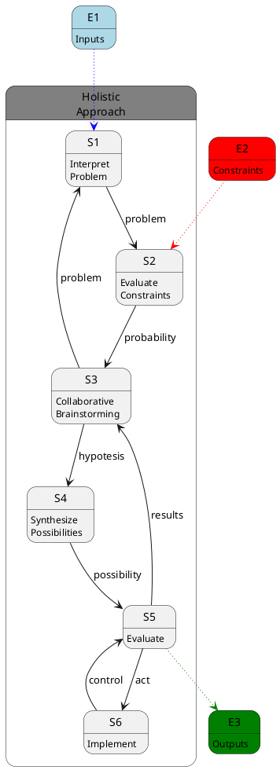

```plantuml
@startuml
    state E1 #lightblue : Inputs
    state E2 #red       : Constraints
    state E3 #green     : Outputs
    
    state "Holistic\nApproach" as G1
    
    state G1 #gray {
        state S1 : Interpret\nProblem
        state S2 : Evaluate\nConstraints
        state S3 : Collaborative\nBrainstorming
        state S4 : Synthesize\nPossibilities
        state S5 : Evaluate
        state S6 : Implement
        
        S1 --> S2 : problem
        S2 --> S3 : probability
        S3 --> S1 : problem
        S3 --> S4 : hypotesis
        S4 --> S5 : possibility
        S5 --> S3 : results
        S5 --> S6 : act
        S6 --> S5 : control
    }
    
    E1 -[dotted,#blue]-> S1
    E2 -[dotted,#red]-> S2
    S5 -[dotted,#green]-> E3
@enduml
```