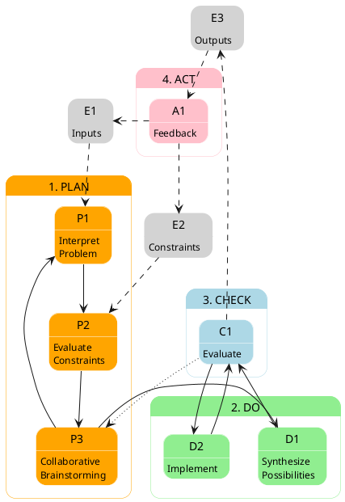

```plantuml
@startuml
    state E1 #lightgray;line:lightgray : Inputs
    state E2 #lightgray;line:lightgray : Constraints
    state E3 #lightgray;line:lightgray : Outputs
    
    state "1. PLAN"  as G1
    state "2. DO"    as G2
    state "3. CHECK" as G3
    state "4. ACT"   as G4
    
    state G1 #orange;line:orange {
        state P1 #orange;line:white : Interpret\nProblem
        state P2 #orange;line:white : Evaluate\nConstraints
        state P3 #orange;line:white : Collaborative\nBrainstorming
    }
    
    state G2 #lightgreen;line:lightgreen {
        state D1 #lightgreen;line:white : Synthesize\nPossibilities
        state D2 #lightgreen;line:white : Implement
    }
    
    state G3 #lightblue;line:lightblue {
        state C1 #lightblue;line:white : Evaluate
    }
    
    state G4 #pink;line:pink {
        state A1 #pink;line:white : Feedback
    }
    
    P1 --> P2
    P2 --> P3
    P3 --> P1
    P3 --> D1
    D1 --> C1
    C1 -[dotted]-> P3
    C1 --> D2
    D2 --> C1
    
    E1 -[dashed]-> P1
    E2 -[dashed]-> P2
    C1 -[dashed]-> E3
    E3 -[dashed]-> A1
    A1 -[dashed]-> E1
    A1 -[dashed]-> E2
@enduml
```